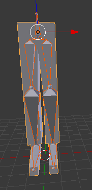
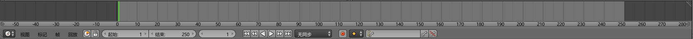
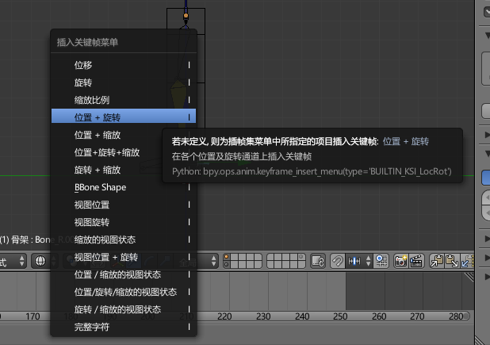
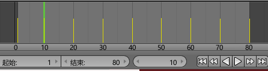
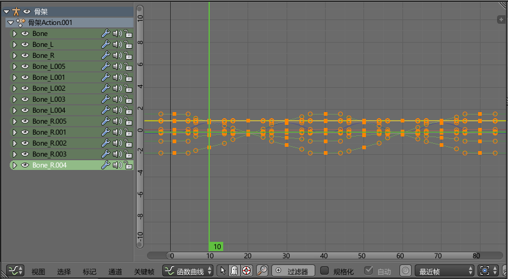
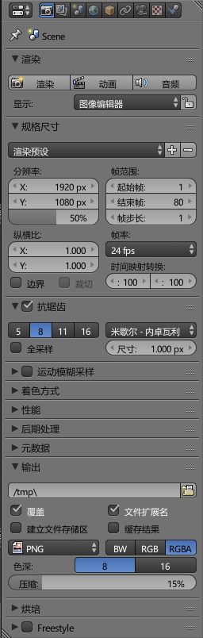
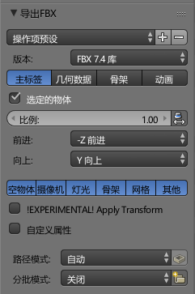

# 创建关键帧

这篇笔记中，讲解如何在blender中创建简单的关键帧动画，以及动画的一些相关概念。

## 创建关键帧

这里首先做一个简单的腿作为骨骼动画的例子。

blender下方有时间轴，我们可以在时间轴上选择当前帧，调整时间轴总长度等操作。

按I键可以插入一个关键帧。注意：关键帧是相对于选中的物体的，也就是说，我们用插入关键帧时，需要选中我们操作的骨骼，再按I键插入。

在时间轴上插入多个关键帧，拖动时间轴，就能看到动画了。在模型编辑器中，预览动画可以使用快捷键`Alt+A`，停止使用快捷键`Esc`。

在曲线编辑器中，我们可以调整骨骼动作随时间的变化曲线，默认情况下，blender创建的动作像是多个二次函数曲线串接到一起，大部分情况无需修改。需要修改的情况通常是整体位移动画，可能需要作出减速，或是线性变化等效果。

## 输出动画文件

如果是用于比较专业的影视作品，动画输出通常是一张张位图，简单的低质量视频则是直接输出视频格式即可。

在右侧的面板中，选择`渲染`面板，可以看到输出路径，格式等信息。

## 输出带动画模型

导出FBX格式的模型文件，如图可以调整导出的一些选项，默认情况下导出模型上也具有动画，加载到游戏引擎中就可以直接使用了。
