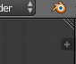
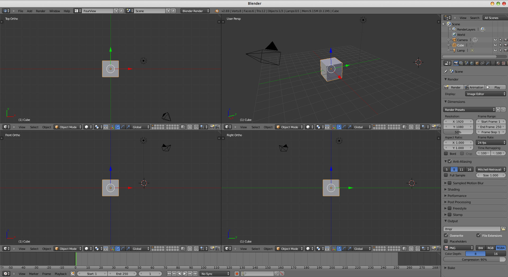
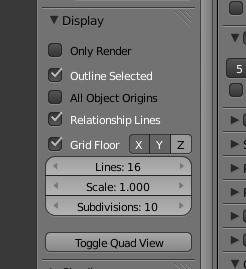
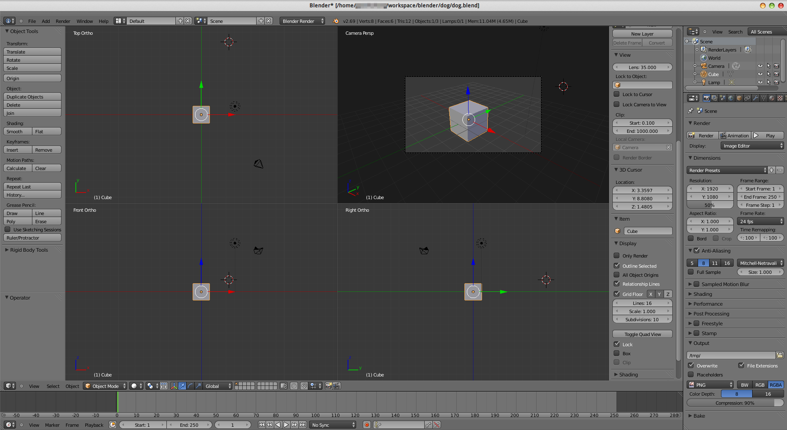
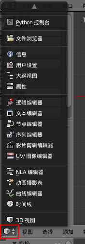

# Blender 创建四视图布局

之前使用的3ds max等软件默认能同时观察俯视图，正视图，右视图和自定义视图，十分方便。Blender可定制程度很高，但是没有默认提供四视图布局。我们可以自己创建一个。

## 步骤1 创建一个新布局

如图所示，我们在default的基础上，点击`+`按钮，新建一个布局，命名为`FourView`，这样我们就添加了一个自定义的布局。

## 步骤2 添加四个模型编辑窗口

如图，模型编辑窗口右上角有一个三个横线的按钮，鼠标拖动就能脱出一个新模型编辑窗口，十分方便，我们拖四个出来即可。

## 步骤3 调整四个模型编辑窗口

选中左上俯视图，按小键盘7，使用俯视图视角，按小键盘5，使用正交视图（默认是透视图）。

左下正视图分别按小键盘1和5。

右下右视图分别按小键盘3和5。

注意：这个操作必须用小键盘，我的电脑都是带有小键盘的，没有小键盘的电脑恐怕得用虚拟键盘。

## 步骤4 保存布局

这样修改完没有保存，关闭blender下次再打来，又变回default视图了，我们按快捷键`CTRL+U`，选择`Save Startup File`即可保存（`File`菜单里也有这个功能），下次再打开blender就是熟悉的四视图布局了。

## 放大一个窗口

使用快捷键`CTRL+↑`和`CTRL+↓`可以切换模型编辑窗口的大小。

## blender自带的四视图布局

实际上新版blender自带了分割四视图布局的功能，在模型编辑器的右侧属性面板（快捷键`N`）中，找到`Display`选项中的`Toggle Quad View`按钮，可以直接切换到四视图布局。

结果如下：

这样做，四个窗口共用两侧工具和属性面板。但是这样做也有坏处，不方便编辑单一模型编辑窗口的属性。这种状态下，切换窗口大小的快捷键是`CTRL+ALT+Q`。不知道这个功能在以后的版本中，是否会作出改进。

## Blender的窗口结构

Blender不仅快捷键十分复杂，窗口结构也十分反常，刚使用时经常找不到需要的工具，或者错按了哪个按键根本不知道发生了什么。但其实Blender的窗口结构不难理解。

从GUI角度看这个软件的界面设计，在主Window中，Blender按功能划分了不同的区域用于不同的状态数据展示，而各种操作则是通过全局的快捷键进行响应，每个功能区域都能找到上图红框中的按钮，这个按钮点开，该区域就能切换到对应的功能。
