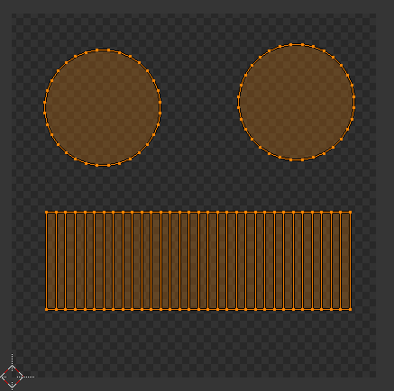

# UV展开

我们知道制作一个三维模型后，可以为模型指定材质和贴图，使模型看起来更加真实。三维物体有许多面，这些面对应贴图上的一部分，这就涉及到了三维模型的展开问题。

## 什么是UV展开

我们知道三维世界中，有一个全局坐标，有三个维度x,y,z，代表三维世界中的三个基本方向。贴图则是平面的，有两个维度u,v。UV展开的目的就是建立两个坐标系坐标点的一种对应关系，当然数学运算是blender自动帮我们完成的，我们要做的就是操作blender，使展开的贴图便于手工绘制。

## UV展开的最佳实践

UV展开是一个同建模型一样难度的工作，展开一个复杂的模型需要耐心和技巧。一种比较通用的方法是通过缝合线手动分割几何体，达到展开的目的。下面以一个例子进行介绍。

在UV展开之前，确保模型制作无误，UV展开后就没办法调整模型了，如果模型存在缺陷，如：某个面制作错误等，成品就会有很大缺陷，此时只能重做。

### 标记缝合线

我们以一个圆柱体为例。要较好的展开圆柱体，我们可以把它分割为上下两面和侧面。我们选中缝合线，在右侧`着色/UV`工具中，点击标记缝合边，被选中的边就会变为红色，标记的边在UV展开时就会被切开。

技巧：选边时，可以灵活使用`选择->循环边`工具。

## 展开贴图

按快捷键`U`，选择`展开`，在顶部窗口布局中切换到`UV Editing`模式，就能看到展开后的贴图了。UV编辑窗口中，平移、缩放等操作和模型编辑窗口是一样的。

## 调整贴图

贴图的所有部件必须位于左侧框内，同时，为了方便绘制，我们不能把贴图的各个部分靠的太紧，需要手动分隔开。

技巧：灵活使用`G`移动工具和`S`缩放工具。快捷键`Ctrl+L`可以全选相关组件。

## 导出UV布局图

确认展开无误后，在UV布局视图中，使用`A`全选，然后点击`UV->导出UV布局图`，导出png格式的UV布局图。将其导入GIMP中，我们就可以开始绘制贴图了。

这里只是简单的示范。

## blender中导入UV贴图

点击打开按钮，可以载入我们刚才做好的贴图。

在场景视图中，将显示方式改成`纹理`，就能看到我们的贴图了。`UV Editing`中看到的贴图是暂时显示的，我们需要切换到场景视图的物体模式，打开纹理面板，正式的为物体指定纹理。

## 注意点

1. 指定贴图前必须正确制定材质（Material），否则会报错`丢失数据块`，物体显示为紫色。
2. 贴图可以通过纹理绘制模式，在UV布局文件上进行标注，因为比较复杂的模型我们很难分清对应关系，更不用说方向了。
