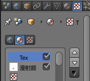

# 实时绘制

blender有个很好用的功能，叫做`纹理绘制`模式，实际上出现的类似功能最早是C4D的BodyPaint。纹理绘制模式中，我们可以直接在三维模型上绘制图案。这种绘制方式比较适合精度比较低的生物模型。除此之外，UV展开图中，我们经常分不清贴图的对应关系，可以通过纹理绘制功能，在UV布局图中进行标记。

## 使用纹理绘制功能

首先我们需要对物体进行恰当的展开，如果打算只使用纹理绘制，展开图可以不用调整的很精细。然后，切换到纹理绘制模式，添加一张贴图，就可以开始绘制了。

切换回场景视图的纹理面板，就可以看到我们刚刚画的贴图了。

