# DragonBones 简介

DragonBones是一个很好用的2D骨骼动画编辑器，能够针对2D精灵实现骨架创建，动作动画编辑，蒙皮这几个功能，使用起来并不是很复杂。本系列笔记主要介绍一下DragonBones工具的使用，以及如何整合到游戏引擎中。另外，DragonBones是免费的，而2D骨骼动画的另一个热门选择Spine是收费的。

## 资源

官网：[http://dragonbones.com/cn/animation.html](http://dragonbones.com/cn/animation.html)

官方视频教程：[https://www.bilibili.com/video/av9072544/?p=1](https://www.bilibili.com/video/av9072544/?p=1)

DragonBones编辑器文档：[http://developer.egret.com/cn/github/egret-docs/DB/dbPro/interface/mainInterface/index.html](http://developer.egret.com/cn/github/egret-docs/DB/dbPro/interface/mainInterface/index.html)

Armature API：[http://developer.egret.com/cn/apidoc/index/name/dragonBones.Armature](http://developer.egret.com/cn/apidoc/index/name/dragonBones.Armature)

## 前置需求

做骨骼动画之前我们得先有素材，网上似乎很难找拆解好的骨骼动画素材图，这里我就简单画了点素材：

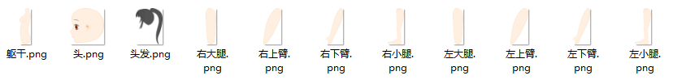

素材是正侧面角色，拆分成11张图（躯干，头，头发，四肢的上下肢），一般手脚、装备甚至眼睛，头发都会有拆分，这里我们就不搞那么复杂了。

后期补充：**图片素材画完之后，一定要在Unity里比量好了再导入DragonBones做动画，无论DragonBones按缩放比例导出，还是导入Unity再缩放，图片都会严重失真，在Unity里也没找到任何和抗锯齿、插值有关的选项。**

## 下载安装

打开DragonBones之后，可以看到首页有很贴心的例子、视频教程、文档。

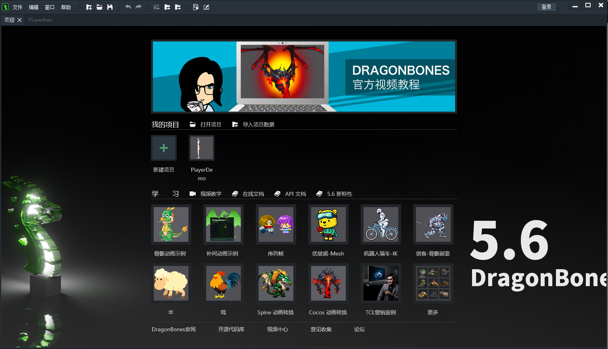

我们这里创建一个新的龙骨动画（另外还有个「动态条漫」选项，漫画我肯定是手绘，骨骼动画做的漫画据说是没有灵魂的(⊙_⊙)???）

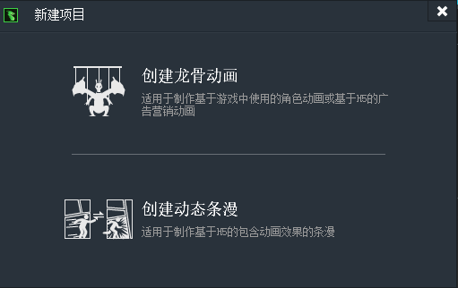

创建好新的工程后，界面如下。

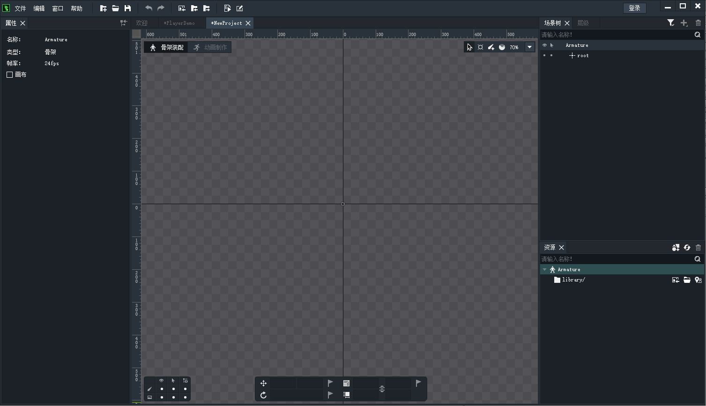

## 软件界面简介

### 工作区

左上角可以看到有「骨架装配」和「动画制作」两个模式，分别用于编辑骨架和编辑动画。

右上角的几个按钮分别是「选择工具」、「Pose工具」、「创建骨骼」、「权重工具」，都很好理解。

左下角几个按钮是切换骨骼和图片显示隐藏的，2D平面上经常有一个图挡住另一个图的情况，操作时可能造成没法选中下面图的情况，我们可以把碍事的图暂时隐藏。

下面的几个框框是移动、旋转、缩放，比较简单。

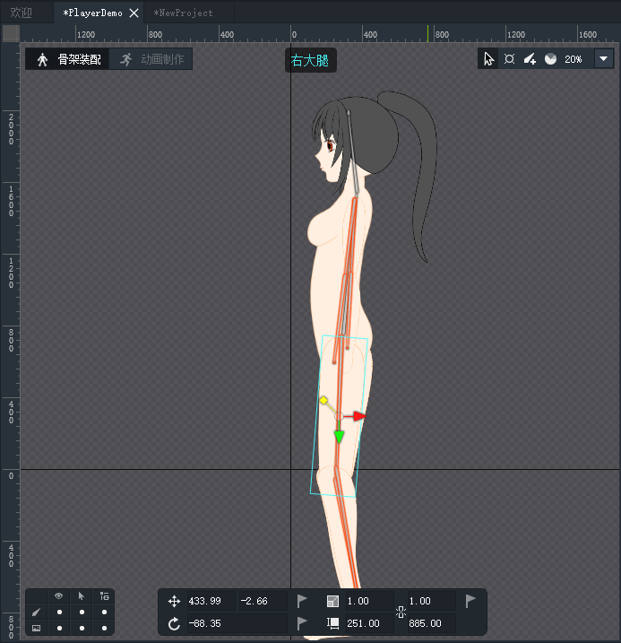

几个常用操作：

* 缩放场景：鼠标滚轮
* 拖动场景：右键拖动
* 取消选择：空白处右键点击

### 资源面板

资源面板中是我们拖进来的图片，我们可以从资源面板往工作区里拖图片。

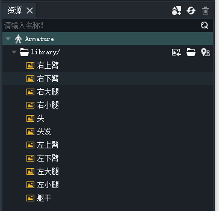

### 场景树面板

我们拖进工作区的素材图片，创建的骨骼，IK定义等所有的资源都以树形结构管理，在场景树面板中我们可以管理这些资源。其中`root`是所有内容的根节点。

下图是一个用我画的素材做的一个简单的身体，红圈是IK的定义，骨骼则是层级结构，root是根骨骼，其余骨骼链接到躯干骨骼上。

骨骼下面是插槽，插槽可以设置多个图片，但是同一时刻只能显示一张图片，这可以用来实现衣服（装备）切换。

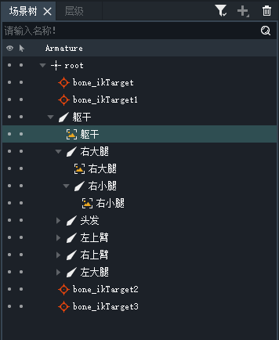

几个常用的操作：

* 改变节点父子结构：拖动就行
* 暂时显示隐藏和是否允许拖动：点那个眼睛和小箭头下面的圆点切换

### 层级面板

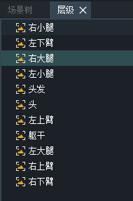

这个是用来控制图层顺序的，上面的图层会覆盖下面的图层。

### 属性面板

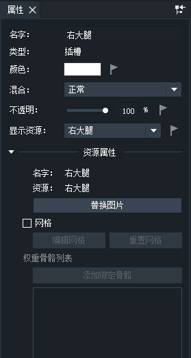

在场景树中，选择一个资源，属性面板中会显示对应的属性。上图中，是选中一个图片时显示的属性。

### 动画编辑区

工作区切换到「动画制作」可以调出几个编辑动画用到的面板。

「时间轴」可以创建和编辑关键帧，组成补间动画。

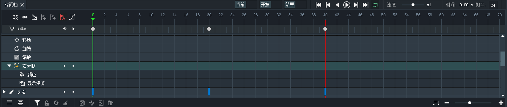

「曲线编辑器」用来编辑补间动画的时间曲线，要求不高的话，除了线性补间一般就加个淡入淡出什么的。

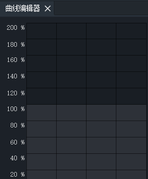

「动画」面板显示我们针对一套骨骼制作的若干个动画，可以在游戏引擎中进行切换。

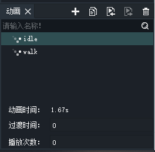
