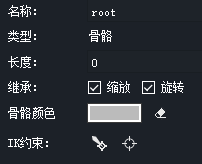
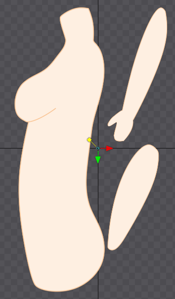
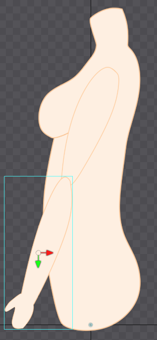
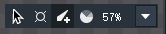
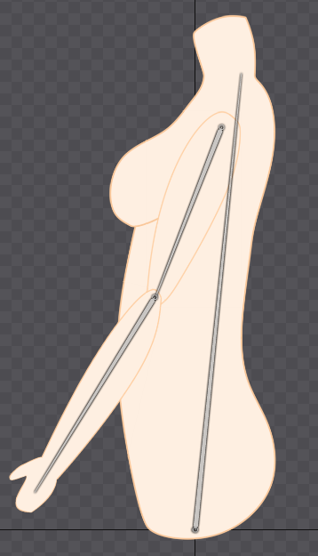
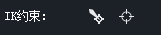
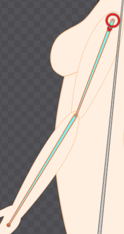
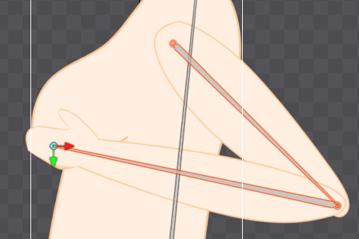
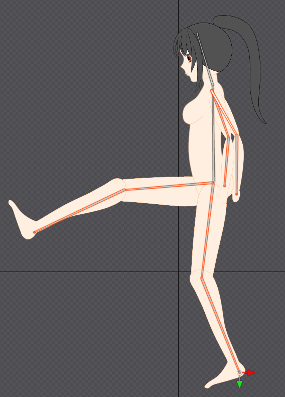

# 骨骼创建

新建一个工程后，场景树中默认有一个root，尽管只是一个点，但它实际上是一根骨骼，我们创建的其他骨骼都将以root为根节点。

这里我们拖三个素材进来演示一个胳膊的动画。

## 创建骨骼

我们首先把素材正确的摆放，参考层级面板调整图层顺序。

注意图中root点的位置大约位于胯部，这是因为我们将以这个位置为起始点创建脊柱（骨骼），然后从脊柱再拉出上臂和下臂。骨骼节点的父子关系其实就是一种正向运动约束（Forward Kinematics，FK），和3D软件中一样，我们旋转、移动父骨骼，会带动所有子骨骼。

注：对于整只的高级脊椎动物，一般都是从脊柱开始创建骨骼的，脊柱是整个生物的左右对称点，而胯骨的位置大致是人体上下的中点，将root设置在这里便于肢端设置IK后摆造型。

这里点击骨骼创建工具，我们从root点拉出几根骨骼，拖拉骨骼很简单，从起始点按住鼠标拖到结束点即可，骨骼划过的图片会自动框选提示。如果图片遮挡导致没法把我们需要的图绑定到骨骼，可以隐藏挡住的图，或手动操作场景树。

## 创建反向运动约束（Inverse Kinematics，IK）

这里我们同时选中两根骨骼（注意只能选两根），在属性面板中选择「在骨骼末端生成约束目标」，就能创建一个IK约束。

创建IK后，对应骨骼会变红，场景树中也有相应的约束节点。

我们鼠标在场景树中可以点选IK约束，或者点击点击工作区中IK末端的小圆点（很容易选错，建议骨骼不太复杂所有选择操作都去场景树中找），然后鼠标在空白区点击拖拽就能看到效果了。

这里我们简单的摸一下胸（雾）。

注明：其实我的素材画的有点问题，因为我画的是线稿+上色形式的素材图，然而骨骼动画必须把身体拆分，关节处就画了线条，接线比较违和。这个肘关节其实可以改成一张图进行蒙皮，或者用阴影、渐变之类的东西糊弄过去。

## 完整的骨架

组装好后大致就是这样子了（手动滑稽）
