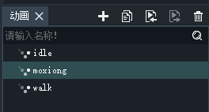
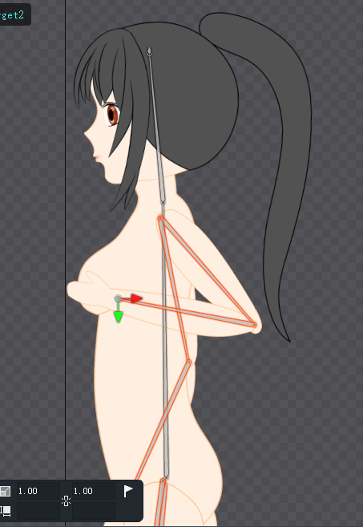
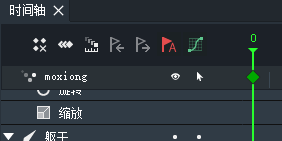
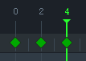
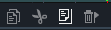
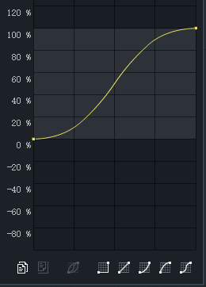
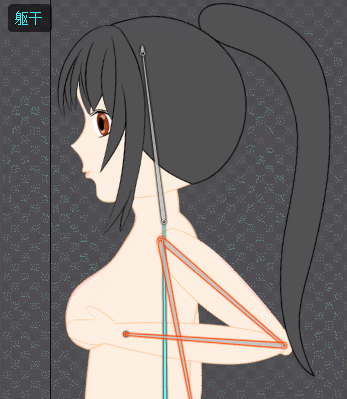

# 创建动画

这里我们基于上一篇笔记中创建的骨架，制作一个简单的动画例子。

一点建议：开始制作动画前一定要确保骨架已经做好，骨架确定做好就不要动了，尤其不要乱改结构，3D中也是如此。

## 创建动画

我们可以在动画面板中创建多个动画。这里我们新建一个~~名为`moxiong`的~~动画（雾）。

## 创建关键帧

首先切换到「动画制作」模式。创建关键帧前，我们可以开启这个自动关键帧的按钮（默认开启，红色），这样我们摆到什么姿势，这一帧就是什么姿势。而不选中这个按钮，就要手动针对骨骼和三种变换创建关键帧，经常丢三落四的还是打开比较好。

注：创建骨骼动画关键帧俗称K帧。

然后拖动骨架，摆到我们需要的起始姿势：

创建关键帧后，时间轴会出现一个菱形：

如此反复，我们创建了一系列的动画关键帧，DragonBones会自动为我们进行补间：

注意：最后一帧关键帧需要和第一帧一样，否则动画循环播放就会出现动作跳跃的情况。复制关键帧可以用Ctrl+C/Ctrl+V，或底部的工具按钮：

## 动作优化

我们可以编辑一下动画时间曲线，让动作更流畅：

如果动画执行的太快，我们可以把关键帧往后拖，或者点击这两个按钮移动关键帧，这两个按钮能「推动」一个关键帧后面的所有关键帧。

我们可以点击播放按钮，查看效果：

注：GIF动画的帧数比较低，实际运行时很流畅的。
