# 蒙皮

在3D中，蒙皮是将三维空间中，Mesh（网格）表面划分的许许多多的三角形顶点绑定到骨骼，这样骨骼动作就会带动网格形变。当然，每个顶点通常会收到许多骨骼的影响，我们需要为顶点分配骨骼影响的权重，使得骨骼引起的网格形变更自然，这个操作俗称刷权重（Blender里权重真的是刷子刷上去的）。

2D中也是差不多的意思，只不过3D网格变成了2D。但是，3D建模本身建的就是一大堆顶点和面，而2D则是我们手绘出来的像素图，因此为了实现蒙皮，我们还必须手动将位图进行切分。

## 绘制网格线

选择一个图形后，我们可以在属性面板中点击网格选项，这样就进行网格线绘制和图形切分。

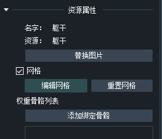

点选网格后，我们直接选择「手动绘制边线工具」，在图片四周画出网格线，网格内部则自动生成了许许多多的三角形。

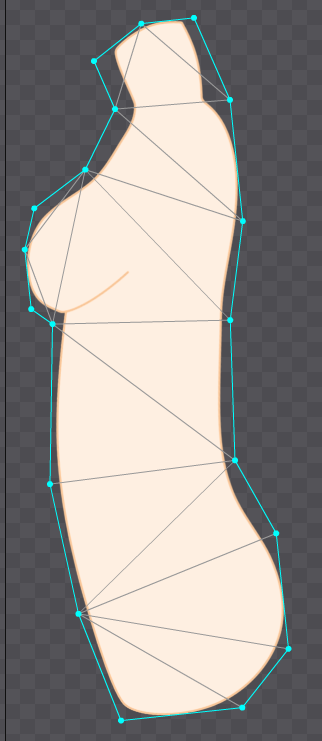

注意：网格线不要紧挨着图片边界，因为三角形网格会引起图形的形变，网格线贴的太紧会导致像素被错误的切开，网格线要和图形边界保持一定的距离。

大致画好后，我们可以用剩下的三个按钮进行一些修修补补。

除此之外，还有个自动生成边界线功能，但这个效果好像不太行，不建议用。

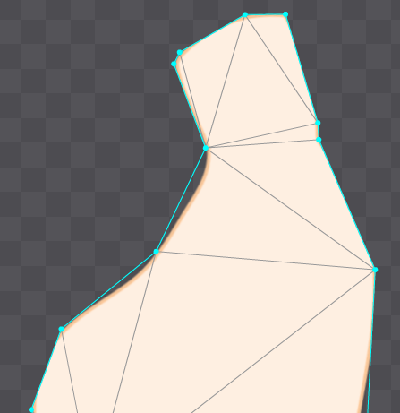

## 手动切分

我们画好网格线后，虽然出现了一堆三角形，但是这些默认的三角形是随机的，我们需要进行手动切分，绘制出确定的三角形。

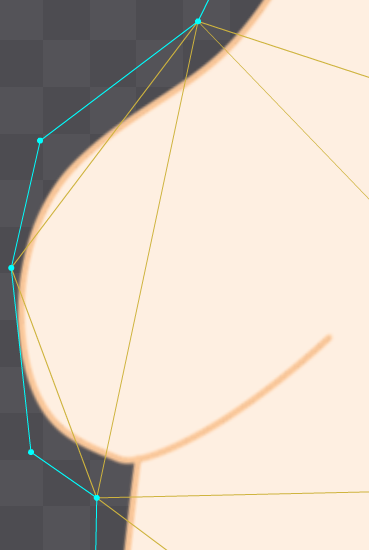

选中编辑网格三个按钮中的添加工具，选择网格边线上的一个顶线，按住鼠标拖到另一个顶点，就能创建一条黄色的线，黄色的线是确定的切分线。

我们当然也可以在图形内部创建顶点，实现更好的切分效果，这里我们的素材也是过于简单，就不切的太复杂，我们照着原来默认生成的三角形切分线绘制一下所有的确定切分线就行。

## 绑定骨骼

之前我们躯干只有一根骨骼，这个实际上不太对劲，一只人类实际有33节脊柱，骨骼动画中躯干一般要绑定两根才能正确的表现出角色动作，这里我们重新拖一个骨架出来，然后重点对躯干做一下蒙皮的绑定。

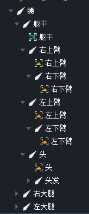

点击之前我们划分的网格，然后添加绑定骨骼，按照提示，点选躯干和腰两根骨骼。同时，工作区中的骨骼会添加颜色进行区分，方便我们刷权重。

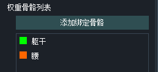

我们可以点击那个扇形图按钮，查看每个顶点的权重。DragonBones会给我们自动一些权重值，我们在此基础上调整就行了。

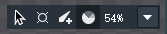

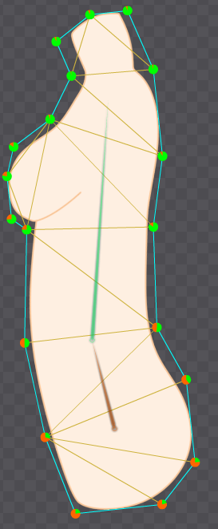

要调整权重，在权重视图中点选一个顶点，拖动属性面板的滑动条就行了。

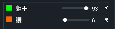

刷完权重，我们的蒙皮就起效果了，可以拖动骨骼试一下。

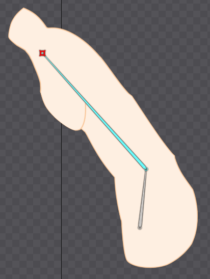

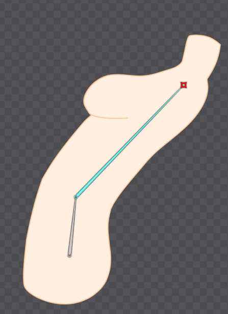

注：我这里搞得有点失败，网格切的不好，导致向前弯腰出现了棱角。。。

## 有蒙皮的骨骼动画

这个和骨骼动画是一样的操作。而且除了控制骨骼外，我们也可以直接操纵蒙皮切分节点，实现一些不受骨骼控制的形变动画。
