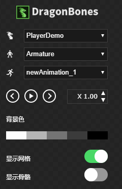
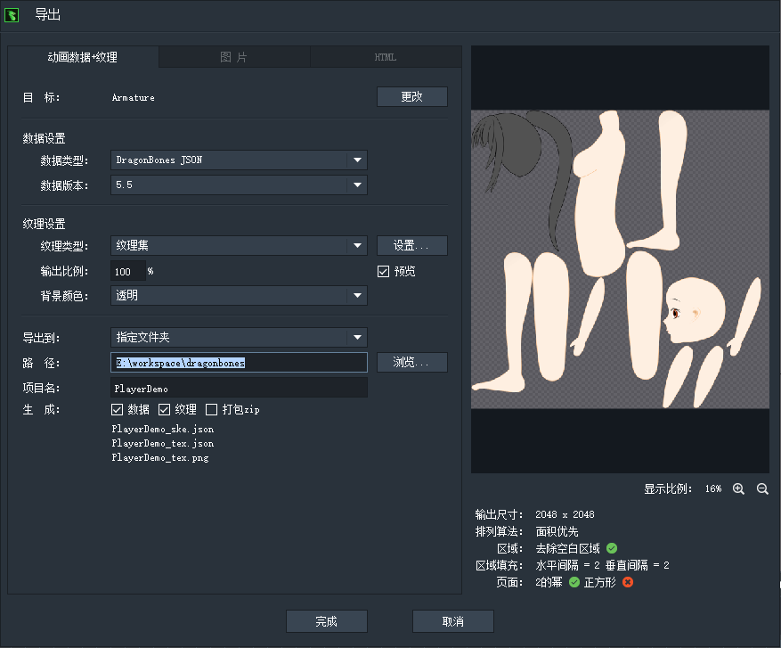

# 预览和导出

在DragonBones顶部有这么两个按钮，分别是导出和预览。

## 预览

预览会在浏览器中打开一个Egret编写的H5版预览窗口，动画播放的各种属性都很齐全。

## 导出

导出会生成三个文件：

* PlayerDemo_ske.json：骨骼数据
* PlayerDemo_tex.json：纹理数据
* PlayerDemo_tex.png：合成一张的大纹理图片

导入游戏引擎时，就需要用到这三个文件。
