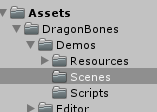
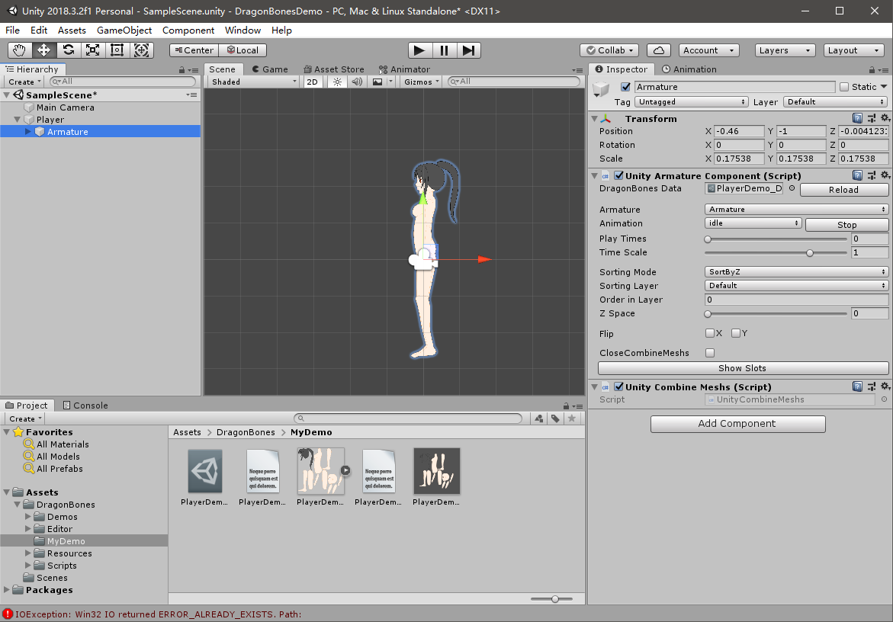

# 导入Unity

上一篇笔记中，我们导出的结果是三个文件，Unity中需要对应有解析这些数据文件的插件，才能播放DragonBones设定的动画。

在DragonBones的Github仓库下载针对Unity的插件。

[https://github.com/DragonBones/DragonBonesCSharp/releases](https://github.com/DragonBones/DragonBonesCSharp/releases)

下载完成后，将其导入Unity即可。其中Demos文件夹包含一些十分有用的例子，我们编写脚本时，基本都得接合这些例子和API文档，当然在正式使用时，可以选择性的不导入这些例子。

## 查看例子

例子中包含了一些Scene，我们打开就能看演示了，对应的源码在相应的脚本里。

## 创建一个骨骼动画的游戏对象

在层级视图中，我们选择`右键->DragonBones->Armature Object`，然后在检视视图中，选择一个JSON文件（就是骨骼`xxx_ske.json`文件），DragonBones相关的插件会自动为我们生成好附有骨骼动画的GameObject。

实际上，DragonBones就是通过`Unity Armature Component`的脚本实现各种功能的，在这个组件里我们可以调整动画播放的各种属性，如下图：

注：不要在意图里那个报错，貌似是一个自带例子导致的，例子都能勉强正常运行。
