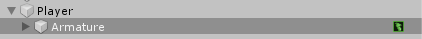
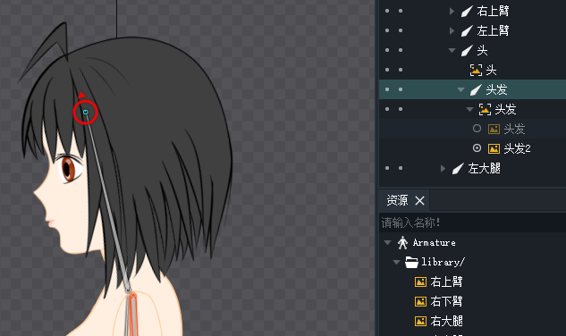
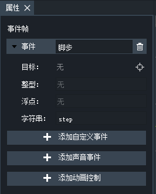

# 脚本控制

## 控制动画的播放



下面例子代码中，我们实现了按A键播放行走动画，放开A键播放idle动画。

PlayerController.cs
```csharp
using System.Collections;
using System.Collections.Generic;
using UnityEngine;

using DragonBones;

public class PlayerController : MonoBehaviour
{
    // DragonBones的动画组件脚本
    private UnityArmatureComponent uac;

    void Start()
    {
        uac = this.transform.Find("Armature").GetComponent<UnityArmatureComponent>();
    }

    void Update()
    {
        if(Input.GetKey(KeyCode.A))
        {
            setAnim("walk");
        }
        else
        {
            setAnim("idle");
        }
    }

    void setAnim(string animName)
    {
        // 如果正在播放的动画是当前要设置的动画，就不触发动画更新，否则就更新当前播放的动画
        if(uac.animation.lastAnimationName != animName)
        {
            uac.animation.Play(animName);
        }
    }
}
```

注：本篇笔记之后的代码都基于这个类进行编写。

## 切换插槽中显示的图片

之前我们说过，一个插槽可以设置多张图片，但是某一时刻只能显示其中一张图片。角色换装就是用切换插槽上显示的图片实现的。这里我们再画一张发型的图，拖进DragonBones编辑器中，然后设置到对应的骨骼插槽上。



**注意：不要搞错了，我们给插槽加一个图片而不是加一个插槽。**

改变插槽当前显示图片的函数，每调用一次，就会显示下一个发型。

```csharp
void ChangeHair()
{
    Slot slot = uac.armature.GetSlot("头发");

    slotDisplayIndex++;
    int cnt = slot.displayList.Count;
    if(slotDisplayIndex >= cnt)
    {
        slotDisplayIndex = 0;
    }
    slot.displayIndex = slotDisplayIndex;

}
```

## 定义事件和事件监听器

DragonBones中在关键帧上可以定义一些事件，然后在Unity脚本中监听，实现动画触发脚本回调。


在属性面板中可以编辑事件名和值。



```csharp
void OnAnimationEventHandler(string type, EventObject eventObject)
{
    // 事件名
    Debug.Log(eventObject.name);
    // 事件值
    Debug.Log(eventObject.data.GetString());
    // 触发事件的动画名
    Debug.Log(eventObject.animationState.name);
}
```

上面代码是动画事件监听器的回调函数：

1. 第一个参数是事件类型，这个类型是我们从监听器定义时传进去的，貌似应该是用来给事件分类，不太常用。
2. 第二个参数就是包含我们再DragonBones中定义的事件的内容，包括事件名，事件值，触发该事件的关键帧的信息。

```csharp
uac.AddDBEventListener(EventObject.FRAME_EVENT, this.OnAnimationEventHandler);
```

上面代码为`UnityArmatureComponent`绑定事件监听器。
