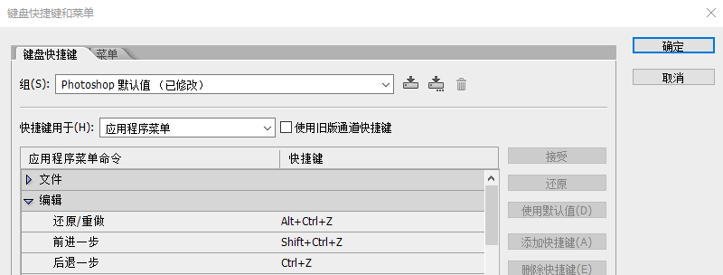

# PhotoShop入门介绍

PhotoShop是使用最广泛、功能最强大的图像处理软件之一，广泛用于照片后期处理、视觉创意设计、绘画、平面设计、软件原型设计等领域，本系列笔记着重介绍PhotoShop中常用工具的一些基本功能，以对此类软件的使用建立相应的基本概念。这里使用的版本是PhotoShop CS6。

## 安装后的一些设定

### 对调撤销快捷键

PhotoShop中，撤销上一步操作的快捷键有两个：

* `Alt+Ctrl+Z`：按照修改历史连续撤销
* `Ctrl+Z`：只撤销一步，再按一下还原

我们在菜单中找到`编辑->键盘快捷键`，在下图中所示的位置把这个反人类的设计对调以下。

### 调出标尺

尤其是在平面设计和软件原型设计中，标尺是相当重要的工具，PhotoShop默认没有打开，可以用`Ctrl+R`快捷键把标尺调出来。

标尺的几个功能：

1. 标尺上右键，可以改变单位或使用百分比
2. 拖拉标尺能够生成参考线（要选中`视图->额外内容`）
