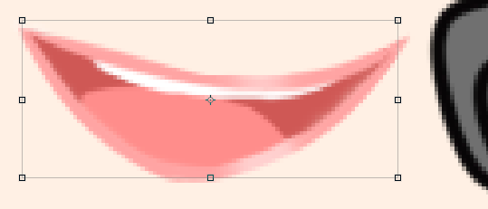
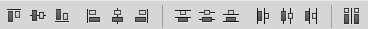

# 工具之移动

PhotoShop的复杂性之一就是功能特别多，即使是一个简单的移动工具，其中也包含了不少内容，很多功能能够极大的提升我们的工作效率。

我们这里仔细学习一下这个移动工具。

## 移动工具的基础使用

选择移动工具后，鼠标在工作区中拖动，能够平移当前的图层。这个工具方便我们在多图层模式工作时，调整两个图层的相对位置。

## 自动选择功能

自动选择是个非常实用的功能，勾选自动选择后，下拉框可以选择「图层」或「组」。

* 图层：鼠标点击时，自动选择该位置有像素的最上一层的图层
* 组：鼠标点击时，自动选择包含和该位置周围相连的所有图层的图层组

## 显示变换控件

勾选显示变换控件后，我们点击的图层或图层组会自动加上自由变换的拖动控件，我们可以用它对选中的图层进行自由变换。

## 对齐

我们同时选择多个图层时，这排对齐工具就会生效，它们可以对多个选中图层自动对齐。

