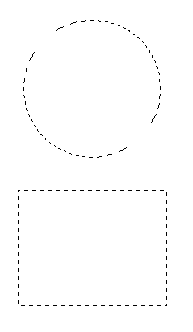
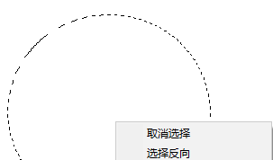
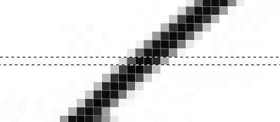
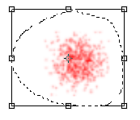
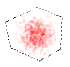
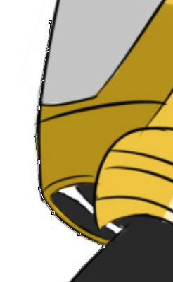
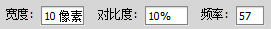
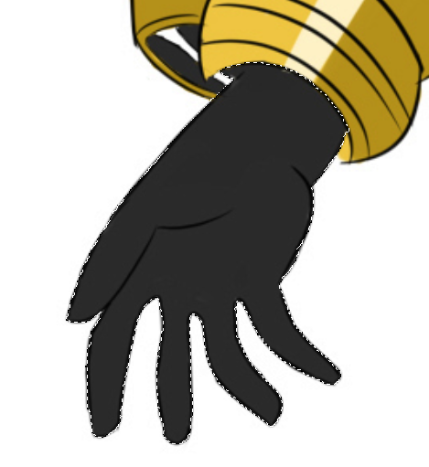
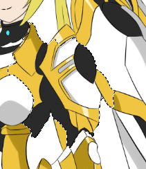
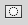

# 工具之选区

PhotoShop的选区工具非常强大，我们主要讲对选框、套索、魔棒三种选区工具进行介绍。

## 矩形选框和椭圆形选框

* 使用选区工具，鼠标左键拖拽能够拽出选区
* 按住Shift能够拖出正方形和正圆选区
* 按Alt能够从圆心（或正方形中心拖出选取）
* Ctrl+D能够取消选区

顶部有这样四个按钮：

* 新选区：每次拖出选区框都会重新创建一个选区，并取消原来的
* 添加到选区：新创建的选区和之前的选区同时存在，选区相交则取交集
* 从选区减去：说白了就是选区差集
* 与选区交叉：选区并集

在选区的右键菜单能够找到反选选项，这个也经常用到，配合四个多选区按钮，能够实现复杂的选择。

## 单行选框 单列选框

这两个工具能够选择水平或垂直的一像素。

## 套索

套索工具实际上就是手绘一个选区。

有数位笔的情况下手绘选区非常方便。在绘画时我们会使用多图层的工作形式，我们画了一个部件，发现位置不太对，那么直接用套索圈一下，然后配合自由变形工具`Ctrl+T`，移动一下就好了。

SAI2中也是同样的操作习惯，但是SAI2的手绘选区能够自动调整到像素边缘，而PhotoShop（这里是CS6版本）则不能，这就比较蛋疼了。

## 多边形套索

这个工具就是画一个多边形选区，对方方正正的物体还比较有效，但其实除了图纸、图标、排版一类的东西，生活中很少有精确到像素的横平竖直的图，因此这个功能比较少用到。

## 磁性套索

磁性套索比较适合抠图，光标划过的物体的边缘能够被近似选择，我们也可以用鼠标加点。

我们也可以调整磁性套索的识别宽度、对比度，以及控制点的吸附频率。

## 魔棒

魔棒能够快速选取颜色相似的像素，通过调整顶部的容差值，可以比较概括的间接调整选区范围。

魔棒在抠图时用起来比较麻烦，因为上好色的图会有明暗变化，背景的影响等因素，但是线稿上底色时魔棒真的是神器。

## 快速选择

快速选择是个比较玄学的工具，原理我也不是很清楚，总之就是和魔棒差不多但选的更快，更适合抠图时用。

使用时，快速选择可以像画笔一样划过我们的图片，划过的部分都会进行被快速选择工具处理，顶部可以调整快速选择的笔刷大小。

## 选区蒙版（选区笔）

Photoshop中，选区蒙版能够以绘画的形式编辑选区（不是套索那种画边框，而是类似SAI2的选取笔），采用画笔的笔刷进行绘制，画笔选择黑色代表取消选择区域，白色代表所选选区。

Photoshop中的选取笔主要是用来修饰选区，取消选择区域会呈现红色，SAI2默认是选择区域呈现蓝色，恰好相反。

