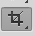
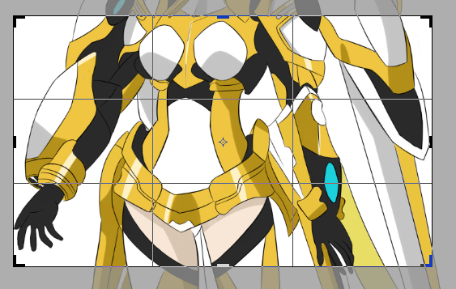
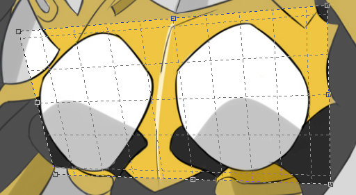
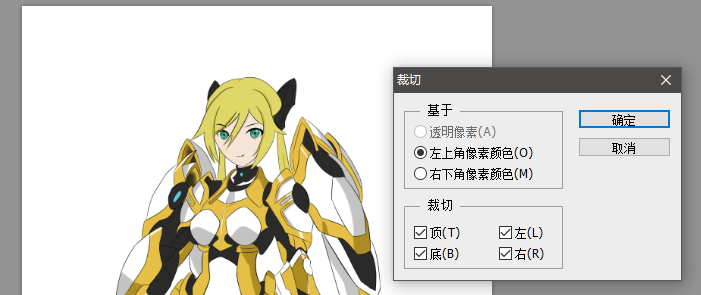
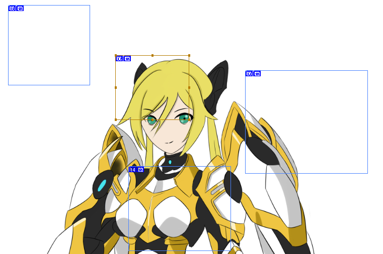
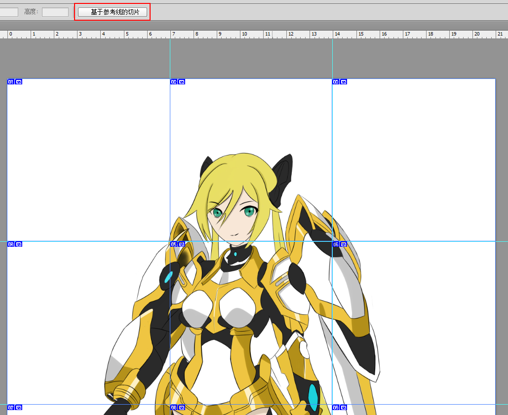
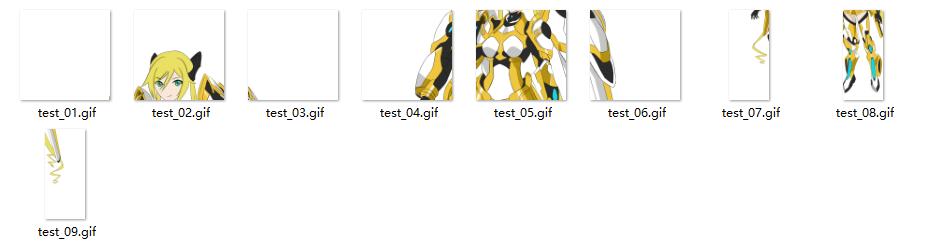
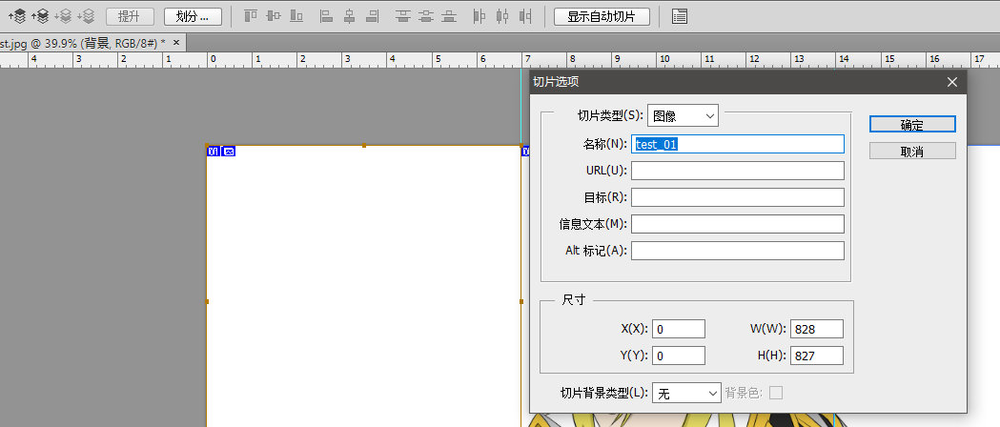

# 裁剪工具

我们画画平时都用的标准A4纸，但是我们经常要把某个原件或者角色裁剪出来，由于其它目的，这可以用裁剪工具实现。

## 裁剪工具

在工具栏中可以找到裁剪工具。

使用裁剪工具，拖个框框就行，确认裁剪就是回车键。

## 透视裁剪

透视裁剪用于拉直一个有透视效果的照片，透视裁剪的选框类似SAI2的透视尺，选框所选的区域会被自动逆向计算透视效果并拉直。

当然，我感觉并不是太好用，毕竟二维的图像是要少一些细节的，而透视是观察三维空间的效果。

## 自动裁剪

点击`图像->裁剪...`能够实现基于像素的自动裁剪，由于我们平时画画用的都是A4纸，但是如果是作为游戏素材导入Unity、DragonBones之类的东西肯定不能把一大张带透明的图导进去，一张张图手切又很麻烦，这时可以用这个自动裁掉透明部分（其实有更自动化的工具）。

## 切片

我一直没搞明白这个切片是干什么用的，据说是用于网页大图片分片加载的，可以将图片用表格划分，直接就能分块加载了，古代人的智慧真是无穷啊，反正我是没见过，可能是用于专业用途的图片，Web开发中我们一般都是通过缩略图的形式优化用户体验的。

反而游戏中可能会用到无缝地图分片加载，但是貌似很少有2D游戏做无缝地图。除此之外，或许古时候UI切图也能用到切片，现在的UI都用的自动切图工具一下子就切好了。

我们还可以使用基于参考线切片，只要预先拖出参考线，然后选择切片工具，选择基于参考线的切片即可。

切片完成后，选择`文件->存储为Web所用格式`，然后选择保存，就能得到所有切片了（不知道默认为什么是gif，这个可以调）：

## 切片选择工具

切片选择工具能够选择一个切片并设置一些信息，很显然这个工具就是专门为网页设计的，但是如今我们其实根本不会用到它。

