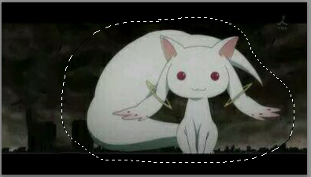
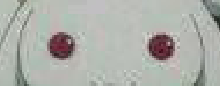

# 工具之玄学修复

这篇笔记主要讲解`污点修复`和`图章`工具，这两组工具都用于修图，尤其是各种污点修复里面用到的算法也是比较复杂，不是很懂，因此暂且称为玄学修复工具（手动滑稽）。

## 仿制图章和修复画笔

**仿制图章**是一个非常简单的工具，选择一个取样点后，能够在一张图的另一个区域映射绘制取样点周围的区域。简单示范一下：

1. 选择仿制图章，按住Alt，在白云附近设定取样点：

2. 在另一个地方就能画一个完全一样的白云w(ﾟДﾟ)w

当然，仿制图章效果很不好，因为不能自动处理背景的融合，上图中，下面的白云P图痕迹非常明显。

**修复画笔**是升级版的仿制图章，能够自动实现背景融合，使用方法和仿制图章一样，按Alt选区采样点，然后绘制就行了。

## 污点修复画笔

修复画笔的作用就是去除一片颜色周围突兀的像素（污点），但并不是像仿制图章一样的简单取样覆盖，而是会进行比较复杂的运算，效果非常好。

这里我们网上找张图，修复一下脸上的雀斑。

用污点修复画笔在雀斑上点两笔就行。

## 修补工具

修补工具能够圈定一个范围，然后用你想要的其他地方覆盖，修补工具能够自动融合背景。

1. 鼠标圈定区域

2. 拖动，自动融合

## 内容感知移动工具

这个工具就更加玄学了，能够感知我们圈定的内容主角，然后移动或复制它。

我们圈一只QB：

移动：

连背景居然都给我们补上了。

## 红眼工具

这个是用于修复照片的红眼。

修复前：

修复后：

## 注：什么是红眼

我们知道人类这种高级脊椎动物有视网膜反贴的巨大bug，毛细血管在视网膜前面，而亮度暗时瞳孔会扩大，拍照时闪光灯打在眼球上，毛细血管会被照亮发出红色，影响整体观感，闪光灯闪烁两次就是为了避免红眼。

红眼不是虹膜变红，而是瞳孔，这就十分诡异了，感受下黑暗中QB的直视：

