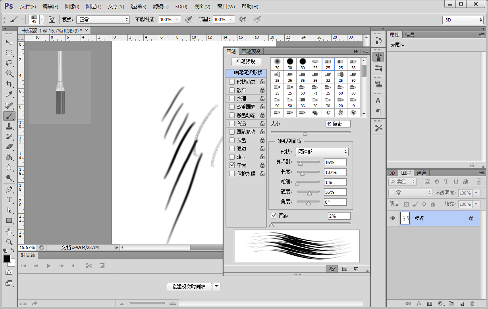
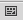
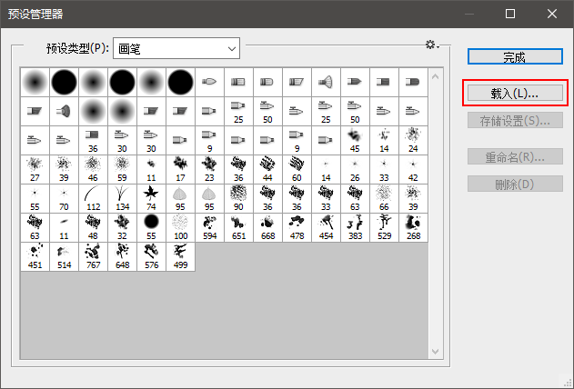
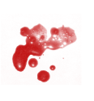
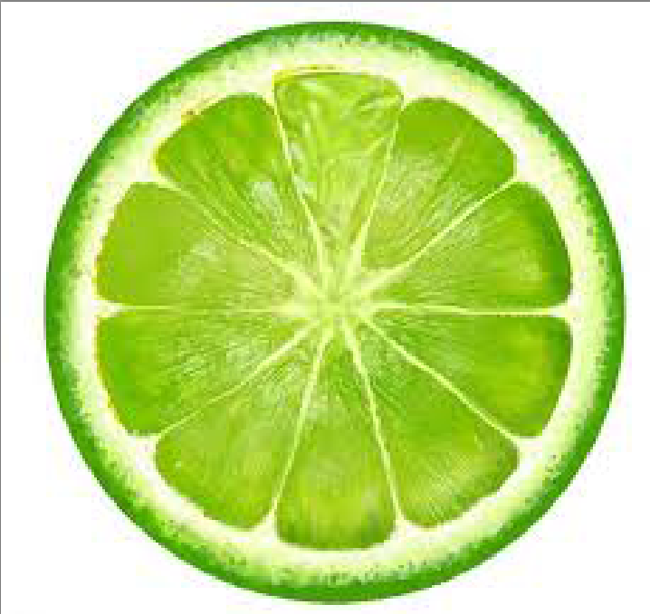
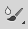
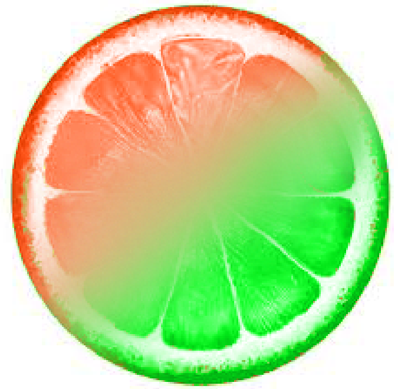

# 工具之画笔

画笔是个使用起来比较复杂的工具，Photoshop和数位板的组合也是专业的手绘工作离不开的工具。据说最新版的Photoshop CC已经有了抖动修正，更加适合作画了。

注：Photoshop最初只是一个图片处理软件，但是后来由于绘画功能也非常强大，用于有这方面的需求，因此也慢慢的演变成了一个强大的绘画软件（其实有很多人还没认识到这件事）。

## 画笔预设

选择画笔工具后，顶部的下拉按钮可以调节画笔预设，但是那个窗口功能不全面（历史原因）。我们绘画时，一般会打开工作区右侧的画笔属性和画笔预设面板。

这个画笔属性实在太多，也不太好解释，只能用心去感受，这里就不多做介绍了。

要注意的是，在没搞懂某个预设究竟是什么意思之前，最好不要乱调画笔参数，因为Photoshop好像没有笔刷重置选项，各种画笔属性的效果都懂倒没什么问题，但不懂效果又发生不可名状的奇怪效果，那就比较坑了。

## 如何导入笔刷

Photoshop自带的笔刷比较少，我们可以导入别人制作的笔刷。Photoshop中，自定义笔刷可以导出文件，文件以`.abr`为文件后缀名，我们可以在预设管理器导入。

这里我们导入一个从网上找到的血液笔刷。

实际上，Photoshop这个软件缺乏一个好用的笔刷分类管理和检索功能，我们只能把导入的笔刷堆成一堆，很难查找。现阶段，还是建议笔刷用到哪个加载哪个，加载后及时命名，不用的及时删除，不要网上找一堆全部加载，根本用不过来，而且难以管理。

## 铅笔工具

铅笔工具和画笔的区别就是硬边缘，没有基于压感的深浅变化，可以看成一种特殊的画笔笔刷。铅笔用的比较少，一般用来纯粹的构图和打草稿。

## 颜色替换工具

颜色替换工具更多是用于修图的，虽然它也被放在画笔工具栏。

我们这里找一个没熟的橙子：

用快速选择工具选择这个橙子后，将前景色调到合适的颜色，然后使用颜色替换工具涂抹：

## 混合器画笔

混合器画笔有点像SAI2的水彩笔（用于涂抹渐变，也能单独用来上色），但是表现又不完全一样，具体就自己感受吧。

