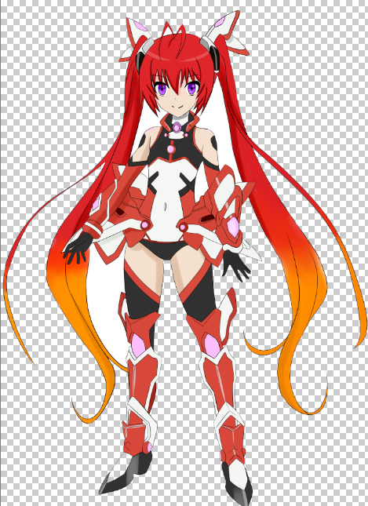
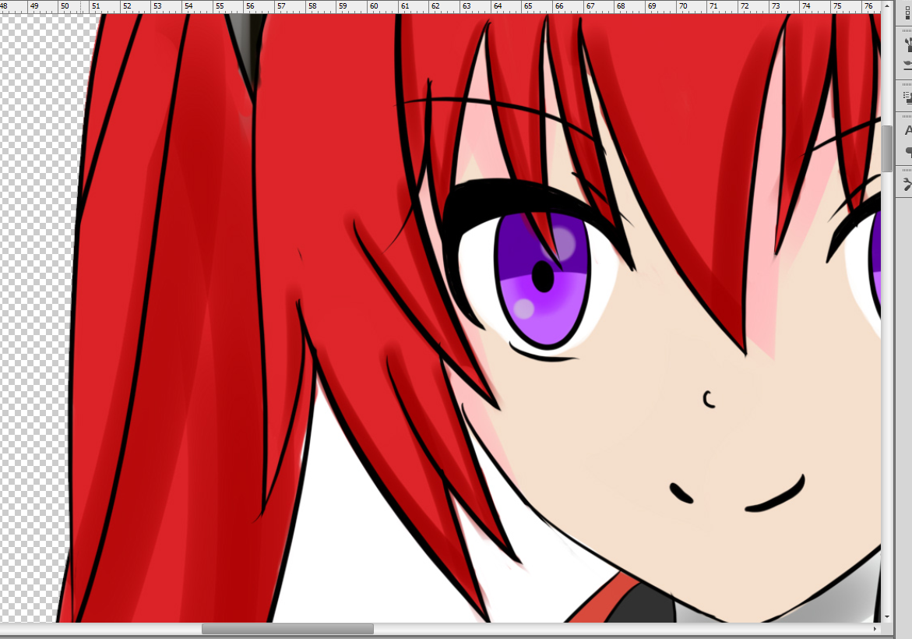

# 工具之橡皮擦

Photoshop中的橡皮擦也并不简单，这篇笔记介绍一下Photoshop中的三种橡皮擦。

## 普通橡皮擦

普通橡皮擦没什么可说的，就是能够擦除像素的工具。

橡皮擦也能调整下笔刷，但是我们一般只会选下笔触的硬度，模拟硬响皮和软橡皮。

## 背景橡皮擦

背景橡皮擦专门用于擦除一个图片的背景色，是抠图的一种方式。

背景橡皮擦顶部有这三个按钮：

* 取样连续：这个没什么用，表现就是普通橡皮。
* 取样一次：以笔触起始点采样，只擦除这一种颜色。
* 取样背景色：只擦除背景色。

上图我们使用擦除背景色的方式，去擦一个图的白色背景，很显然，一些不想被擦掉的部分也被擦掉了，因此背景橡皮擦实际上也并不是很好用。

## 魔术橡皮擦

魔术橡皮擦就非常厉害了，只需在背景上划一次，就能够智能识别相连的背景并擦除。

我们在这张图的白色背景上划了一下，相连的背景都被去掉了（不相连的未被去掉）：

放大看下，擦除边缘效果真的不错，完全没有锯齿等状况（也可能是这张图的纯色背景过于简单）。

