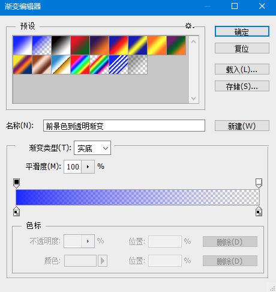

# 工具之渐变

PhotoShop中，渐变和油漆桶工具是一组。油漆桶工具没什么好说的，这里我们主要学习一下渐变工具。

## 渐变工具的使用

选择渐变工具后，我们可以看到在上方出现了一些配置选项，可以调节渐变预设，渐变方向等。

我们可以打开渐变编辑器，更加详细的编辑渐变属性。

## 渐变工具的特殊技巧

实际上，在日常绘画中，渐变工具配合套索有意想不到的效果。

使用从前景色到背景色的线性渐变，然后使用套索工具把渐变固定在一个区域内，这样有时候上一个渐变色会非常方便。
