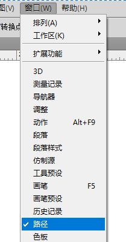

# 工具之钢笔

PhotoShop中，钢笔工具主要有三个用途：

1. 矢量绘图
2. 抠图
3. 矢量蒙版

矢量绘图其实就是类似使用`Illustrator`，通过调节钢笔工具画出的贝赛尔曲线，来构成线条或色块的轮廓（其实和3D建模也十分神似）。

除此之外，其实除了使用数位板画画，传说中还有一种听起来就很困难的绘画方式——“鼠绘”，即只用鼠标，并通过调整线条参数模拟笔压来绘画。其实，用PhotoShop的钢笔工具，也能很容的达到“鼠绘”的效果。

## 路径和路径层

路径：钢笔工具绘制出的矢量线就是路径，它并不是真实存在（画到纸上）的像素，而是一个类似辅助和引导功能的线，我们后续需要对其描画、填充等操作。

路径层：类似图层，路径也可以分层管理，一个层上可以有多条路径，通过层能够实现统一显示/隐藏，描画等功能。

PhotoShop中的路径层面板：

如果找不到这个面板，可以在菜单栏`窗口->路径`中找到。

## 路径和路径层的基本操作

使用转换点工具单击路径，能够选中路径。

使用转换点工具或钢笔工具，按住CTRL单击空白处，能够取消选择路径。

在路径层面板中，单击一个层，能够显示该层的所有路径，单击面板内空白处，使得没有选中任何路径层，能够隐藏所有路径。

没有任何路径层时，使用钢笔工具后会自动创建一个`工作路径`层，这只是一个临时的层，我们需要在其上双击，重命名后保存为正式的层。

## 钢笔工具组的使用

钢笔工具这一栏中，`钢笔工具`、`转换点工具`是非常常用的，下面我们依次进行介绍。

### 钢笔工具

选择钢笔工具后，在画面上不断点击，就能得到直角锚点，和连接锚点的路径。如果需要曲线，我们后续再用转换点工具调整。

补充：按住`SHIFT`还能够画直线。

另一种使用方式是按住笔尖（鼠标）拖动，可以看到拖动得到了一个拉杆，再在空白处添加一个锚点后，就可以直接得到曲线。

钢笔工具能够绘制出闭合路径，只要路径首尾相连就行了。

另外，选择钢笔工具后，在路径上点击会添加锚点，在锚点上点击会删除锚点。因此，我们一般都不用再选取`添加锚点工具`和`删除锚点工具`这两个选项。

### 转换点工具

转换点工具是用来调整锚点的。

选择转换点工具，在画面任意空白位置单击，可以清除当前选择的路径，点击任意路径，可以选择当前操作的路径。

在任意锚点上拖动，可以得到曲线拉杆，用来编辑当前锚点的曲线。

使用转换点工具直接点击一个锚点，能够将其重置回直角锚点。

按住`CTRL`同时用转换点工具拖动光标，能够移动锚点位置。

使用转换点工具框选，能够选中单个或多个锚点，因此也要注意：选择锚点不是直接点击，那样会重置锚点的曲线拉杆！

## 路径的实际应用

### 基础应用

在路径上右键，可以看到描边、填充、建立选区几个选项。

注：如果画笔设定了`形状动态`和`传递`，描边时勾选模拟笔压，还可以得到笔压效果。

### 自定义形状

在路径上右键，选择`定义自定形状`，能够将其保存为自定义形状。注意：当前层所有路径会一起保存为一个形状。

选择自定形状工具，能够再次使用我们刚刚保存的形状。

这对于绘制漫画气泡框等操作时，很有帮助。同时，自定义形状，也可以按照路径的方式来操作。

### 矢量蒙版

矢量蒙版，即用我们画出的路径来作为蒙版。这一般用于漫画、宣传画的分格等效果。

要添加一个矢量蒙版，需要先绘制一个作为蒙版的闭合路径。

然后在图层面板中，按住`CTRL`键点击`添加图层蒙版`按钮，这个操作会添加一个矢量蒙版。

注：或者在菜单栏中选择`图层->矢量蒙版->当前路径`。

由此便可以得到类似分格的效果。

注：图中路径是我额外描黑的。
