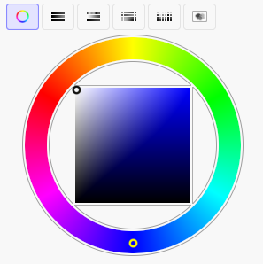
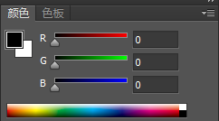
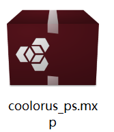
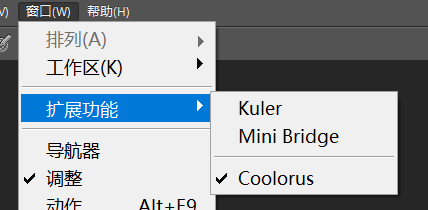
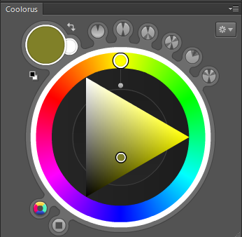

# coolorus 调色板插件

很多流行的绘画软件，其调色板都是这种形式：

然而PhotoShop这个软件偏不是这样，选择颜色也非常不顺手：

好在有一个叫做Coolorus的软件能够解决这个问题。

## 安装

Coolorus售价和更新费用并不便宜，这里我们找到了一个学习版来研究学习。

安装方法很简单，双击其中的`mxp`文件，默认会启动`Adobe Extension Manager`程序，稍等几分钟，就会自动为`PhotoShop`安装该插件。

安装完成后，在`窗口->扩展功能`中即可找到该插件面板，打开即可。

## 使用

这个插件使用比较简单，这里就不多说了。
