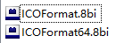
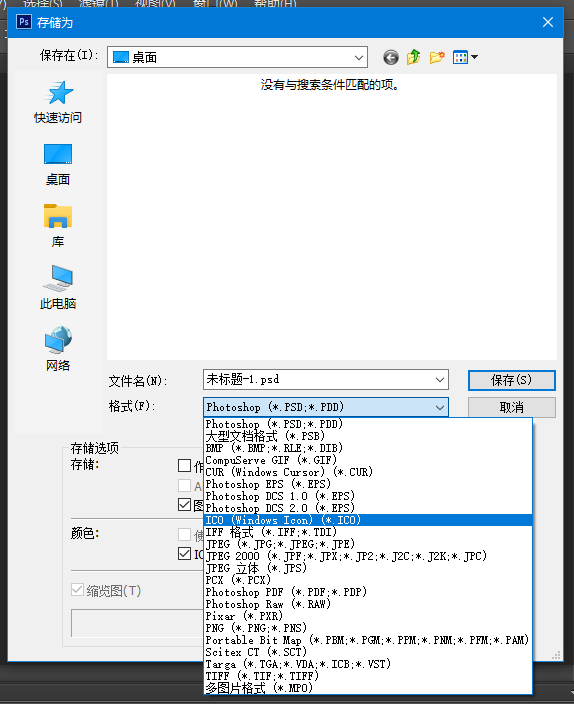

# 制作ico格式图标

PhotoShop保存时，默认没有输出ICO格式的选项，`ICOFormat.8bi`这个插件可以增加输出ICO格式文件的选项。

## 安装

带`64`字样的文件适用于64位PS。

将插件文件放在PhotoShop安装目录下`/Plug-ins/File Formats/`文件夹内即可。

## 保存

PhotoShop中，选择`文件->存储为`，即可选择保存为ICO格式。

注：保存图片的大小不能大于`256x256`。
