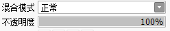
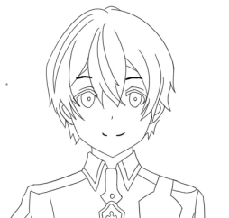
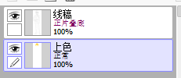
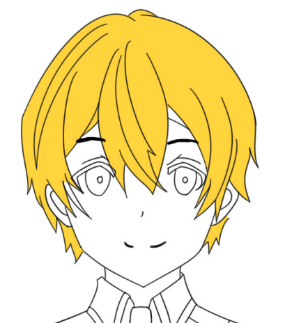
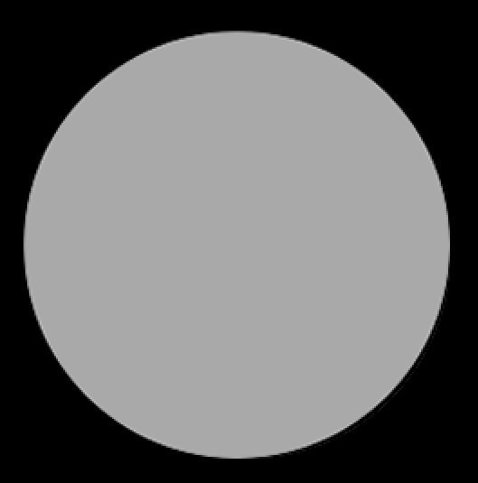
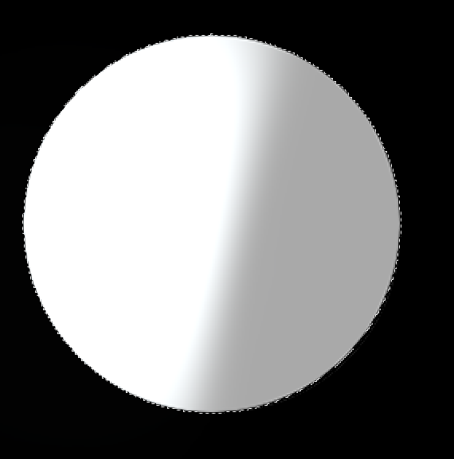
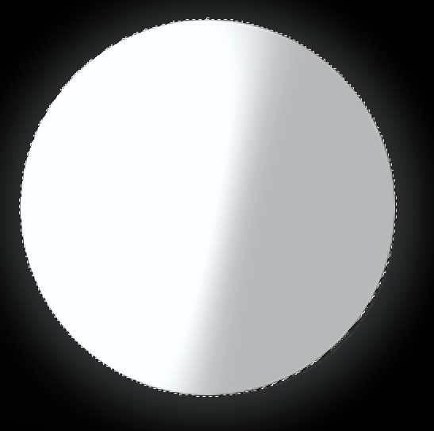
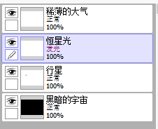

# 图层混合模式

SAI2的图层有个混合模式，这篇笔记主要记述这个混合模式的用法。

## 正片叠底

「正片叠底」这个名字理解不能的模式，一般用于从黑白参考图上描线或上色。

假设现在我们有这么一张线稿图，我们想直接上色，但是图背景是白色的（因为是JPG，不会有透明度），如果直接将涂色层叠在线稿下面，涂色会被白色盖住，而涂到线稿上面，则会盖住线条，也是不行的，这时候就应该将线稿设置为「正片叠底」。

这样在涂色的时候，软件会自动计算颜色的叠加混合，白色会被「透过」，黑色则不会。

注意：正片叠底图层一定要放在上面。

## 发光

「发光」混合模式是一个比较常用的类似特效的手段，可以用于绘制黑暗中摇曳的灯光，或是物体身上的漫反射光Z，「发光」最好配合喷枪使用。

现在我们画一颗宇宙中很常见的岩质星球，它有灰白色的表面，但是一面受到了恒星的强烈照射，会非常亮。

加上发光图层，用喷枪绘制几笔。

加上一点点稀薄的大气，灰尘会造成漫反射。

发光图层就是这样用的。

