# 尺子

SAI2中的尺子非常好用，有了尺子可以说是想画直线就画直线，想画圆就画圆，非常好用。此外，还有透视尺这种神器，也省的我们画透视效果的画面时画一堆辅助线的操作了。

所有有关尺子的操作都是用的`CTRL`，`SHIFT`，`ALT`这三个快捷键，具体我也记不清，用的时候随便按按就出来了，`CTRL+R`能够切换普通尺子的显示和隐藏，透视尺在图层上面的工具栏创建。

## 普通尺

### 直线

直线就是个直尺。

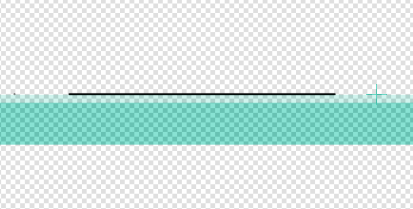

### 椭圆

椭圆尺拿出来是个正圆，能够通过拖动边界，让它变成椭圆。

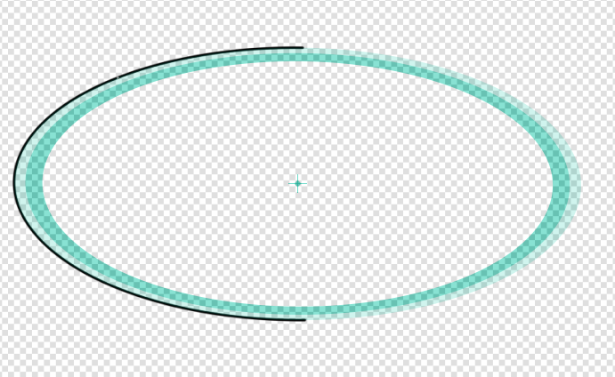

### 平行线

平行线能够画多条平行的直线，其实可以替代直线尺。

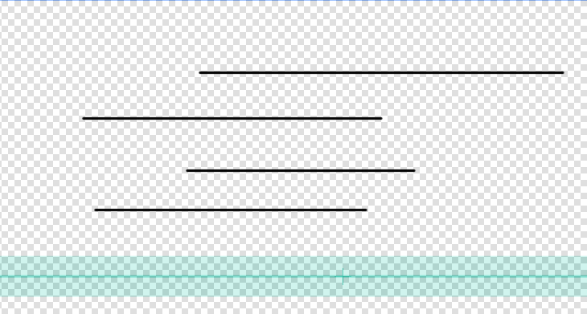

### 同心圆

和椭圆尺的区别就是能画多个半径不同的椭圆，可以替代椭圆尺。

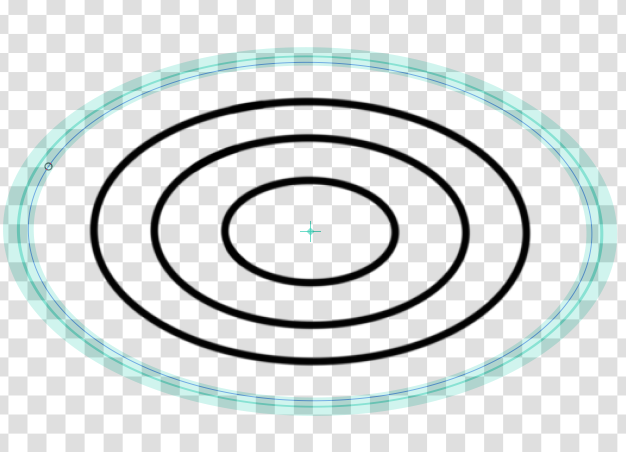

### 集中线

集中线，顾名思义。

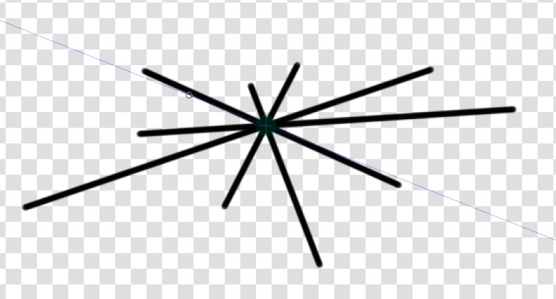

## 透视尺

一点透视尺还好说，但是二点三点透视尺不是太好用。透视尺两条相同颜色的线交点代表透视灭点，调整透视尺的技巧就是先画个草稿，否则分分钟把尺子弄乱。

### 一点透视尺

新建一个一点透视尺，就会出现如下图的一堆线，这是一点透视的几条辅助线，我们可以沿着红绿蓝三条线进行一点透视图的绘制。

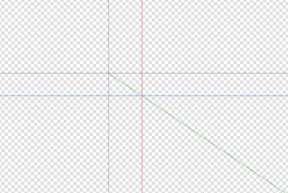

绘制的时候，笔压也会自动调整。

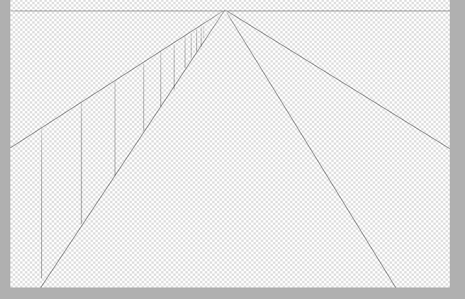

在图层这里，我们可以切换显示隐藏透视尺，或者删除它们。

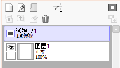

### 两点透视尺

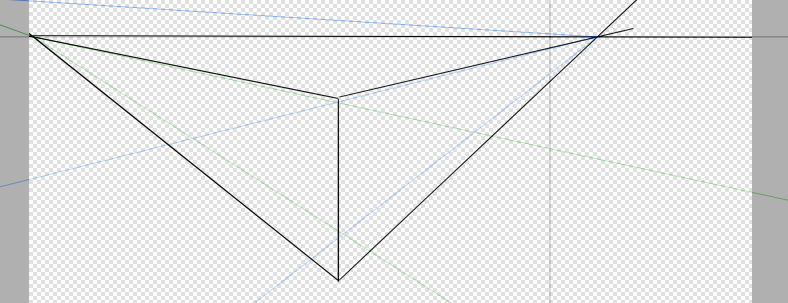

### 三点透视尺

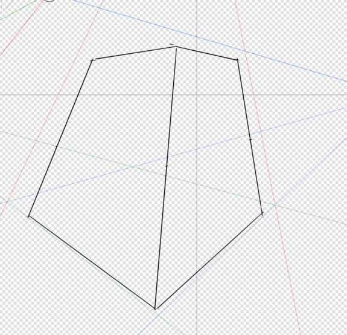

### 二点透视网络

这个透视网络就比较奇葩了，我也没太搞清楚这是用来画啥的，可能是表现一个面的吧。

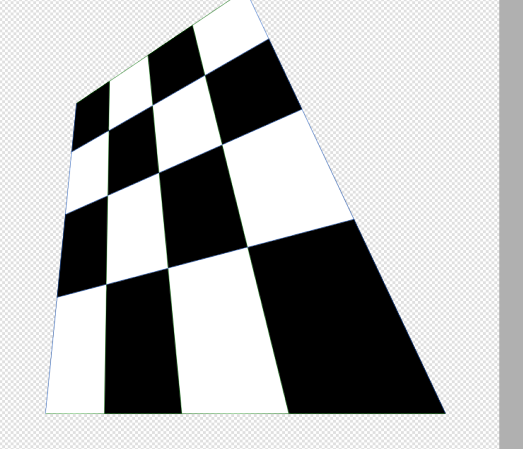

### 三点透视网络

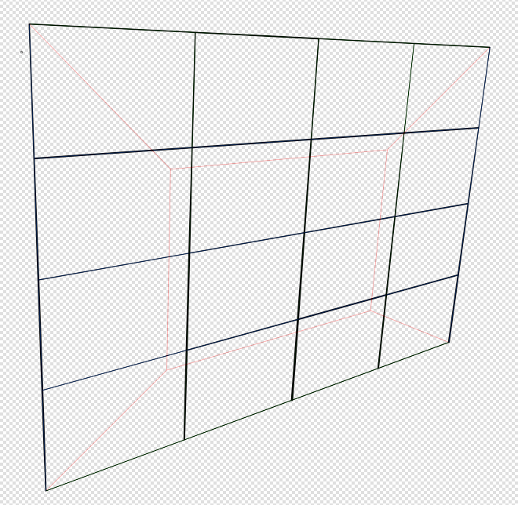
