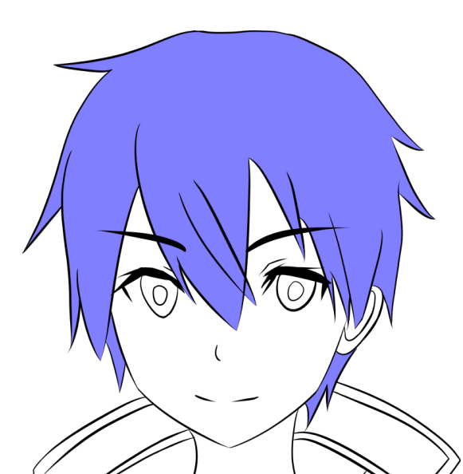
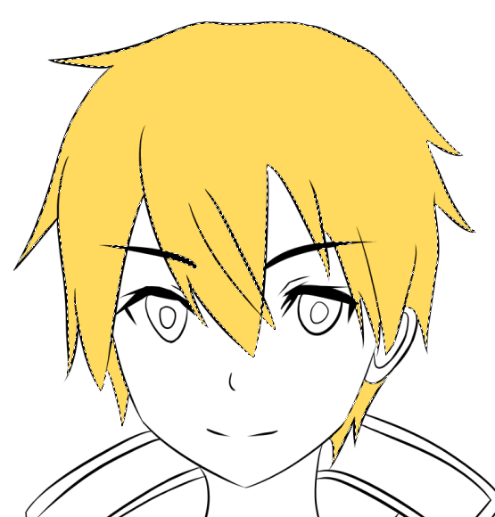
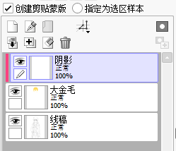
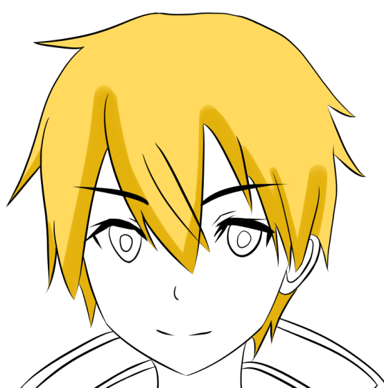
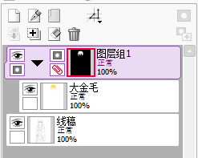
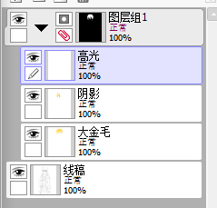

# 蒙版工具

SAI2中，蒙版的最大作用将就是涂高光和阴影的时候，防止把颜色涂到外面去。有效的利用蒙版，能够极大的提高生产力。

下面直接以实际例子的形式，介绍如何使用剪贴蒙版和图层蒙版。

## 剪贴蒙版

这里找一张线稿，我们现在打算给头发上色，首先新建一个上色图层，用魔棒把所有要上色的区域选中，注意调节魔棒的「色差范围」和「防止溢出范围」。

随便涂个金毛。

新建一个图层上阴影，勾选「创建剪贴蒙版」。

这样上阴影的时候就不用担心颜色溢出了。

## 图层蒙版

「剪贴蒙版」只能根据一张底图层锁定像素，「图层蒙版」能创建一个锁定像素的图层组。

在涂色选区激活的情况下，创建一个「图层组」，把激活选区的图层拖进去，然后选中图层组，点击「创建图层蒙版」，就会变为如图情况。

此后，该图层组新加的图层都会应用蒙版的像素锁定。

这样就不用担心各种阴影、高光图层的颜色溢出了。

