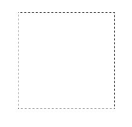
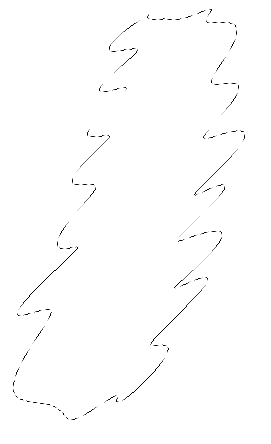
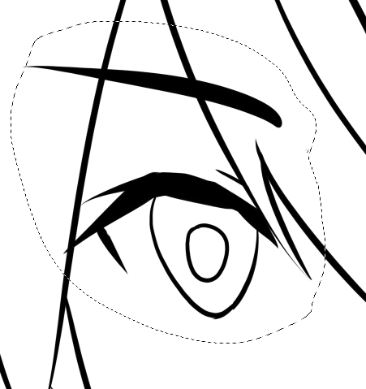
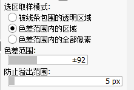
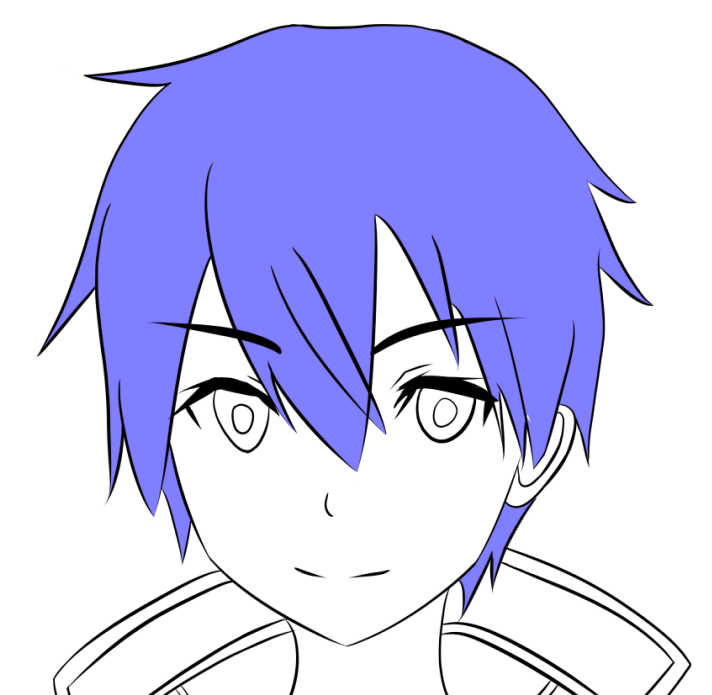
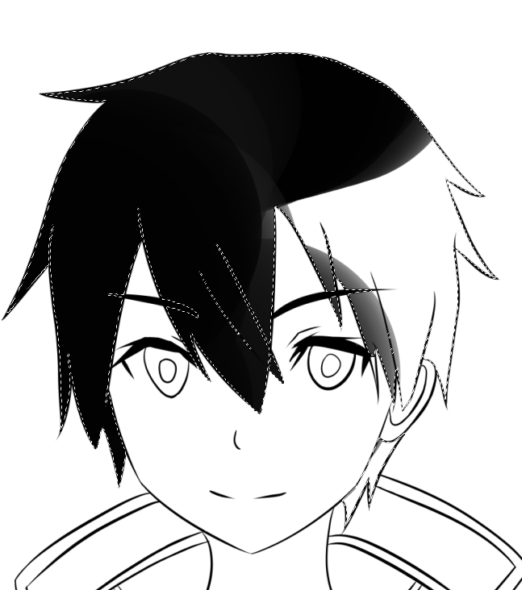
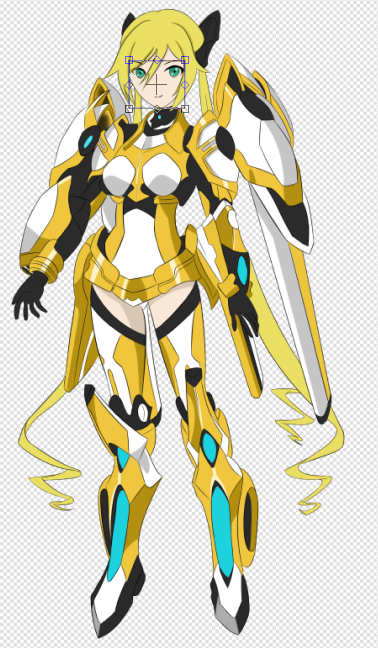

# 选区操作

选区操作是SAI2中最重要的操作，利用好各种选区工具，能够极大提高我们的生产力。

## 矩形选区

这个非常简单，没啥说的。

注：按住`SHIFT`能够画出正方形选区。

## 套索

套索工具能够实现自由选取，这个工具必须配合数位板试使用。

套索工具非常实用，假设你把眼睛画歪了，这样选中操作下就行（画的时候肯定是分图层的）：

## 魔棒

魔棒工具在涂色的时候非常实用，有很多人觉得魔棒选区涂色有锯齿，结果就用画笔去一笔一笔的涂，费时费力，实际上是魔棒没设置好，魔棒有这么几个参数可以调整，针对每幅画都要合理设置。

魔棒工具多次点击鼠标，就能实现多选区域（选中呈蓝色）。

选好选区，涂色就比较爽了。

注意：线稿一定要闭合，否则涂色时没法用魔棒，那就很麻烦了。

## 选区笔和选区擦

「选取笔」、「选取擦」，顾名思义就是像笔和橡皮一样涂抹选区，而不是框选选区。这个工具一般配合魔棒上色。

有时候我们的线稿会出现这种不可名状的bug，导致魔棒无法正常工作，使用选取笔涂上就好。

## 选区剪切、粘贴、复制

* 剪切：CTRL+X
* 复制：CTRL+C
* 粘贴：CTRL+V（粘贴后会自动新建图层）

## 选区自由变换

* 选区自由变换：CTRL+T

比如说现在想调整下脸，选中脸的图层，按`CTRL+T`就可以自动选中有绘制过的区域：

我们主要用这些选项进行调整。
