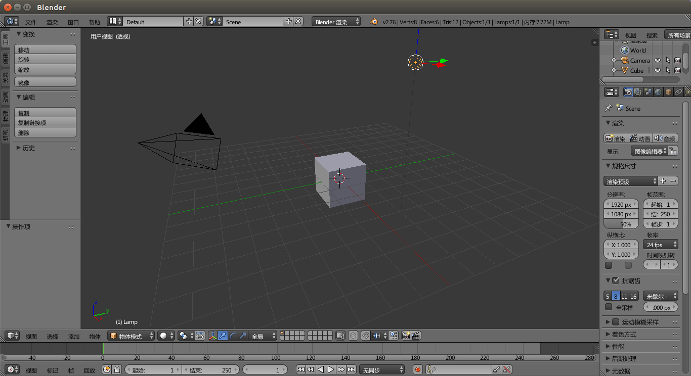

# blender简介

blender是开源的三维动画制作软件，集成了建模，动画，材质，渲染等功能，重要的是这个软件是免费的。blender功能强大，而且可定制化程度很高，对我来说，用来做低面数的游戏模型非常适合。我曾经使用3ds max很长时间，刚开始使用blender，觉得它的缺点之一就是操作比较怪异，不是很容易习惯（不过后来觉得也没什么问题）。

blender操作以快捷键为主，不是所有的操作菜单或工具都能在界面中找到，这和程序开发常用IDE的设计思路完全不同。

## 安装

Linux下直接在软件源中安装即可，Ubuntu16.04目前Blender版本为2.76。

## 调整界面为中文

blender中有很多英文的专有名词，因此建议把界面调成中文。

点击`File->User Preferences`，点击`System`标签，勾选`International fonts`，语言选择简体中文，然后选择一个包含中文的字体文件。Linux下字体文件在`/usr/share/fonts`下，建议使用美观、常用的字体。然后依次点选`Interface`，`Tooltips`，`New Data`。如果未设置字体，界面上的文字就会变成方块。
