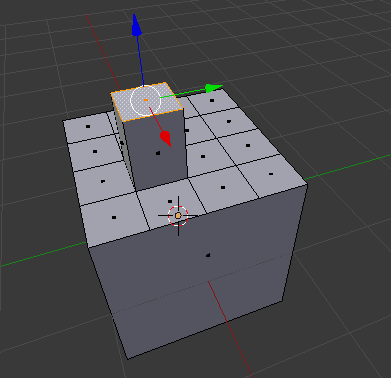
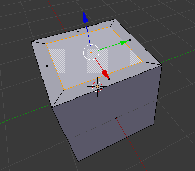
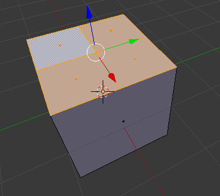
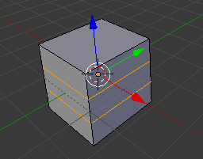
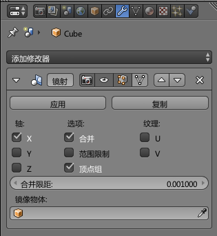
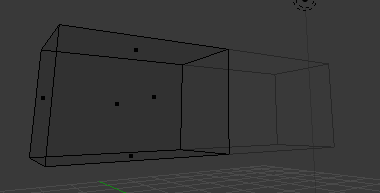

# 建模操作和工具

建立三维模型是一个比较考验个人空间感觉的过程，其中经验也十分重要。这里介绍blender中，和建模相关的操作工具。在场景视图中，按快捷键`T`可以切换建模工具面板。

## 变换工具

变换工具完成的基本工作就是移动、旋转和缩放。在物体模式下，使用变换工具变换的是整个模型，在编辑模式下，变换工具变换的则是被选中的点线面。变换工具十分常用，因此建议记住它们的快捷键。

* 移动：`G`
* 旋转：`R`
* 缩放：`S`

除了使用快捷键，点击下方工具条中的变换工具能够叫出拉杆，拉动拉杆也可以进行变换操作。

## 网格工具

网格工具是建立三维模型时最重要的工具，下面一一介绍常用的网格工具。网格工具需要在编辑模式下使用。

### 挤出工具 extrude

挤出工具是最常用的工具，快捷键为`E`，选中一个面使用挤出工具，效果就像牙膏被挤出来。

### 各自挤出

挤出工具的一种变体，如果选择了两个法线方向不同的面，使用各自挤出，可以让这些面沿着自己的法线方向延伸。

### 内插面

在一个面内分割出一个子面。和挤出（挤出高度为0）后调整大小效果差不多。

### 创建边/面

快捷键为`F`，选择若干边或顶点，可以讲其自动连接成面或边。

### 细分

可将所选的面或边等比例分割。

### 环切

环切十分有用，点击环切工具后，将鼠标移动到一个面上，会自动识别和这个面形成面环的所有面，并在所有识别的面上显示紫色的切割线，使用鼠标滚轮可以调整环切的切割线数，鼠标左键单击确认后，可以沿识别的面环拖动切割线，再次鼠标单击即可确认。

### 切割

切割工具可以在面上切出新的边。使用切割工具，鼠标会变成刀片图标，鼠标位于顶点或线上时，会自动识别，单击鼠标确认切割点，`Enter`键确认完成切割。

### 切分

切分工具可将一个面切分为两个面。选中一个平面，使用切分工具，在该平面上拖动鼠标，可以看到一个可调整的切割线，松开鼠标确认切割线。

## 选择工具

除了鼠标右键选取模型或点线面，还有一些快捷键可以帮助我们高效地完成选取操作。

* 框选 `B`
* 套索选择 `Ctrl+鼠标左键`
* 反选 `Ctrl+I`
* 关联选取 `L` 一个Object可能是由不连续的物体组成的，关联选取会选择所有和当前选中组件相连的组件

## 融合和合并工具

选中若干点或边，使用快捷键`Alt+M`可以呼出合并菜单，通常选择`到中心`，所有选中点线面会尽量合并为一个点。

除此之外，选中若干个面，按快捷键`X`，选择`融合面`、`融合边`等，可以产生融合效果，融合效果和合并不同，例如：选择同一平面上两个面融合，结果是一个更大的平面。该菜单也包含删除功能。

## 镜像操作

建立对称的模型时，必须使用镜像操作。比如建立一个人体模型，我们只建半个就好了，另一半镜像过去，否则两面一起操作每次操作都要选中左右两边，面数多时，是几乎不可能完成的。

镜像操作需要添加镜像修改器。按`Tab`进入编辑模式，使用两次`A`快捷键使物体被全选，右侧修改器中添加`镜射`。注意被镜射物体的初始位置，如果不和坐标轴对准，看着比较难受。

如图，菜单中可以改变镜射的轴，同时通常建议勾选`范围限制`，可避免顶点在变换时穿过镜像。

注意：镜像的两个半模型即使“靠拢”到一起，中间的面也不会自动删除，因为这些面完全看不到，所以需要手动删除。

## 如何下手

假设我们现在想出了一个想要制作的模型，甚至已经画出了三视图，那么从哪下手开始建立这个模型呢？

对于较规则、形状方正的物体，比如房子，车辆，可以从预设物体如cude开始，对cube进行切分、挤压等操作，使其渐渐成型。对于不规则的生物体，尤其是在有参考图时，可以从一个点开始手动构造剖面，然后挤压出立体，再细分调整。
