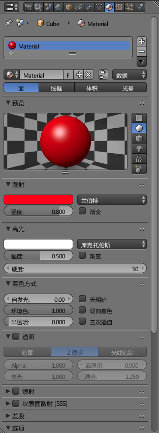

# 赋予物体材质效果

现实中，物体有金属，布料，塑料等不同材质，不同材质反光效果，透明度等均不同，blender中使用材质的概念表现这种效果。

## 为一个物体添加材质

在`物体模式`下，选中物体，点击材质面板，可以创建一个新的材质。

其中有一些选项可以供我们调节，比如：漫射实际上就是物体材质漫反射的颜色（可以理解为物体颜色），高光是指物体表面的反光点，我们可以调节高光光斑的强度，大小等。这些选项比较简单，就不细说了。

## 材质和物体的关系

blender中，我们可以将物体和材质看做两组对象，一个物体不同表面可以赋予多种材质，多个物体也可以共用一个材质。

## 为一个物体指定面设置单独材质

选中若干个面，在右侧材质面板中，添加一个材质，然后点击`指定`，就能为若干个面单独制定材质了。
