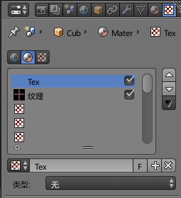

# 贴图的作用

我们通常看到的游戏中的3D模型其实处于性能考虑，面数不会太多，但是有时候又要求模型必须体现一些细节，这些细节就可以通过贴图来体现。比如人物模型的眼球，一般不会细分其结构，而是画一个眼球贴上去。除此之外，还能用贴图实现物体表面凹凸的效果。

## blender中设置贴图

在物体模式下，点击纹理面板，可以看到和贴图有关的选项。

如果我们希望把一张外部图片贴到模型上，可以选择贴图类型为`图像/影片`，然后载入一张图片即可。

## 通过贴图表现凹凸效果

在`纹理面板->影响`菜单中，可以看到默认值选择的是`漫射`，如果要实现凹凸效果，可以选用`几何体`选项，注意此时要求贴图是灰度图像，blender会根据灰度在渲染时，实现凹凸效果。这个凹凸效果不会增加模型的面数。

