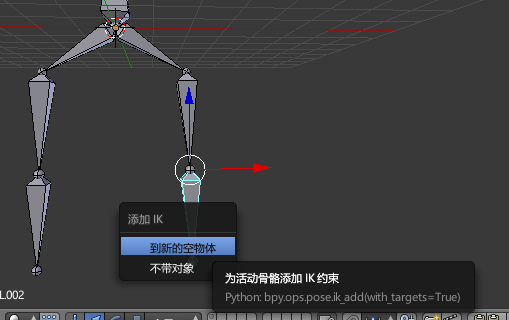
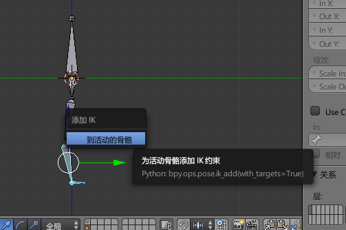
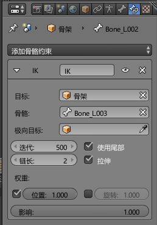
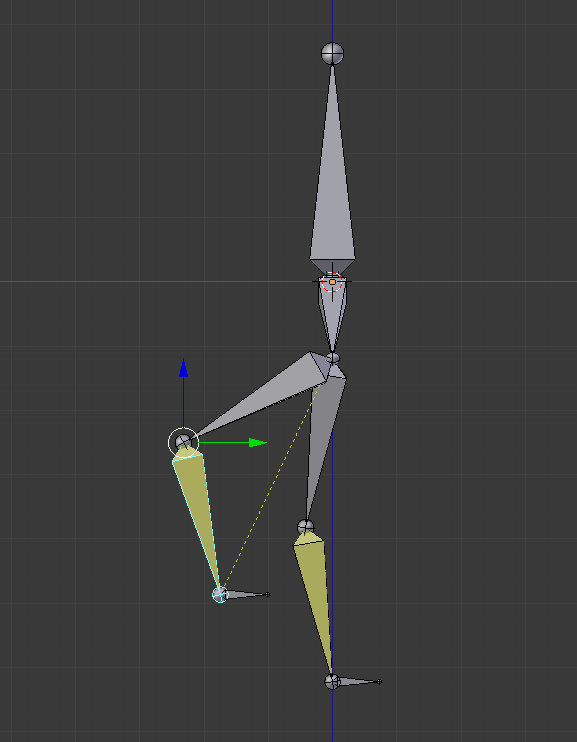

# 反向动力学骨骼

在骨骼动画的创建中，正向的骨骼调整（前一篇介绍的最简单的骨骼系统）往往用起来比较麻烦，调整整个模型的姿态时，只能从父节点骨骼一节一节往下调整。

除此之外，很多3D游戏需要实现布娃娃系统（Ragdoll，例如《上古卷轴5》里角色死亡后姿势由物理系统计算得出，而不是录制的固定的死亡动画，而例如《Mabinogi》实际上没有物理系统，所有角色动画都是事先录制的，角色不管怎么死都是一个飞出去再倒地的姿势）。

这些情况下，需要用到反向动力学骨骼（Inverse kinematics：简称IK）。

IK简单来说，就是先确定子骨骼的位置，然后反向求出其上任意节父骨骼的位置，从而确定整个骨骼链的状态。blender里支持这种算法，实现IK十分简单。

## 创建IK

在姿态模式下，选中要添加IK的骨骼，然后使用快捷键`Shift+I`，可以弹出添加IK菜单。

* 到新的空物体：创建一个空对象（Empty Object）作为IK的操纵点
* 不带对象：不创建空对象

实际上还有另一种方式：

* 到活动骨骼：使用一个额外的骨骼作为IK的操纵点

这里建议这样创建：在一个需要IK的关节新建一个小骨骼，取消这个小骨骼的所有父级关系，选择这个小骨骼和原父级骨骼（注意选择顺序），使用Shift+I弹出菜单，使用“到活动的骨骼”创建IK的操纵点，创建后，如图。被小骨骼作用的骨骼会被标为黄色。

使用一个小骨骼的好处：取消了所有父级关系的小骨骼作为操纵点，它可以用来记录其初始位置，调完姿势，可以使用`Alt+G`恢复。

默认情况下，IK的作用范围是选定关节到根节点（blender会用虚线标出），我们可以通过调整IK作用的链长，来调节IK的作用范围。选择`骨骼约束`，调整`链长`。

这样使用IK调节骨骼就比较形象了，上图中是一个类似直立生物的腿部骨骼。调完姿势，如果想要恢复，使用`Alt+G`即可。
