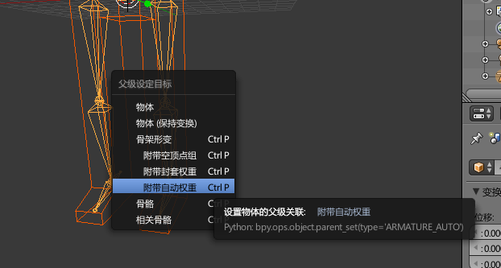
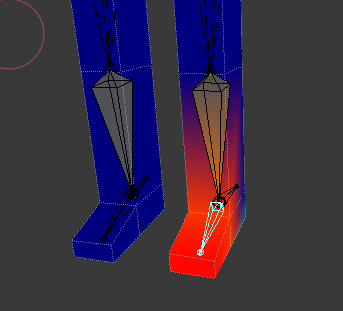
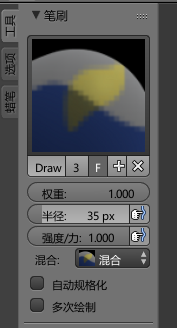
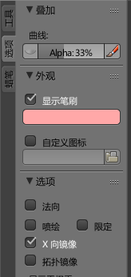

# 权重绘制模式

将骨骼绑定到模型时，我们需要调整骨骼的影响范围，以及对于某些顶点的影响强度。

骨骼和模型绑定的一种方式是，为模型添加骨架修改器，使用`封套模式`的骨骼，调整关节大小，以此调整骨骼的作用范围。但是我们此时并没有调整骨骼对于顶点的影响强度。三维设计软件中中引入了“权重”的概念，表示这个影响强度。

## 使用权重绘制模式

这里我们就不使用`封套模式`骨骼了，在物体模式下，先选中模型，然后选中任意一根骨骼，按`Ctrl+P`，选择`附带自动权重`。这个选项的作用：自动给模型添加一个骨架修改器，自动设置一些顶点的权重。

点选模型，进入`权重绘制模式`，右键点选任意一根骨骼，模型上就会显示出顶点的权重分布。

深蓝色代表权重最低，绿色，黄色，权重逐渐升高，红色为最高。

左侧工具栏中，可以看到权重绘制的笔刷，也就是说，我们可以使用笔刷像涂色一样绘制顶点的权重（所以，这个步骤也俗称“刷权重”）。笔刷的调整比较简单，这里就不介绍了。

注意，对称绘制时，可以勾选`选项->X轴镜像`。
