# 骨骼系统简介

我们制作的3D模型不光有静态的，有时候还需要模型具有动作。比如：人物模型需要有走动的动作，捡东西的动作等。这个动作动画和传统二维动画的制作过程是不一样的，传统2D动画是分别绘制动作的每一帧，每一帧都是从头画起的。游戏中2D人物的走动动作，往往是许多已经画好的序列帧图片，在循环绘制到屏幕上。

对于3D模型，动画的每一帧都重新建模是不可能的，3D模型采用模型绑定骨骼的方式，动画作者通过操纵骨骼，就能让模型摆出不同姿势。通过摆姿势录制动画的每一帧，导入3D游戏引擎中。其实，2D的游戏中也渐渐开始采用绑定骨骼的方式实现动作了。

## blender中使用骨骼

下面举一个骨骼使用的简单例子：通过骨骼实现圆柱体的弯曲动作。

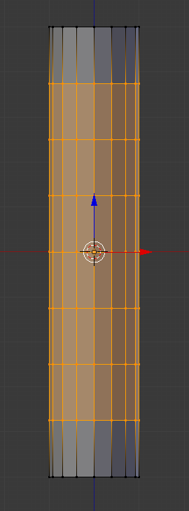

这里我们创建一个圆柱体，并用环切工具将其切7刀。

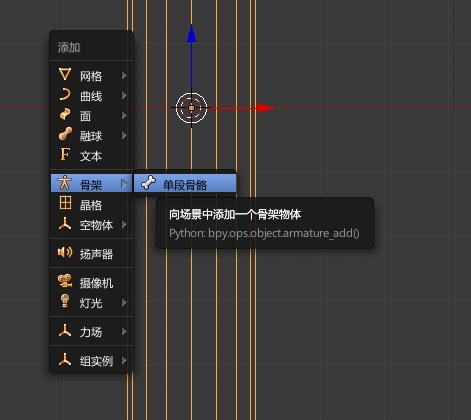

切换回物体模式，使用`Shift+A`调出创建菜单，创建`骨架->单段骨骼`。

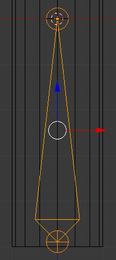

选中骨骼切换到编辑模式，我们就可以对这段骨骼进行平移、旋转、缩放操作了。这里我们要注意，一段骨骼其实包含三个可操作的节点，整个骨骼本体，和两端的两个关节。

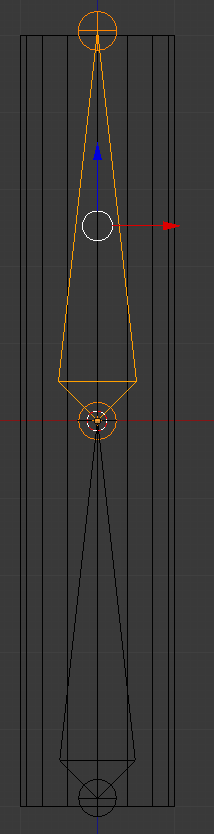

选中一个关节，使用挤出工具（快捷键`E`），我们就能创建一段新的骨骼。新建的骨骼是原来骨骼的子物体，骨骼有一个特点：父骨骼移动时，会带动所有子骨骼，子骨骼移动时不会影响父骨骼，和父骨骼相连的关节点不会移动（效果就是子骨骼只能绕父骨骼旋转）。

从blender数学实现上来看，这也符合道理，父子骨骼组成树形结构，某块骨骼移动，所有子节点乘以变换矩阵即可，父节点不受影响。

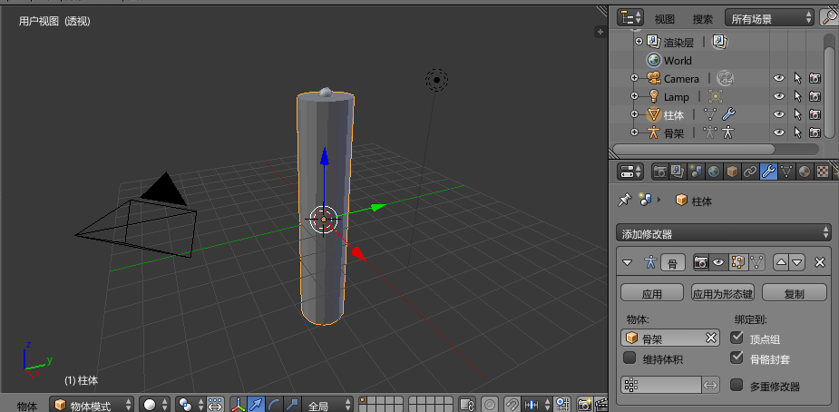

创建好骨骼后，我们需要把圆柱体绑定到骨骼上。回到物体模式，选中圆柱体，添加修改器`骨骼`，`物体`中选择我们刚刚创建的骨骼（注：第一个创建的骨骼默认被命名为叫做`骨架`的物体）。注意勾选`骨骼封套`。

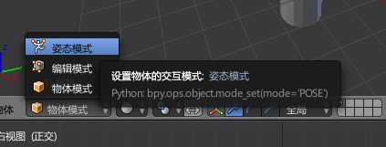

选中骨骼，进入`姿态模式`。我们给模型摆动作就是在这个模式下进行的。

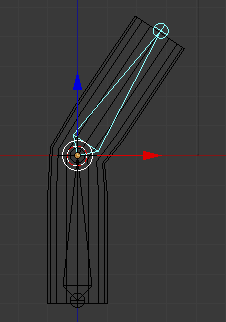

我们移动某段骨骼，就可以看到效果了。

注意：如果想要恢复某段骨骼的角度改变，我们可以选中一段骨骼，按`Alt+R`或`Alt+G`，全选可以恢复整个骨架到初始状态。（注：因为骨骼的一个点被父节点固定了，因此只能围绕父节点旋转，即旋转工具和移动工具是等效的，所以恢复旋转之前的初始状态`Alt+R`和恢复移动之前的初始状态`Alt+G`都可以）

## 骨骼作用于顶点的范围

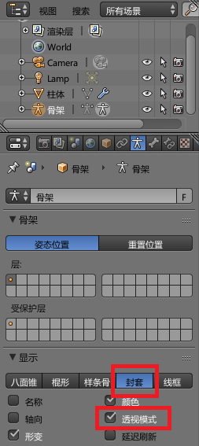

骨骼的作用范围可以通过关节进行调整。这里我们选中`骨架`物体，`数据->显示`中，列出了几种可用的骨架显示方式，默认为`八面锥`，这里我们选择`封套`。

注：勾选`透视模式`可以在场景编辑器中，渲染模型表面的同时，透视看到骨骼，比较好用。当然，不使用透视模式，使用`线框`显示模型也可以。

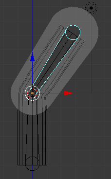

编辑器中切换到`姿态模式`，就可以很方便的显示出骨骼的作用范围了。`编辑模式`下，也会显示出选中骨骼部件的作用范围。

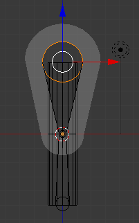

编辑模式下，我们可以用`Alt+S`对关节大小进行缩放，以此控制一个关节的作用范围。注：本来这个功能是快捷键`S`（缩放工具），新版本blender不知为什么改成了`Alt+S`，而且工具栏里也没有对应的功能按钮，不知道是怎么想的。

## 创建镜像骨骼

生物大多是对称的，因此需要镜像创建骨骼。和镜像模型不同，镜像创建骨骼不是使用修改器，而是骨骼在编辑模式下，直接勾选`选项->骨架选项->X轴镜像`，如图。

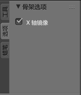

注：我们知道前视图是看向X轴正方向的，这里“X轴镜像”实际上意思就是正视图中，左右对称创建。

镜像后，骨骼分叉的地方需要使用`Shift+E`创建，分叉后，使用`E`创建的骨骼就具有镜像性质了。

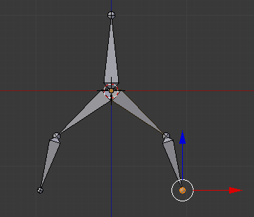

## 注意

1. 使用骨骼开始摆动作后，再在编辑模式中修改骨骼或部件的相对位置，就要十分注意了，可能编辑模式里动一点，摆好的姿势就全乱了。因此调整骨骼和建模，展UV，画贴图一样是个十分需要耐心的操作，游戏模型的骨骼和动作尽量复用。
2. 绑定好骨骼的模型如果想要移动、旋转、缩放，一定要模型和骨骼都在物体模式下，同时选择模型和骨骼，然后执行移动、旋转、缩放操作，否则会错位。
