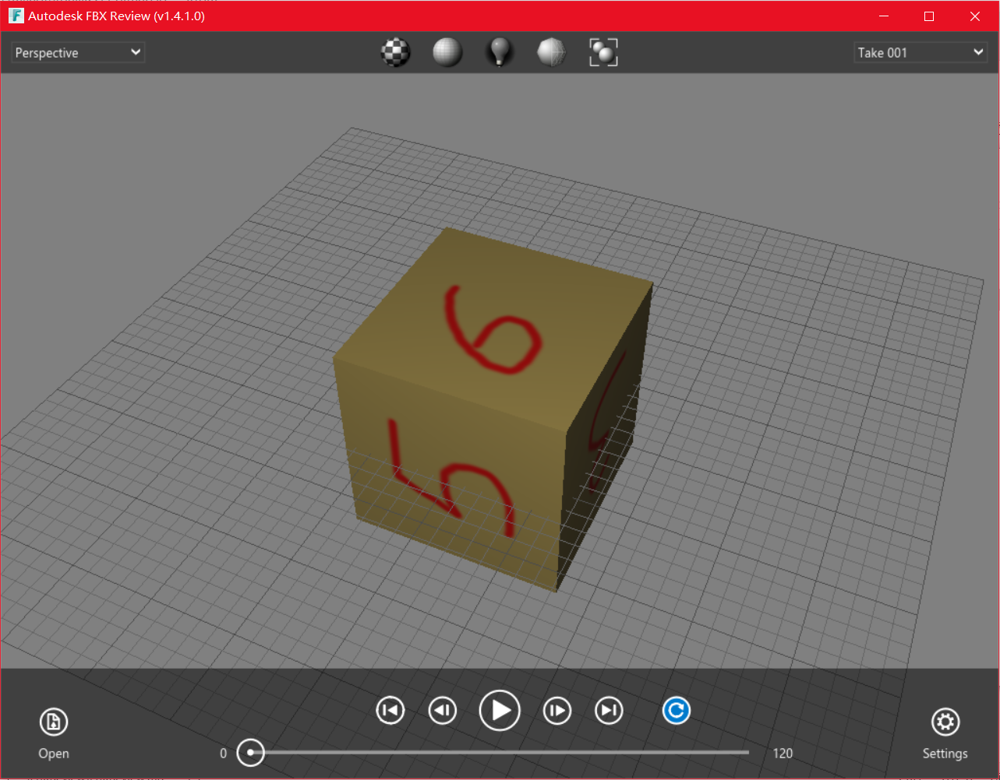

# FBX Review

游戏开发中，我们经常需要从三维设计软件导出模型到游戏引擎，Autodesk发明的FBX是比较常用的格式。网上下载的fbx文件有时候我们仅是想看看里面内容对不对，Autodesk提供了一个软件FBX Review，用起来比较方便。

下载地址：[https://www.autodesk.com/products/fbx/fbx-review](https://www.autodesk.com/products/fbx/fbx-review)

操作：左键拖动改变视角，滚轮缩放视角，鼠标中键平移场景，右键显示/隐藏菜单。
