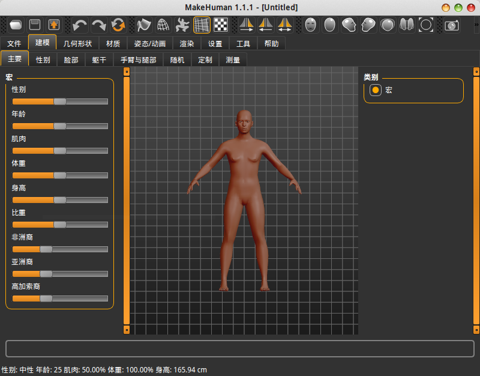

# MakeHuman 安装和简单使用

## 简介

MakeHuman是人体建模工具。人体模型建起来真的很费时间，通常都是直接使用现成的模型，或者在现有的基础上改进。很多3D游戏有捏脸系统，这种捏脸系统提供了预制的人物模型，玩家在上面通过调整几个有限的参数进行改动。MakeHuman虽然不算捏脸系统，但是使用方法差不多，重要的是导出模型还提供了骨骼，这真的非常方便。

当然，这个软件只能捏出真实系的人体模型，对于漫画风格的美型人物，怪物之类的帮不上什么忙。一般也只用它捏一下裸体，输出的模型也要进行一些外观调整，包括发型、衣服等。

## 安装

Ubuntu下可以通过ppa进行安装：

```
sudo add-apt-repository ppa:makehuman-official/makehuman-11x
sudo apt-get update
```

Windows下需要到官网下载安装包进行安装。

## 运行软件



场景视图中，鼠标左键可以拖动摄像机围绕模型转动，鼠标中键可以上下左右拖动摄像机，鼠标滚轮可以进行缩放。

注：`设置->通用->语言`菜单可以调节为中文界面。

## 导出模型到blender
