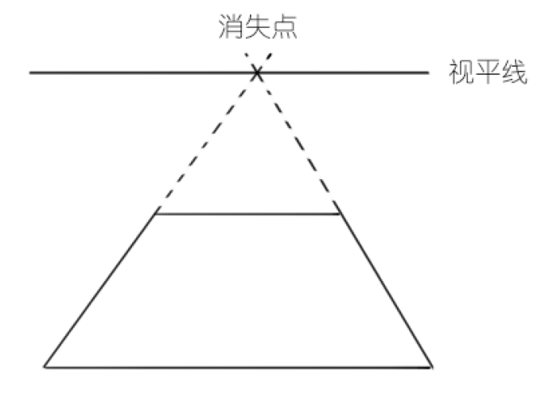
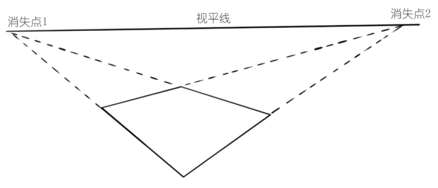
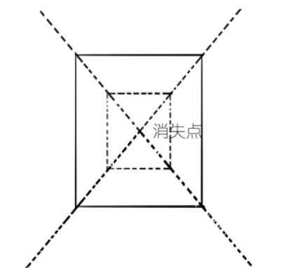
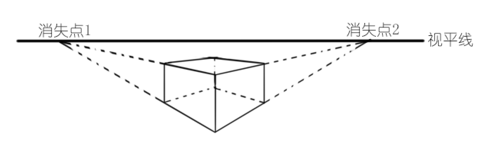
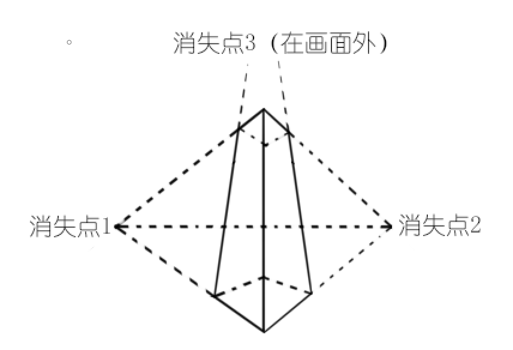

# 透视的原理

当我们试图在二维的纸上或屏幕上描绘三维空间时，为了使这个二维画面更具有立体感，诞生了“透视”的概念。简单来说，透视可以概括为四个字“近大远小”，最常见的一个能直观感受透视的例子就是一张延伸到远处的铁路的图：

两条铁轨实际上是平行的，但是在延伸到无限远时，其间距变得越来越小，直至交于一点。

## 透视的理解

在3D图形学相关章节中，我们了解过一个概念叫“平截头体”，或是“视锥体”，无论人眼还是摄像机的镜头，我们感受光线的这一端可以看作为一个小矩形面，而看到的画面可以看作一个大矩形面（当然人眼肯定不是不是矩形），可以这样近似理解：我们只能看到物体表面某一点漫反射光中，方向恰好指向镜头的那缕光线。

但这里还有个问题，多个物体发出的光线会互相干扰，只有一组CCD或视网膜放在世界中，同一点会接收到许多点发出的光线，它自己是无法成像的，只能感受到一片模糊的光晕，这时必须配合凸透镜（晶状体）来实现成像，由此有一个焦距的概念，人眼或镜头实际上只能看清一定成像范围内的物体，这部分是初中光学内容，就不多介绍了。

人眼和摄像机都是变焦装置，虽然摄像机像素和人眼没法比，但摄像机比人眼多了个功能：调节相距，视网膜或CCD的面积是固定的。调节相距相当于平截头体另一端同一位置截面的大小变化了，平截头体四棱的倾斜程度改变了，这会对透视效果造成影响。我们可以直观的感觉到，照同一距离的同一人，“广角”镜头透视效果“弱”，人脸显得“扁”，“长焦”镜头透视效果“强”，人脸显得“立体”，这就是“透视程度”不同造成的效果。

回到画画上，这里就出现了一些困难，我们是在一张纸上来模拟三维成像的效果，首先距离成像焦距远的地方的模糊效果就难以画出来，只能近似糊一糊来表示，或者干脆都画成清晰成像，这是反直觉的；第二个问题是平截头体棱的倾斜程度，也就是透视效果的“强弱”也完全是凭感觉来的，这和人脑的空间想象能力有关，弱的人虽然有透视的概念，但表现到画面上就是透视效果“不均匀”，自己也感觉不出画的透视效果对不对，这时就需要靠辅助线来补正，强的人不需要辅助线，大致画一画草图，不断修改线条到符合自己大脑预期，就是一幅正确的透视图，这个就很NB了。

## 基本概念

画透视图时，有一些可以辅助我们画出正确透视图的技巧，这需要掌握一些基本概念。

**视平线**：摄像机俯仰轴和横滚轴组成的平面，和画面的交线，在地表附近，且没有横滚时，视平线就可以当做地平线，因此是个重要的参考量

**消失点**：画面中两条平行线在透视图中的交点

注：姿态角（Euler角）用来表示场景中的摄像机非常适合，它用三个矢量确定一个相对姿态，即俯仰、偏航、横滚，这三个矢量就是字面意思，很好理解。

## 透视的画法

画面模拟的是三维空间，我们知道所有物体其实都可以近似成矩形面和立方体，下面我们就以矩形面和立方体为例，介绍一些透视图的画法。

### 面一点透视

之前例子中，铁路其实就可以看成面一点透视。

### 面两点透视

### 立方体一点透视

立方体一点透视的情况比较少，因为透视的方向都被挡住了，难以画出立体感，这也是为什么漫画里脸半侧面比正面多，因为好画。

### 立方体两点透视

### 立方体三点透视

三点透视在有俯仰姿态时会发生，比如一个从下向上仰望大楼，或是从上到下看一个深坑。

