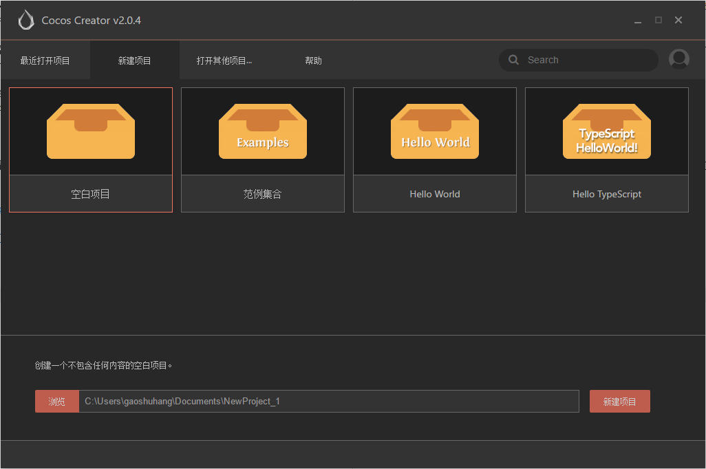
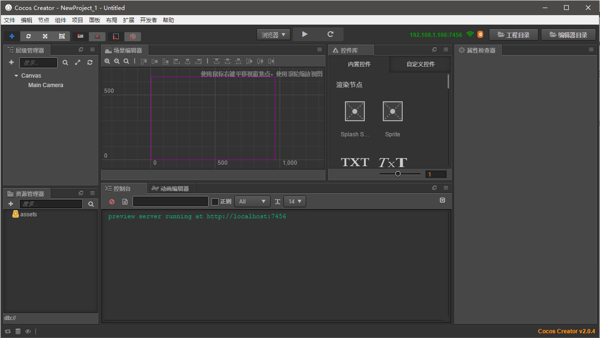
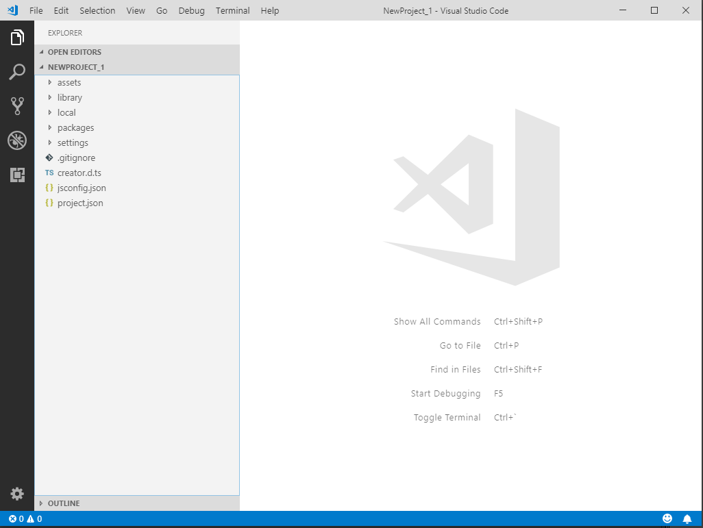
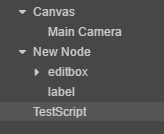
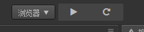
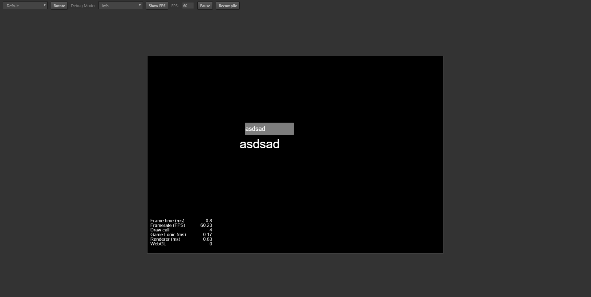

# Cocos Creator 简介和环境搭建

## Cocos2D发展历史

最初，cocos2D是在2008年，由阿根廷程序员Ricardo Quesada使用Python语言编写的一个游戏引擎，后来使用Objective-C重新编写了Cocos2D for iPhone，成为了iOS平台上一款十分成功的2D游戏引擎。后来，cocos2D引擎由许许多多人进行了各个平台的移植，其中在国内比较成功的版本是cocos2d-x，是国人作者王哲的C++移植版本，cocos2d-x最大的优点之一是跨平台支持，不仅支持Android、iOS，还支持桌面操作系统Windows、Linux等，在2014年左右，cocos2d-x制作手机游戏相当火。

cocos2d-x由北京触控科技支持，这家公司主要靠手机游戏“捕鱼达人”发家，现在（2018年）这种益智类小游戏基本已经凉了，触控科技已经转为做平台而不是做游戏了。cocos2d-x时期出现了cocos studio和cocos builder，但是据说都十分坑，我都没用过，在同时期Unity的对比之下，这俩工具估计也凉了。

最近接触了H5平台的游戏开发，Unity开发H5平台总感觉有点坑，于是闲的无聊开始找找有什么Unity的替代方案，一开始找了有点印象的egret、laya之类的，后来发现了Cocos Creator，触控科技现在主推的就是这个Cocos Creator，主要面向的平台就是移动端H5游戏，工作流程基本照抄Unity（褒义，Unity确实值得借鉴），中文文档、教程又相当完善，感觉不错，于是打算学习一下。

## 环境搭建

直接在官网下载最新版的Cocos Creator就行了，开发语言可以选用JavaScript或TypeScript（v1.5版本后支持），JavaScript基本是当下这个时代的程序员吐着也得学完的，熟的不能再熟了，TypeScript如果接触过Angular2也基本都会用，代码编辑器推荐使用webstorm（IDE）或vscode（文本编辑器，TypeScript体验较好）。

官网链接：[https://www.cocos.com/download](https://www.cocos.com/download)

官网中文文档：[https://docs.cocos.com/creator/manual/zh/](https://docs.cocos.com/creator/manual/zh/)

## 创建项目

这里我们直接打开Cocos Creator，第一次使用需要登录（这都跟Unity一样），然后就可以创建项目了。



这里我们直接搞了TypeScript工程，界面和Unity神似，基本乱点点就会用了，这个系列的笔记不会再介绍Cocos Creator编辑器的用法，具体请参考官方文档。



用VS Code打开新创建的工程文件夹就行了，目录结构和Unity差不多。



```
ProjectName（项目文件夹）
├──assets 资源文件夹，包括图片、脚本和第三方库文件，是我们主要编辑的地方
├──library 通过assets文件自动生成的内容，不需要纳入版本控制
├──local 本地编辑器的设置，不需要纳入版本控制
├──settings 项目相关设置，需要纳入版本控制
├──temp
└──project.json 项目配置,需要纳入版本控制
```

## 随便写点东西

这里我们往界面上拖一个文本框（cc.EditBox），还有一个显示文字的标签（cc.Label），实现输入文本同时改变标签文字的功能。



这里我们创建EditBox和Label，以及一个脚本TestScript.ts，然后新建一个空对象，把三个东西拖上去。

这里我简单翻了一下官方UI组件的文档，文档例子都是用的JavaScript，这里我就用TypeScript写一下：

```typescript
const { ccclass, property } = cc._decorator;

@ccclass
export default class NewClass extends cc.Component {

    @property(cc.Label)
    label: cc.Label = null;

    @property(cc.EditBox)
    editBox: cc.EditBox = null;

    // onLoad () {}

    start() {
        // 文本改变回调this.callback()函数
        this.editBox.node.on('text-changed', () => {
            this.callback(this.editBox.string);
        }, this);
    }

    callback(str: string) {
        // 改变Label的内容
        this.label.string = str;
    }

    // update (dt) {}
}
```

注意：成员变量label和editBox的值是编辑器“拖”上去的，和Unity一样操作。

## 运行



点那个和Unity里长得一样的三角按钮运行，会自动启动Chrome浏览器。



运行成功。

## 总结

从表面上来看，Unity用户基本无缝过渡，虽然做的貌似简单了点，但Unity重度使用的功能都有，一开始觉得不错，但是使用一段时间后，发现这个Cocos Creator还是不太完善的，有很多坑，有很多bug。很多难解决的问题，遇到之后百度和谷歌都搜不到，文档也说的不清楚，最后只好凑合着把问题绕过去了。

总的来说做的还行，适合开发H5小游戏。
