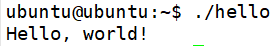

# Go语言简介和环境搭建

Go语言是Google开发的一个静态类型语言，像C/C++语言一样，它可以编译为二进制程序在操作系统上执行，而不要额外安装运行时环境，但是和C/C++不同的是，Go具有垃圾回收功能。

## Go语言的用途

Go语言最初于2009年发布，如今很多项目都是采用Go语言开发的，比如我们熟知的Docker、K8s等。不仅如此，我接触的很多开发者都会使用Go语言写一些个人的小项目，这些小项目大多轻巧高效，给我留下了非常好的印象。从使用者的角度看，Go语言开发的程序巧妙的折衷了几个其它语言开发的程序的痛点：

* Java巨大的内存占用，成本较高
* Python/PHP的低性能，动态类型语言难以维护
* C语言的开发效率低下
* C++语言的特性过多导致学习周期过长，以及团队代码质量参差不齐导致难以维护

Go的缺点：

* 某些语法（尤其是异常处理）广受诟病
* 技术相对比较小众，生态圈小，远远不能和Java、Node相比，找实现某功能的库，可能确实有几个，但是真的没有靠谱的

## Ubuntu16.04下Go语言开发环境搭建

目前Ubuntu16.04源中，Go语言开发包的版本太过古老了，Go官网文档中也没提从源中安装，而且直接下载预编译版本安装也是非常简单的。我这里安装的是当前最新的1.12.4版本。我们可以从这个页面找到当前最新版本的Go语言环境：[https://golang.org/dl/](https://golang.org/dl/)

```bash
# 下载Go语言开发包
wget https://dl.google.com/go/go1.12.4.linux-amd64.tar.gz
# 解压
tar xvf go1.12.4.linux-amd64.tar.gz
# 将解压得到的文件夹放到 /usr/local目录
sudo mv go /usr/local
# 设置环境变量
export PATH=$PATH:/usr/local/go/bin
```

注意：`export`只是让环境变量在当前shell中生效，也可以设置到`~/.bashrc`或`/etc/profile`使其在当前用户或全局生效。

## Windows下Go语言开发环境搭建

同样在之前的网址找到Windows版本的安装包，这里我下载的是`go1.12.4.windows-amd64.msi`，直接双击安装即可。安装完成后，环境变量已经为我们自动设置好了，如果不确定也可以自己手动查看下。

## Hello World

Go语言没有太过复杂的运行时环境设置，这里我们以Linux环境进行介绍。我们可以像C语言一样，用vim直接开始写。Go语言源代码文件一般用`.go`作为后缀名。

hello.go
```go
package main

import "fmt"

func main() {
  fmt.Printf("Hello, world!\n");
}
```

上面代码没什么难懂了，和大多数语言语法都差不多，只不过换了个标准输出的API而已。

编译运行：
```
go build hello.go
./hello
```



注：上面编写了一个`.go`文件并编译运行，看起来非常简单，但实际情况要复杂一点。我们知道项目构建和依赖管理是个比较复杂的过程，Go语言有自己推荐的一套项目和工作空间目录结构，来管理源代码和程序库，这些内容将在下一节介绍。
