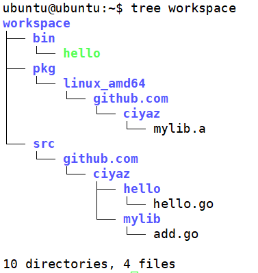

# Go语言包目录结构

本篇笔记介绍Go语言开发的推荐目录结构，以及Go语言的package（包）机制。

## 一个例子

下图是一个Go语言开发工作区的例子：



Go开发包的构建机制比较与众不同，Go语言项目构建时，没有Make、Maven这样需要配置文件的构建工具，而是依赖一个`GOPATH`环境变量，和约定的包目录结构。

上图是一个标准的Go语言开发工作区：

* bin：可执行二进制文件
* pkg：程序库二进制文件
* src：可执行程序和程序库的源代码
  * `github.com/ciyaz/hello` 一个可执行程序package
  * `github.com/ciyaz/mylib` 一个程序库package

关于包的命名，Go推荐和版本控制系统结合使用，比如我的Github名是`ciyaz`，因此使用个人包名`github.com/ciyaz`，之后接上项目名比如`mylib`，这样一个是能够避免重复，另外还能方便其它开发者直接用`go get`命令从远程版本控制系统引用程序库。

新建工程时，我们在src文件夹中创建对应的包（其实就是工程名），比如`github.com/ciyaz/hello`，编写完成后，使用`go install github.com/ciyaz/hello`，这样就会在`bin`中生成对应的可执行文件。如果我们编写的是程序库，`go install <包目录>`则会在`pkg`文件夹中生成对应的二进制内容。

程序库会静态链接到可执行文件，因此你不用担心发布时要带上哪些库的问题。

下面我们看看例子代码：

hello.go
```go
package main
import (
    "fmt"
    "github.com/ciyaz/mylib"
)
func main() {
    fmt.Printf("Hello, world!\n")
    fmt.Printf("%d\n", mylib.Add(1, 2))
}
```

add.go
```go
package mylib

func Add(a int, b int) int {
    return a + b
}
```

我们可以看到源代码中，使用包机制引用程序库，在`import`关键字下的路径中，就是通过对应的目录结构实现库引用的。另外还要注意，一个可执行程序包定义为`main`，库程序定义为对应包名，编译时会依赖这些信息。

## PATH和GOPATH

前一篇笔记我们将Go语言开发包的`bin`目录加入了PATH，这里我们还需要了解另外两个环境变量。

* GOPATH：Go语言开发工作区的根目录
* $GOPATH/bin：Go语言开发工作区的可执行文件目录

`go`命令必须有`GOPATH`才知道到哪去找我们的源码，把编译结果输出到哪里。把`$GOPATH/bin`加入`PATH`完全是为了方便起见，这样我们编译一个可执行文件后，就不用切换到`bin`目录去执行了，因为我们已经把`bin`目录加到环境变量了。

我们可以在`.bashrc`中这样添加这几个环境变量：
```shell
export PATH=$PATH:/usr/local/go/bin
export GOPATH=/home/ubuntu/workspace
export PATH=$PATH:$GOPATH/bin
```
