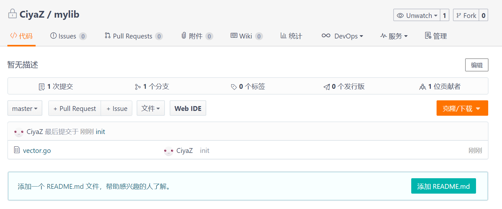

# package包机制

笔记第一节已经简单介绍过Go语言的package（包），这里我们再详细了解一下Go语言中和包相关的常见用法。

## package 包

### 可执行程序代码

一个最简单的Go语言版的HelloWorld可执行程序如下：

src/gitee.com/ciyaz/mytest/hello.go
```go
package main

import "fmt"

func main() {
	fmt.Println("Hello, world!")
}
```

其中`package main`就是我们当前些代码所在的包，如果我们创建的是一个可执行程序，它必须在`main`包中。

### 库代码

一个简单的库项目如下：

src/gitee.com/ciyaz/mylib/vector.go
```go
package mylib

import "math"

type Vector interface {
	Abs() float64
}

type Vector3 struct {
	X float64
	Y float64
	Z float64
}

type Vector2 struct {
	X float64
	Y float64
}

func (v *Vector2) Abs() float64 {
	return math.Sqrt(v.X*v.X + v.Y*v.Y)
}

func (v *Vector3) Abs() float64 {
	return math.Sqrt(v.X*v.X + v.Y*v.Y + v.Z*v.Z)
}
```

src/gitee.com/ciyaz/mytest/hello.go
```go
package main

import (
	"gitee.com/ciyaz/mylib"
	"fmt"
)

func main() {
	vec := mylib.Vector2{X: 3, Y: 5}
	fmt.Println(vec.Abs())
}
```

上面代码由于是属于一个库的，要被其他地方引用，就不能将包声明为`main`了，而是当前所在目录的目录名。你当然也可以任意取个名字，Go语言中包名和当前所在的这个目录名是无关的，但是我们还是约定包的名字采用目录名，以免混淆。

Java中每个文件只允许定义一个公有类（先不考虑非公有类等特殊情况），每个这样的文件都会编译为一个类（Class），但是Go语言中不要有这样的定势思维，Go语言中所有代码最终会编译到一个二进制文件中，即使把几个函数分散在不同的源代码文件中，它们编译后的效果也与合到一起写是一样的，只要它们声明的`package`相同，引用的时候只要引包就行了，跟某个`.go`文件没有任何关系。

## 编译项目

Go语言编译工具中最常用的就是编译命令`go install`，我们在包目录下执行，该命令会将代码编译成二进制文件，放到`bin`或`pkg`下（对应可执行文件或二进制库）。

```
go install
```

注：我们写代码时，如果引用一个库，不用先将库编译，再编译可执行程序，直接编译可执行程序会自动编译库并放到对应位置。

## 发布和引用库项目

Go语言的包管理工具基本是没有的，但是Go的包机制能够和Github等版本控制系统很好的结合使用，这个设计不得不说非常巧妙，让人眼前一亮。我们这里就不使用Github了，在国内就使用Gitee替代。我们这里将之前`gitee.com/ciyaz/mylib`发布到Gitee上的私有库。



那么现在假如我们是一个想要用这个库的程序员，我们怎么引用它呢？这时就可以使用`go get`命令了。

这里我把之前`mylib`目录删掉了，然后进行测试：
```
go get gitee.com/ciyaz/mylib
```

我们就会发现`mylib`目录又被`git`给拉下来了，这样我们实现下载并引用了一个库，非常的方便。
