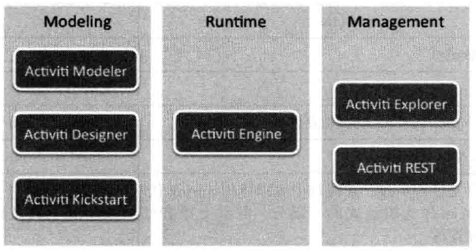

# Activiti 简介

本系列笔记参考《Activiti实战》这本书，所使用的Activiti版本是5.x，开发IDE选择Eclipse Mars.2。

## 工作流引擎的基本概念

### 工作流

什么是工作流？工作流就是通过计算机系统对业务流行进行自动化执行和管理。

假设我们开了个公司，员工请假时，需要得到项目经理、总经理的审核，最简单的操作是这样的：

1. 规定一张请假申请表
2. 员工要请假时，打印若干份请假申请表，签上自己的信息
3. 拿着这张表去找项目经理签字
4. 项目经理同意并签字
5. 拿着这张表去找总经理签字
6. 总经理同意并签字
7. 申请表归档留存，请假流程完成

这一系列操作的规定就是一个工作流。

### 工作流引擎 BPM BPMN

那么在软件系统中，如何实现这个流程呢？如果没有学过工作流引擎，我们其实也是可以写的，无非就是在数据库中定义一系列记录任务状态的字段，并和我们的业务相关联，但是很显然，这个功能写起来并不容易，而且如果我们的请假流程更新了怎么办（比如现在要三个领导签字）？又出现了销假流程、请短假请长假流程怎么办？这种情况大量出现之后，前人们从实际经验中总结出了“工作流程管理”的概念，试图抽取、复用相关的功能模块，实现一个通用的“工作流程建模规范”和“工作流程管理系统”。

* BPM（Business Process Management），工作流管理。
* BPMN（Business Process Modeling Notation），它是一种建立工作流的建模规范，有了这种规范，支持BPMN的工作流框架的工作流设计就可以通用，工作流引擎也可以替换。
* 工作流引擎：工作流程管理系统，基于BPMN实现，它不和业务耦合，是支撑业务工作流程的基础设施。

## Activiti

Activiti说白了就是一个管理流程的系统，以请假流程为例：Activiti提供了API供我们用于流程部署、流程开始结束、流程推进等一系列操作，而Activiti并不和业务耦合，它并不知道正在执行的“请假流程”中，每一个流程究竟是什么意义，只知道当前请假流程走到了哪一步。我们使用Activiti的目的就是为了从这种复杂、容易出bug的流程管理代码中解脱出来，把它交给Activiti去管理，我们专注于我们正在实现的业务上，而不是一堆流程改变、下一步流程判断的状态变量读写操作上。

### Activiti架构

#### Modeling 建模工具

如何描述一个流程，BPMN已经规范好了，我们要做的就是按照规范，设计这个流程的描述文件。BPMN2.0是基于XML进行流程描述的，而且规范也是相当的复杂。当然，我们并不需要手写XML，Activiti提供了图形化的流程编辑工具，我们画画流程图，设定几个参数就可以了。

图中，Activiti Designer就是比较常用的图形化流程设计工具，我们可以在Eclipse中安装相关插件，实现流程编辑。

#### Activiti Engine 工作流引擎

有了流程描述文件，剩下的就是Activiti Engine的工作了，Activiti Engine说白了就是一个数据库增删改查系统，它的底层基于MyBatis，支持MySQL、Oracle等主流数据库，我们配好相关配置，Activiti Engine就能自动创建数据表进行工作了。

那么我们怎样访问这些数据呢？显然不是直接去查数据库，Activiti提供了业务流程的抽象，并且提供了一系列的Service接口，我们通过调用这些API就可以获得业务流程的每一个细节。我们使用Activiti，其实就是将业务和这些API相结合，实现我们的需求。

<table style="text-align:center">
  <tr>
    <td colspan="2">Activiti引擎接口</td>
  </tr>
  <tr>
    <td>接口</td>
    <td>作用</td>
  </tr>
  <tr>
    <td>RepositoryService</td>
    <td>用于流程部署，删除，读取流程资源</td>
  </tr>
  <tr>
    <td>IdentifyService</td>
    <td>身份管理，设置用户、用户组和之间的关联</td>
  </tr>
  <tr>
    <td>RuntimeService</td>
    <td>用于启动流程实例，操作当前运行的流程信息</td>
  </tr>
  <tr>
    <td>TaskService</td>
    <td>用于任务管理，通常是操作个人任务和组任务</td>
  </tr>
  <tr>
    <td>FormService</td>
    <td>表单管理类，配置表单数据</td>
  </tr>
  <tr>
    <td>HistoryService</td>
    <td>用于操作历史流程信息</td>
  </tr>
  <tr>
    <td>ManagementService</td>
    <td>用于引擎管理，Activiti引擎监控</td>
  </tr>
</table>

## jBPM和Activiti

jBPM是另一个工作流框架，是Activiti的同类产品，在Activiti流行之前，老版本的jBPM3、jBPM4用的是非常多的。后来，jBPM的创始人单干，基于jBPM4创建了Activiti，它从jBPM4迁移比较容易，而jBPM5和jBPM4差别比较大，因此许多项目迁移到了Activiti而不是jBPM5。

jBPM和Activiti这两个框架都保持着积极的更新，也都有巨大的用户量，功能上也是各有特色。Activiti基于Apache v2协议开源，我们可以免费使用。

Activiti官网地址：[https://www.activiti.org/](https://www.activiti.org/)
