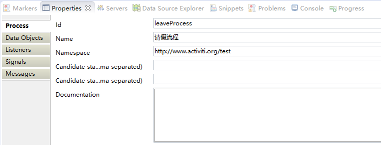

# Activiti 使用入门

## 安装Activiti Eclipse BPMN2.0 Designer

Activiti Eclipse BPMN2.0 Designer是基于BPMN2.0规范的流程设计工具，我们能够以画流程图的形式，生成基于XML的工作流程描述文件。

打开Eclipse，Help->Install New Software，输入`http://www.activiti.org/designer/update/`即可自动安装。安装成功后，我们可以看到新建Activiti流程图的选项。


插件安装完成后，记得勾选“保存流程图时生成图片”这个功能，流程图是后缀名为`.bpmn`的文件，Activiti勾选后可以同时生成一个`.png`格式的图片。有关Activiti Designer的内容，后续章节介绍。

## Activiti工程搭建

### 引入依赖

这里我们使用Maven工程，首先引入以下依赖：
```xml
<dependency>
  <groupId>org.activiti</groupId>
  <artifactId>activiti-engine</artifactId>
  <version>5.22.0</version>
</dependency>
<dependency>
  <groupId>org.activiti</groupId>
  <artifactId>activiti-spring</artifactId>
  <version>5.22.0</version>
</dependency>
<dependency>
  <groupId>mysql</groupId>
  <artifactId>mysql-connector-java</artifactId>
  <version>5.1.47</version>
</dependency>
<dependency>
  <groupId>com.zaxxer</groupId>
  <artifactId>HikariCP</artifactId>
  <version>3.2.0</version>
</dependency>
<dependency>
  <groupId>org.springframework</groupId>
  <artifactId>spring-context</artifactId>
  <version>4.3.21.RELEASE</version>
</dependency>
<dependency>
  <groupId>org.springframework</groupId>
  <artifactId>spring-core</artifactId>
  <version>4.3.21.RELEASE</version>
</dependency>
<dependency>
  <groupId>org.springframework</groupId>
  <artifactId>spring-beans</artifactId>
  <version>4.3.21.RELEASE</version>
</dependency>
<dependency>
  <groupId>org.slf4j</groupId>
  <artifactId>slf4j-api</artifactId>
  <version>1.7.5</version>
</dependency>
<dependency>
  <groupId>org.slf4j</groupId>
  <artifactId>slf4j-log4j12</artifactId>
  <version>1.7.5</version>
</dependency>
```

其中包括Activiti、Spring、Hikari连接池、MySQL驱动、SLF4J日志。除了连接池可以替换为其它的，其余依赖都是必须的。

## Activiti配置文件

Activiti配置文件：src/main/resources/activiti.cfg.xml
```xml
<beans xmlns="http://www.springframework.org/schema/beans"
	xmlns:xsi="http://www.w3.org/2001/XMLSchema-instance" xmlns:mvc="http://www.springframework.org/schema/mvc"
	xmlns:context="http://www.springframework.org/schema/context"
	xmlns:aop="http://www.springframework.org/schema/aop" xmlns:tx="http://www.springframework.org/schema/tx"
	xsi:schemaLocation="http://www.springframework.org/schema/beans
		http://www.springframework.org/schema/beans/spring-beans-3.1.xsd
		http://www.springframework.org/schema/mvc
		http://www.springframework.org/schema/mvc/spring-mvc-3.1.xsd
		http://www.springframework.org/schema/context
	http://www.springframework.org/schema/context/spring-context-3.1.xsd
		http://www.springframework.org/schema/aop
		http://www.springframework.org/schema/aop/spring-aop-3.1.xsd
		http://www.springframework.org/schema/tx
		http://www.springframework.org/schema/tx/spring-tx-3.1.xsd ">

	<!-- hikari数据源 -->
	<bean id="hikariConfig" class="com.zaxxer.hikari.HikariConfig">
		<property name="poolName" value="mercatus_connection_pool" />
		<property name="dataSourceClassName"
			value="com.mysql.jdbc.jdbc2.optional.MysqlDataSource" />
		<property name="maximumPoolSize" value="50" />
		<property name="maxLifetime" value="60000" />
		<property name="idleTimeout" value="30000" />
		<property name="dataSourceProperties">
			<props>
				<prop key="url">jdbc:mysql://localhost:3306/activiti_demo01</prop>
				<prop key="user">root</prop>
				<prop key="password">root</prop>
				<prop key="prepStmtCacheSize">250</prop>
				<prop key="prepStmtCacheSqlLimit">2048</prop>
				<prop key="cachePrepStmts">true</prop>
				<prop key="useServerPrepStmts">true</prop>
			</props>
		</property>
	</bean>

	<bean id="dataSource" class="com.zaxxer.hikari.HikariDataSource">
		<constructor-arg ref="hikariConfig" />
	</bean>

	<!-- Activiti引擎配置 -->
	<bean id="processEngineConfiguration"
		class="org.activiti.engine.impl.cfg.StandaloneProcessEngineConfiguration">
		<!-- 数据源 -->
		<property name="dataSource" ref="dataSource" />
		<!-- 数据库表生成策略 -->
		<property name="databaseSchemaUpdate" value="true" />
	</bean>

</beans>
```

我们可以发现，这个配置文件的作用主要就是配置了一个数据源。同时，不要忘了在MySQL中创建相应的数据库，创建数据库时要记得选择正确的编码。

### LOG4J配置

src/main/resources/log4j.properties
```
log4j.rootLogger=DEBUG, stdout
log4j.appender.stdout=org.apache.log4j.ConsoleAppender
log4j.appender.stdout.layout=org.apache.log4j.PatternLayout
log4j.appender.stdout.layout.ConversionPattern=[%-5p] %d{yyyy-MM-dd HH:mm:ss,SSS} method:%l%n%m%n
```

注意：如果不配置LOG4J，所有的报错信息都看不到，如果发生数据库出错等问题根本无从查起。

## 入门例子：简单请假流程

### 流程图绘制

这个画流程图的工具使用比较简单，具体使用参考专门讲解的相关章节，这里就不多做介绍了。


流程图的一些属性都在下面的`Properties`视图中配置。



### 获取ProcessEngine

Activiti中，各种Service方法API都是通过`ProcessEngine`得到的，这个`ProcessEngine`则是在`Activiti.cfg.xml`中配置好，通过Spring托管的。我们只要调用响应的API获得其引用就行了。

```java
private ProcessEngine processEngine = ProcessEngines.getDefaultProcessEngine();
```

其中，`getDefaultProcessEngine()`方法会自动读取`activiti.cfg.xml`中的配置，但是要注意这个配置文件被放在了classpath下。

### 部署流程

部署流程，就是将我们的流程图（bpmn文件）部署到Activiti的数据库。

```java
/**
 * 部署流程
 */
public void deployProcess() {
  Deployment deployment = processEngine.getRepositoryService().createDeployment().name("LeaveProcess")
      .addClasspathResource("LeaveProcess.bpmn").addClasspathResource("LeaveProcess.png").deploy();

  System.out.println("部署ID " + deployment.getId());
  System.out.println("部署名称 " + deployment.getName());
}
```

注：执行这个方法后，我们以看到数据库中的相应变化。

### 开启流程

开启流程后，流程就会转到第一个处理人手中。

```java
/**
 * 开启流程
 */
private void startProcess() {
  String processDefinitionKey = "leaveProcess";
  ProcessInstance processInstance = processEngine.getRuntimeService()
      .startProcessInstanceByKey(processDefinitionKey);

  System.out.println("流程定义ID " + processInstance.getProcessDefinitionId());
  System.out.println("流程实例ID " + processInstance.getProcessInstanceId());
}
```

### 处理流程

处理流程的过程中，基本的写法就是根据处理人名字找到他对应的`Task`，然后逐一处理。

```java
/**
 * 处理流程
 *
 * @param assignee 审批人名字
 */
private void handleProcess(String assignee) {
  List<Task> tasks = processEngine.getTaskService().createTaskQuery().taskAssignee(assignee).list();

  if (tasks != null) {
    for (Task task : tasks) {
      System.out.println("受理人 " + task.getAssignee());
      System.out.println("流程定义ID " + task.getProcessDefinitionId());
      System.out.println("流程实例ID " + task.getProcessInstanceId());

      // 推进流程
      String taskId = task.getId();
      processEngine.getTaskService().complete(taskId);
    }
  }
}
```

我们可以按照以下的顺序，分别调用这些方法，查看对应的输出和数据库的变化。

```java
public static void main(String[] args) {
  App app = new App();
  app.deployProcess();
  app.startProcess();
  app.handleProcess("employee");
  app.handleProcess("projectManager");
  app.handleProcess("generalManager");
}
```
