# 流程图设计器

Activiti Designer是Activiti的流程图设计器，以插件的形式集成在Eclipse中。通过这个插件，我们能够以拖拽的方式设计流程图，然后生成基于BPMN2.0规范的XML文档，用于部署到工作流引擎中。除此在外，Activiti Designer会实现一些Activiti支持但不是BPMN2.0规范的内容，因此它设计的流程图只能用于Activiti。

有关插件安装的内容在上一节已经介绍过了，这篇笔记主要以请假流程为例，研究如何使用Activiti Designer设计流程图。此外还介绍了Activiti Explorer的使用，它用于演示一个流程，帮助我们学习Activiti。

## Activiti Designer的使用

### 创建流程图

这里我们继续基于上一节搭建的开发环境，再创建一张流程图。

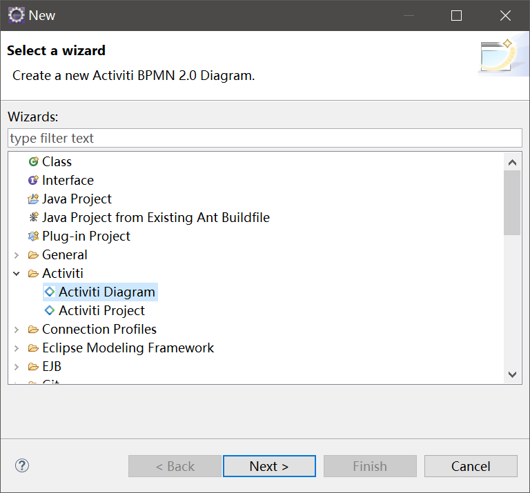

注：我们打开流程设计器后，可以把不用的工具栏折叠起来，点击折叠栏前面的小图标就可以折叠这个面板。默认都是展开的，把所有的工具都给挡住了，这可能是个bug。

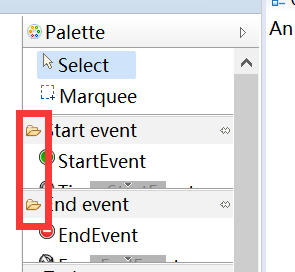

### 流程图的属性

在新建的流程图中点击空白处，切换到Properties面板，我们可以看到这个流程图的一些属性。

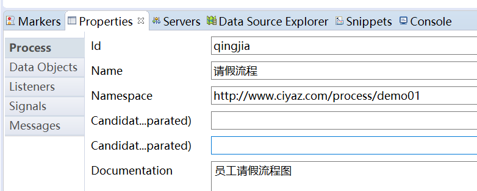

General面板：

* Id：流程的唯一标识，也就是代码中的`processDefinitionKey`，建议用英文。
* Name：流程名，可以是任意字符。
* Namespace：命名空间，推荐使用公司域名+项目名+模块名的形式。
* Document：该流程的一些描述文档。

### 开始流程

我们在设计器的工具栏中找到`Start Event`并拖入设计器的工作区中。

`Start Event`的一些属性配置如下图。

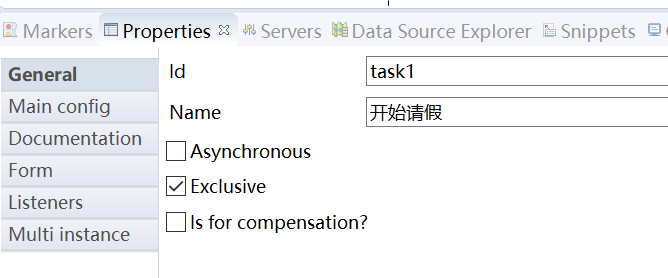

### 用户任务

开始流程后，流程就转到了`User Task`，我们需要指定一些流程对应步骤涉及到的受理人需要完成的工作，让流程走下去。

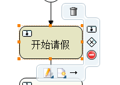

和`Start Event`一样，我们可以为`User Task`指定`Id`和`Name`。除此之外，我们还需要为其指定受理人`assignee`。

### 结束流程

一步步完成流程定义，最后加上一个`End Event`，一个最简单的流程就定义好了。

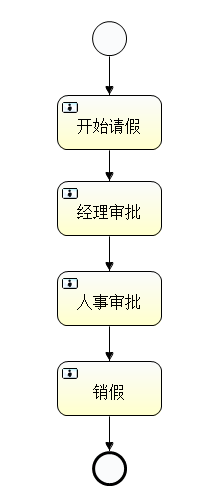

我们可以用`XML Editor`打开`bpmn`文件，看看Activiti设计器为我们自动生成的流程定义，实际上都非常好理解。如果Activiti设计器出bug了，或者有某方面出现了局限性，我们有可能必须得手写这些XML。

## Activiti Explorer的使用

Activiti Explorer是一个Activiti自带的流程定义执行模拟器，我们可以用它测试我们的流程。注意：这个程序还是有些bug的，我们不用太在意细节。

在下载的Activiti包中，我们可以找到`activiti-explorer.war`，将其部署到Tomcat即可使用。

部署完成后，用浏览器访问`http://localhost:8080/activiti-explorer/`即可。

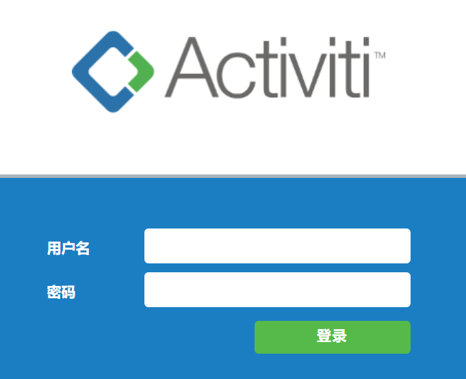

我们使用用户名和密码都是`kermit`的账户登录，Activiti Explorer是个例子程序，其中自带一些流程和例子，`kermit`是其中具有管理员权限的例子账户，我们需要用它部署流程以及创建更多的账户。

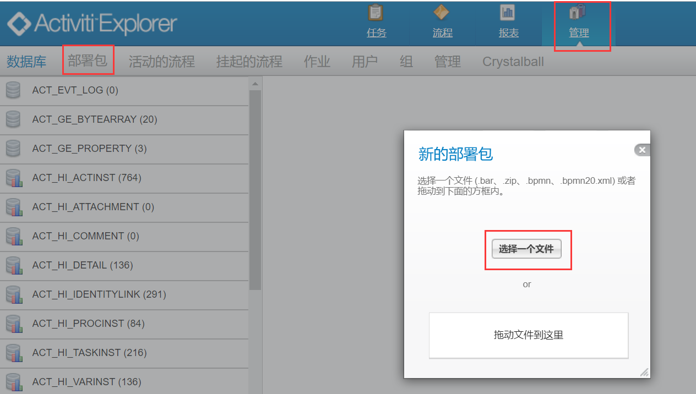

点击图中的位置，我们把设计器生成的`QingJiaProcess.bpmn`和`QingJiaProcess.png`进行部署，这里要注意一下，我们最好把`.bpmn`和`.png`压缩成一个`zip`文件再部署，否则`Activiti Explorer`会根据`.bpmn`自动生成一个`.png`文件，这个自动生成的图比较丑，而且还可能有乱码。

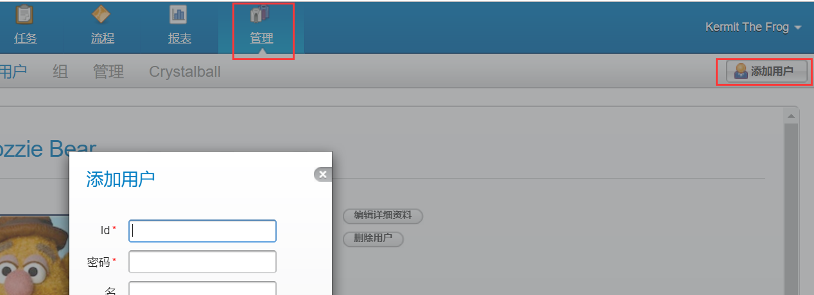

接下来我们添加流程处理涉及到的用户（之前在设计器中指定的受理人）。

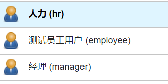

添加完成后我们就可以演示整个流程了。

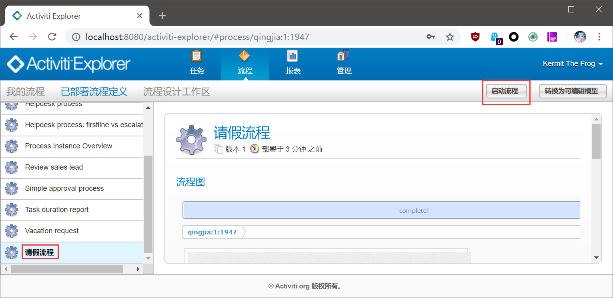

分别登录测试员工用户，经理，人力的账户，相应的任务会在Activiti Explorer首页显示，我们点击完成后，流程就会流转到下一个受理人。

