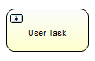
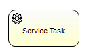
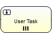

# BPMN流程规范

前面介绍过，工作流程其实就是以XML形式定义的，这个XML定义遵循BPMN2.0规范，Activiti负责解析工作流程定义，并提供API供我们的程序操作。除此之外，Activiti也自己定义了一些非标准的规范，来简化BPMN定义。根据BPMN2.0和Activiti规范的分类，我们需要掌握以下概念：

* 启动与结束事件 StartEvent/EndEvent
* 顺序流 Sequence Flow
* 任务 Task
* 网关 Gateway
* 子流程 Subprocess
* 边界事件 Boundary Event
* 中间事件 Intermediate Event
* 监听器 Listener

要想顺利使用Activiti工作流引擎实现我们的业务功能，就必须知道如何基于以上概念定义工作流。这篇笔记我们介绍一些最常用的规范内容。

## StartEvent 启动事件

启动事件定义了流程的触发条件，流程触发后会产生一个新的流程实例并按预定义的步骤运行。

### StartEvent 空启动事件

最普通的启动事件就是空启动事件，它没有任何自动的触发条件，而是需要我们在Java代码中调用`RuntimeService.startProcessInstanceByKey()`方法手动启动流程。


空启动事件的符号是一个空心圆圈。

空启动事件的XML表示：
```xml
<startEvent id="startevent" name="Start"></startEvent>
```

BPMN属性：

* `id`：流程节点的标识符
* `name`：流程节点的名字，可以为中文字符串、带空格字符串等任意形式

上述两个属性每个节点都存在，后续就不多赘述了。

Activiti扩展属性：

* `activiti:formKey`：用于指定关联的表单数据，有关表单内容将在后续章节介绍
* `activiti:initiator`：可以用来指定一个记录启动流程人ID的变量

### TimerStartEvent 定时启动事件

定时启动事件能够定义一系列和时间相关的启动触发条件，满足时间条件时触发。


下面例子定义了从`2012-01-01 00:00`起，每月触发一次该流程：

```xml
<startEvent id="timestartevent" name="Timer Start">
  <timerEventDefinition>
    <timeCycle>R1/2012-01-01T00:00/P1M</timeCycle>
  </timerEventDefinition>
</startEvent>
```

定时启动事件接收三种类型的时间条件：

* `timeDate`：在指定日期时间一次性启动流程
* `timeDuration`：在指定时间后启动流程
* `timeCycle`：根据参数表达式周期性启动流程

注：Activiti使用的日期时间是ISO8601格式，上面例子中，`R1`代表执行一次；`2012-01-01T00:00`代表起始时间，其中`T`为日期和时间的分隔；`P1M`表示每一个月。

### ErrorStartEvent 异常启动事件

异常启动事件只能使用在事件子流程中，而且只能通过主流程抛出异常来被动触发，而不能手动触发。在主流程抛出异常结束事件后，如果异常启动事件错误码和主流程抛出的错误码匹配，对应的异常启动事件子流程会被触发并执行。


下面例子中，异常启动事件会捕获`ERR_01`错误并启动错误处理子流程。

```xml
<startEvent id="suberrorstartevent" name="Error start">
  <errorEventDefinition errorRef="ERR_01"></errorEventDefinition>
</startEvent>
```

## EndEvent 结束事件

结束事件标志着流程实例执行完成。

### EndEvent 空结束事件

空结束事件表示不抛出任何结果，当前流程输出流成功结束，没什么需要流程引擎继续处理的了。


```xml
<endEvent id="endevent" name="End"></endEvent>
```

### ErrorEndEvent 异常结束事件

异常结束事件必须定义抛出的错误代码，如果定义了对应错误代码的异常启动事件，它就会被启动，否则流程也和空结束事件一样彻底结束了。


下面例子定义了一个错误码为`ERR_001`的异常结束事件。

```xml
<endEvent id="errorendevent1" name="ErrorEnd">
  <errorEventDefinition errorRef="ERR_001"></errorEventDefinition>
</endEvent>
```

实际上，异常结束事件一般用在子流程中，抛出的异常通过异常边界事件来捕获。

### TerminateEndEvent 终止结束事件

终止结束事件可以立即终止一个流程实例（和空结束事件区别：空结束事件结束的是输出流，它可能结束的是子流程，而主流程还没结束）。


```xml
<endEvent id="terminateendevent" name="TerminateEndEvent">
  <terminateEventDefinition></terminateEventDefinition>
</endEvent>
```

## SequenceFlow 顺序流

所谓的顺序流其实就是流程图中的箭头，顺序流分为两种：

* 普通顺序流：无条件向下一步执行
* 条件顺序流：根据条件决定是否向下执行

普通顺序流定义：

```xml
<sequenceFlow id="flow1" sourceRef="startevent" targetRef="usertask1"></sequenceFlow>
```

条件顺序流定义：

```xml
<sequenceFlow id="flow1" sourceRef="startevent" targetRef="usertask1">
  <conditionExpression xsi:type="tFormalExpression"><![CDATA[${pass == true}]]></conditionExpression>
</sequenceFlow>
```

条件顺序流中，需要通过UEL表达式计算逻辑值的方式，进行条件判断。因为表达式编写在XML中，所以我们需要`CDATA`标签来包裹。

当然，如果流程的输出流中只有一条路径，对它设置条件也是没意义的，因为如果条件不满足，流程就走不下去了。条件顺序流一般配合网关使用。

## Task 任务

任务是工作流程的核心部分，Activiti中定义了很多种任务类型：

* 用户任务 UserTask
* Java任务 ServiceTask
* 脚本任务 ScriptTask
* 邮件任务 MailTask
* 手动任务 ManualTask
* 接收任务 ReceiveTask
* 规则引擎任务 BusinessRuleTask

其中，前两种是最常用的。之前例子中，我们经常使用用户任务，实际开发中，Java任务使用也比较多。

### UserTask 用户任务

用户任务顾名思义，必须有系统的用户参数，比如按一个“同意”按钮，或是提交一个表单，然后，通过系统中的Java代码来触发工作流的下一步。



下面的用户任务例子中，我们将该任务指定给`tom`这个人来处理。

```xml
<userTask id="usertask2" name="User Task" activiti:assignee="tom"></userTask>
```

Activiti扩展属性：

* `activiti:assignee`：指定任务处理人
* `activiti:candidateUsers`：指定可用的处理候选人，多个用逗号分隔
* `activiti:candidateGroups`：指定可用的处理候选用户组，多个用逗号分隔
* `activiti:dueDate`：设定任务的到期时间
* `activiti:priority`：设定用户任务的优先级

注：`assignee`和`candidateUsers`的区别，是`assignee`是指定让某用户处理，而`candidateUsers`是允许若干用户作为处理候选人，其中任何一人处理即可，处理后流程就向下流转了，而非多个人处理。

除了将用户任务指定给用户让其点一下“处理”按钮，用户任务还可以关联表单，收集一些必要的信息，有关表单关联的内容，将在后续章节介绍。

### ServiceTask Java任务

Java任务可以执行一段工程中的Java代码。



下面例子，调用了`com.ciyaz.demo.activiti.service.MyServiceTask`类。

```xml
<serviceTask id="servicetask1" name="Service Task" activiti:class="com.ciyaz.demo.activiti.service.MyServiceTask"></serviceTask>
```

被调用的类需要实现`org.activiti.engine.delegate.JavaDelegate`接口。

MyServiceTask.java
```java
package com.ciyaz.demo.activiti.service;

import org.activiti.engine.delegate.BpmnError;
import org.activiti.engine.delegate.DelegateExecution;
import org.activiti.engine.delegate.JavaDelegate;

public class MyServiceTask implements JavaDelegate {
	@Override
	public void execute(DelegateExecution execution) throws Exception {
		// ...
	}
}
```

### 任务多实例

工作流管理中，有个学名叫“会签”，比如一个提案需要至少三个人审核，那么审核这一步任务可以并行的让审核人员去做，满足“至少三个人审核通过”后，流程再向下流转。由于三个人审核其实是同一个任务（Task），因此这个功能可以用任务多实例实现。



多实例任务用三个横线或三个竖线表示，横线代表串行多实例，竖线代表并行多实例。

下面例子中，我们提前设置了一个流程变量`assigneeList = ['tom', 'jerry', 'lucy']`，表示该任务需要指定给的三个人。

```xml
<userTask id="usertask1" name="User Task" activiti:assignee="${assignee}">
  <multiInstanceLoopCharacteristics isSequential="false" activiti:collection="assigneeList" activiti:elementVariable="assignee">
    <completionCondition>${nrOfCompletedInstances &gt;= 2}</completionCondition>
  </multiInstanceLoopCharacteristics>
</userTask>
```

BPMN属性：

* `isSequential`：是否为串行任务

Activiti扩展属性：

* `activiti:collection`：遍历生成多任务实例的集合
* `activiti:elementVariable`：遍历集合时存储的变量

（未完待续）