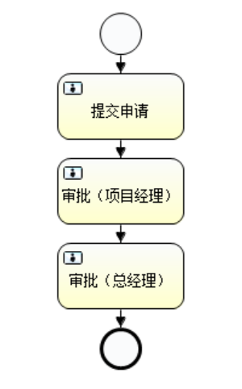

# BPMN规范之事件

前面说过，工作流其实就是以XML形式定义的，这个XML定义遵循BPMN2.0规范，Activiti负责解析工作流定义，并提供API供我们的程序操作。要想顺利使用Activiti工作流引擎实现我们的业务功能，就必须知道如何定义工作流。

这篇笔记我们讲解BPMN2.0规范中，有关事件的内容。

## 启动和结束事件

一个流程定义中，启动和结束事件是必须的，启动事件定义了流程的触发条件，流程触发后会产生一个新的流程实例并按预定义的步骤运行，结束事件标志着流程实例执行完成。

在流程设计器中，我们可以直接拖入相关组件，例子如下图。



### StartEvent 空启动事件

最普通的启动事件就是空启动事件，我们在Java代码中可以通过`startProcessInstanceByKey()`等方法实例化该流程。


空启动事件的XML表示：
```xml
<startEvent id="startEvent" name="Start"></startEvent>
```

Activiti扩展属性：

* `activiti:formKey`：用于指定关联的表单文件
* `activiti:initiator`：用来指定一个记录启动流程人ID的变量

### TimerStartEvent 定时启动事件

定时启动事件能够灵活的定义一系列和时间相关的启动触发条件，下面例子定义了从`2012-01-01`起，每月触发一次该流程。


```xml
<startEvent id="timeStartEvent1" name="Timer Start">
  <timerEventDefinition>
    <timeCycle>R1/2012-01-01T00:00/PM1M</timeCycle>
  </timerEventDefinition>
</startEvent>
```

### 异常启动事件

在另一个流程抛出异常结束事件后，对应的异常启动事件子流程会被触发并执行，但需要两者的错误信息匹配才能触发。异常启动事件必须嵌套在一个事件子流程中。


（待补充）

### 消息启动事件

消息启动事件可以通过消息名称触发，也可以结合消息抛出事件一起使用。在Activiti中，可以通过消息API进行触发。


### 空结束事件

空结束事件表示不抛出任何结果，流程结束，没什么需要流程引擎继续处理的了。


```xml
<endEvent id="endEvent" name="End"></endEvent>
```

### 异常结束事件

异常结束事件必须定义抛出的错误代码，如果定义了对应错误代码的异常启动事件，它就会被启动，否则流程也和空结束事件一样彻底结束了。


### 终止结束事件

终止结束事件可以立即终止一个流程实例。


### 取消结束事件

（待补充）
