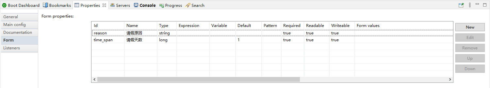
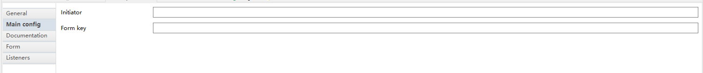

# 集成任务表单

之前我们开发的例子程序中，都没有用到表单。实际上，在真实的OA系统中，很多流程都是需要表单来获取用户输入信息的。Activiti中，我们能够在流程启动和用户任务步骤中加入表单。表单的实现方式有三种：

1. 动态表单：表单以扩展属性方式定义在bpmn文件中，可以在Activiti设计器里编写
2. 外置表单：表单以`.form`结尾的HTML格式文件存储，和bpmn一起部署
3. 普通表单：以固定页面的形式编写表单，系统运行时根据任务的`formKey`跳转表单页面

其中，动态表单能够实现完全由用户自定义整个流程，而不需要开发人员升级系统（类似官方提供的Activiti Explorer例子程序），因此可以设计的相当灵活，但某些方面也会有不可避免的局限性。而普通表单主要用于流程和系统耦合的设计，这也是相当常用的方式。

至于外置表单，由于现在的后台管理程序很多都是前后端分离的，外置表单输出HTML的设计就显得比较落后了，而且使用起来也不是很灵活，这里就不多介绍了。

## 动态表单

### 设置表单内容

在Eclipse的Activiti设计器中，我们可以在`Form`选项卡中设定用户任务或开始事件对应的表单内容。在流程运行过程中，表单内容可以通过Activiti提供的`FormService`接口查询出来。



上图中，表单有很多可以设定的字段，我们习惯上一般把`Id`字段作为表单属性变量名，`Name`作为页面显示的中文名，其它各个字段如`Required`、`Readable`等主要用于控制页面上元素显示。

动态表单支持五种数据类型（即图中`Type`字段）：

* `string`：字符串类型，对应表单文本框
* `long`：数字类型，对应表单数字输入框
* `enum`：枚举类型，对应表单下拉选择框
* `date`：日期类型，对应表单日期选择框
* `boolean`：布尔类型，对应表单开关按钮，或是结果互斥的按钮组

实际上，表单支持字符串基本就能满足所有使用场景了，但毕竟不太优雅，因此实际开发过程中，我们还是应该尽量选择对应的表单数据类型。

生成的BPMN内容例子如下：
```xml
<startEvent id="startevent" name="开启请假流程">
    <extensionElements>
    <activiti:formProperty id="reason" name="请假原因" type="string" required="true"></activiti:formProperty>
    <activiti:formProperty id="time_span" name="请假天数" type="long" default="1" required="true"></activiti:formProperty>
    </extensionElements>
</startEvent>
```

### 读取表单属性

我们可以使用`FormService`接口查询表单数据：

开始事件：
```java
StartFormData formData = formService.getStartFormData(processDefinitionId);
List<FormProperty> formProperties = formData.getFormProperties();
```

用户任务：
```java
TaskFormData formData = formService.getTaskFormData(taskId);
List<FormProperty> formProperties = formData.getFormProperties();
```

其中，开始事件和用户任务分别使用`StartFormData`和`TaskFormData`接收，类中的内容实际都差不多；参数`processDefinitionId`是流程定义ID，流程部署时可以获得，`taskId`是任务ID，可以根据用户信息用`TaskService`查询得到。

`FormProperty`是表单属性的封装类，我们在设计器中定义的各个属性都可以从这个对象中获得：

FormProperty.java
```java
package org.activiti.engine.form;

import java.io.Serializable;
import org.activiti.engine.FormService;

public interface FormProperty extends Serializable {
  String getId();
  String getName();
  FormType getType();
  String getValue();
  boolean isReadable();
  boolean isWritable();
  boolean isRequired();
}
```

页面上的表单渲染，实际上就是基于此的。

## 普通表单

普通表单需要一个`formKey`字段关联用户任务（或开始事件）和表单页面。



```java
TaskFormData formData = formService.getTaskFormData(taskId);
String formKey = formData.getFormKey();
```

这个具体实现就和Activiti引擎本身关系不大了。
