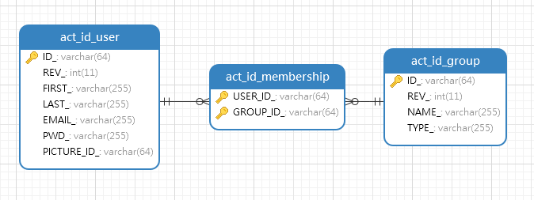

# 用户管理

Activiti内置了一套用户/用户组数据库表，表名以`act_id_`开头（`id`指`IdentityService`接口），流程的启停、用户任务分配等都是依据这套数据库表实现的。这里我们主要介绍下Activiti中和用户、用户组相关的接口，相关接口都位于`IdentityService`。

## 表结构

Activiti中，使用`act_id_user`、`act_id_group`、`act_id_membership`存储用户信息、用户组信息，以及两者的关联信息。



上表中，用户的`ID_`字段其实就是我们一般意义上的唯一“用户名”，至于其它字段，基本没什么大的作用。

## 用户管理接口

### 认证用户

例如用户发起了一个流程，Activiti如何知道是哪个用户发起的呢？这需要调用Activiti的用户认证接口。

```java
identityService.setAuthenticatedUserId(userId);
```

其中，`userId`对应用户表中`ID_`字段，调用认证接口后，当前线程Activiti的所有操作都会关联到当前认证的用户下。

注意这里说的是当前线程，Activiti并没有Session等机制，这个用户认证是通过`ThreadLocal`实现的，也就是说，实际结合到我们的B/S型系统中，我们每次启动流程、处理任务之前，都要从会话中取出当前用户，然后调用Activiti引擎的认证接口。

### 用户创建和删除

用户创建比较简单，只要组装好一个Activiti引擎的`User`对象，调用`save()`方法就可以了；删除只需要根据用户ID调用`delete()`方法即可。

创建用户：
```java
identityService.saveUser(newUser);
```

删除用户：
```java
identityService.deleteUser(userId);
```

### 查询用户

Activiti提供了强大的查询接口，查询所有用户例子如下：

```java
List<User> userList = identityService.createUserQuery().list();
```

有关查询API的内容将在后文详细介绍。

## 用户组管理接口

用户组管理和用户管理基本一样。

创建用户组：
```java
identityService.saveGroup(newGroup);
```

删除用户组：
```java
identityService.deleteGroup(groupId);
```

## 用户和用户组关系接口

Activiti中，用户和用户组关系存储在`act_id_membership`表中，相关管理接口如下：

创建归属关系：
```java
identityService.createMembership(userId, groupId);
```

删除归属关系：
```java
identityService.deleteMembership(userId, groupId);
```

## 如何整合Activiti的用户表

上面介绍了这么多，然而这里有个问题，我们的系统肯定有一套自己的用户管理系统，可能是自己实现的，也可能是借助Shiro等框架实现的。但Activiti也有一套用户表，两者如何结合呢？实际开发中，有三种可行的解决方案：

1. 关联用户系统和Activiti的用户表，创建、删除用户或用户组时，Activiti引擎也同步操作
2. 彻底重写Activiti的`IdentityService`，基于自己的用户系统来实现
3. 基于Activiti的用户和用户组表来开发自己的系统

其中，方式一比较简单可行，也是最常用的方式，方式二对Activiti改动较大，但显然理论上更优雅一些。至于第三种方式，基本思维正常的人都不会这样做。
