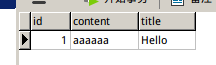

# hibernate 框架环境搭建

直接通过JavaSE使用关系型数据库时，需要使用JDBC接口，JDBC的设计和Java面向对象的风格不一致，而且编程复杂，重复代码多，不利于较大型项目的开发。Hibernate是一个优秀的ORM（Object Relation Mapping）框架，它能够实现对象实体类到数据库表的映射，一般规模的项目，使用Hibernate能够简化持久层的编程，除了一开始配置比较麻烦，等用起来就非常方便了。Hibernate还统一了各个数据库产品的方言，通过简单的配置就能使用连接池和缓存组件。JPA是Java EE的一个ORM规范，Hibernate可以作为JPA的标准实现使用。

Hibernate的缺点是自动生成SQL代码可能不是最优的，对性能要求很高的地方无法使用。对于数据库关系非常简单的项目，没必要使用Hibernate，使用JDBC即可，省去了配置的麻烦。特别复杂的项目，Hibernate也不合适，速度、内存等都不好控制，Java代码会变得难以编写。

Hibernate有详细的中文手册，我们可以下载Hibernate的发行包`hibernate-distribution-3.6.10.Final-dist.tar.gz`，在`documentation/manual/zh-CN/pdf`找到。

注：最新版的hibernate（版本4+）已经不发布在sourceforge上了，而是在`http://hibernate.org/`，但是这里找不到老版本（3.x）。新版本Hibernate改来改去，一些API一会支持，一会deprecated，当初用的很混乱，所以我就一直用的3.6，也没有任何问题，该版本支持的JPA规范版本是JPA2.0。

## 关于JPA和SpringDataJPA

JPA是JavaEE规范，Hibernate实现了JPA规范，使用JPA和使用Hibernate可以说基本就是一样的，只不过换了套API而已。SpringDataJPA是基于JPA的封装，使用起来非常简单，能够大幅提高开发效率，强烈推荐先学习Hibernate，然后在项目中尝试使用SpringDataJPA。

## 搭建Hibernate环境

这里我们先搭建一个普通Java工程，后面在相关框架整合章节再介绍web开发环境中，如何搭建Hibernate环境。

### 引入依赖

```java
//hibernate 核心
compile group: 'org.hibernate', name: 'hibernate-core', version: '3.6.10.Final'
//mysql驱动
compile group: 'mysql', name: 'mysql-connector-java', version: '5.1.44'
//hibernate依赖
compile group: 'org.javassist', name: 'javassist', version: '3.17.1-GA'
//测试框架
testCompile group: 'junit', name: 'junit', version: '4.12'
```

这里我使用的是gradle构建工具，Hibernate使用的版本是3.6.10Final，使用的数据库是MySQL5.7（ubuntu16.04操作系统）。

### 编写一个简单的例子

我们编写一个最简单的例子，向数据库中插入一条记录。首先在MySQL中创建一个数据库：

```
create database hibernate_demo;
```

com.ciyaz.domain.News.java
```java
package com.ciyaz.domain;

public class News
{
	private Integer id;
	private String title;
	private String content;

	public Integer getId()
	{
		return id;
	}

	public void setId(Integer id)
	{
		this.id = id;
	}

	public String getTitle()
	{
		return title;
	}

	public void setTitle(String title)
	{
		this.title = title;
	}

	public String getContent()
	{
		return content;
	}

	public void setContent(String content)
	{
		this.content = content;
	}
}
```

这是一个普通的实体类，没有任何特别之处。

com/ciyaz/domain/News.hbm.xml
```xml
<?xml version="1.0" encoding='UTF-8'?>
<!DOCTYPE hibernate-mapping PUBLIC
		"-//Hibernate/Hibernate Mapping DTD 3.0//EN"
		"http://www.hibernate.org/dtd/hibernate-mapping-3.0.dtd" >
<hibernate-mapping package="com.ciyaz.domain">
	<class name="News" table="t_news">
		<id name="id">
			<generator class="identity" />
		</id>
		<property name="content" />
		<property name="title" />
	</class>
</hibernate-mapping>
```

这个是对应实体类的映射配置文件。注意，hbm配置文件理论上应该放在和类同一个文件夹下，但是使用gradle或maven时，应该放在`src/main/resources/[包名]`下，因为gradle或maven会忽略`java`文件夹下所有xml文件。

hibernate.cfg.xml
```xml
<?xml version="1.0" encoding='UTF-8'?>
<!DOCTYPE hibernate-configuration PUBLIC
		"-//Hibernate/Hibernate Configuration DTD 3.0//EN"
		"http://www.hibernate.org/dtd/hibernate-configuration-3.0.dtd" >
<hibernate-configuration>
	<session-factory>
		<property name="connection.driver_class">com.mysql.jdbc.Driver</property>
		<property name="connection.url">jdbc:mysql://127.0.0.1:3306/hibernate_demo</property>
		<property name="connection.username">root</property>
		<property name="connection.password">[密码]</property>
		<property name="dialect">org.hibernate.dialect.MySQL5Dialect</property>
		<property name="hbm2ddl.auto">update</property>
		<mapping resource="com/ciyaz/domain/News.hbm.xml" />
	</session-factory>
</hibernate-configuration>
```

* hbm2ddl.auto：update表示表不存在时，hibernate会自动键表，表存在则根据实体类和表的对应关系，更新或不作任何操作，一般使用这个选项即可

这个是配置hibernate框架的主配置文件，放在`src`下，gradle或maven结构放在`src/main/resources`下。其中为`SessionFactory`配置了很多参数，参数值都不难理解，这里就不多解释了。

除此之外，开发时还建议配上这两个属性：
```xml
<!-- 控制台输出SQL语句-->
<property name="hibernate.show_sql">true</property>
<!-- 控制台输出格式化的SQL语句-->
<property name="hibernate.format_sql">true</property>
```


com.ciyaz.application.Main
```java
package com.ciyaz.application;

import com.ciyaz.domain.News;
import org.hibernate.SessionFactory;
import org.hibernate.Transaction;
import org.hibernate.cfg.Configuration;
import org.hibernate.classic.Session;

public class Main
{
	public static void main(String[] args)
	{
		//读取配置文件准备启动框架
		Configuration configuration = new Configuration().configure();
		//创建SessionFactory
		SessionFactory sessionFactory = configuration.buildSessionFactory();
		//打开一个Session
		Session session = sessionFactory.openSession();
		//开启事务
		Transaction transaction = session.beginTransaction();
		//执行操作
		News news = new News();
		news.setTitle("Hello");
		news.setContent("aaaaaa");
		//保存对象
		session.save(news);
		//结束事务
		transaction.commit();
		//关闭资源
		session.close();
		sessionFactory.close();
	}
}
```

上面代码中，我们实例化了一个实体类，直接调用`session.save()`，没有编写任何SQL语句，实际上是hibernate自动为我们生成了SQL语句执行了插入操作。

运行结果



### 使用注解取代hbm配置文件

写太多hbm文件实在是不方便，我们可以改用注解。

hibernate.cfg.xml
```xml
<mapping class="com.ciyaz.domain.News" />
```

主配置文件中，将mapping修改为指向类而不是hbm配置文件。

News.java
```java
package com.ciyaz.domain;

import javax.persistence.*;

@Entity
@Table(name="t_news")
public class News
{
	@Id
	@GeneratedValue(strategy = GenerationType.IDENTITY)
	@Column(name = "id")
	private Integer id;
	@Column(name = "title")
	private String title;
	@Column(name = "content")
	private String content;

	// ... 省略get set方法
}
```

注解的内容很好理解，这里就不多说了。

注：无需引入新的依赖，按照刚才的配置已经自动引入了JPA2.0规范的依赖，那个包里包含这些注解（Hibernate包里的注解应该也是完全一样的，但是既然有JPA那就使用JPA，因为是规范）。

### 使用hibernate框架的基本流程

1. 从SessionFactory处获取Session
2. 开启事务
3. 执行数据库操作
4. 关闭事务和session

### hibernate的几个重要概念

hibernate定义了实体类的三种状态，这里应该了解一下这个概念：

* 临时状态 实体类还未与Session关联
* 持久化状态 实体类与Session关联，且实例对应到数据库记录，我们对持久化状态的修改都会映射到数据库的表记录中
* 游离状态 实体类已经脱离了Session的关联（因Session关闭等原因）

对实体类的操作，必须在Session管理下才能同步到数据库。

#### SessionFactory

它是Session的工厂，是单个数据库映射关系经过编译后的内存镜像，是线程安全的。该对象可以在进程或集群的级别上，为事务之间可以重用的数据提供可选的二级缓存。

#### Session

它是我们编写的代码和数据库交互之间的一个单线程对象，我们编写的所有数据库操作都要在Session管理下完成。Session有默认的一级缓存。
