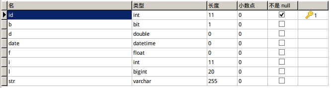

# 持久化对象详解

上一篇笔记介绍了对象的三种状态，我们对操作对象的更改映射到数据库表的记录，必须在对象的持久化状态完成，因此这篇笔记详细介绍对象关键的状态转换和持久化类的编写。

注：这里使用Hibernate3.6和MySQL5.7

## 持久化类的编写

持久化类实际上就是一个普通的POJO，持久化类到数据库表的映射，是通过注解或者hbm映射文件实现的。持久化类一般包含这样几种属性类型：Integer，Float，Double，Long，Boolean，String，Date。这些类型在MySQL中对应的类型分别是：
```
Java类型  MySQL类型
Integer   int
Float     float
Double    double
Long      bigint
Boolean   bit(1)
String    varchar(255)或TEXT
Date      datetime
```

注意Java类中，我们使用的都是包装类，这是因为如果数据库的某个字段为NULL，包装类也能设置为NULL，Java类和数据库表记录更加一致，而Java的基本类型不能是NULL。

除此之外，我们还需要注意String，如果让Hibernate自动建表，无论如何Hibernate都不会使用TEXT类型（我用的JPA注解，使用@Lob或是@Column的columnDefinition，或是指定length都不行），一旦Hibernate建表时指定了varchar(255)，我们插入长字符串就会出错。但是，如果我们预先建好表，让字符串属性对应的字段使用TEXT类型，Hibernate也能正确进行持久对象的映射，不需要任何额外的设置。实际开发中，我们肯定不会用Hibernate自动建表的，这个小bug倒也无所谓。

测试类
```java
@Entity
@Table(name = "t_test")
public class TestEntity implements Serializable
{
	@Id
	@GeneratedValue(strategy = GenerationType.IDENTITY)
	@Column(name = "id")
	private int id;

	@Column(name = "str")
	private String str;
	@Column(name = "l")
	private Long l;
	@Column(name = "i")
	private Integer i;
	@Column(name = "b")
	private Boolean b;
	@Column(name = "f")
	private Float f;
	@Column(name = "d")
	private Double d;
	@Column(name = "date")
	private Date date;

  //...省略get/set方法

  //...省略equals()和hashCode()
}
```

自动键表的结果：



注意，持久化类建议重写equals()和hashCode()方法，数据库中，如果两条记录所有字段都相等（包括主键），那么实际上就是一条记录，而Java中，有完全相同属性值的两个对象可能处于不同的内存地址，这会给业务逻辑造成困难。因此建议重写这两个方法。

当然，数据库的表关系通常不会这么简单，有各种外键，形成一对多，多对多等复杂关系。Hibernate映射这些关系需要一些其他的注解，这些内容将在后面章节介绍。但是我们要知道，即使一个对象持有另一个对象的引用，对象的属性追根揭底也就上面几种类型，因为数据库也就提供了那么几种类型。

## 临时状态转换为持久化状态

临时状态转换为持久化状态，说白了就是保存，把对象包含的信息存进数据库。

```java
Serializable save(Object obj)
void persist(Object obj)
```

save()和persist()都能完成保存功能，save()返回值是主键。区别：

* save() 立即执行insert语句，返回主键值
* persist() 在事务外部被调用时，并不立即insert语句，用于长会话流程，在事务内部调用时和save()相同

## 加载持久化对象和更新

加载持久化对象，说白了就是通过主键值查出数据，填进一个实例化的实体类对象里。

```java
Object load(Class theClass, Serializable id)
Object get(Class clazz, Serializable id)
```

这两个方法区别还是比较大的，load()和get()的区别：

* load()如果找不到指定主键值对应的对象（实际上要先查询Session缓存再查数据库），会抛出HibernateException，而且为了实现延迟加载，load()返回的实际上是这个对象的代理，如果在Session关闭后试图访问未加载的属性，二级缓存中也没有这个数据，就会抛出LazyInitializationException（延迟加载默认启动，不建议关闭）
* get()如果找不到主键值对应的对象，先查询Session缓存和二级缓存，没有再查询数据库，再没有就返回null。get()不使用延迟加载

持久化状态的对象，一旦被改变，在事务结束时，hibernate框架会统一把持久化对象的更改写入数据库中。

下面看一个例子
```java
//...省略开启Session
News n = (News) session.get(News.class, 1);//get：此处会执行insert语句 load：此处会加载未初始化数据的代理对象
System.out.println("===========================");
n.setContent("xxxx");
transaction.commit();//get：此处会执行update语句 load：此处会加载数据并执行更新，即insert和update（实际上是在事务提交之前执行了session.flush()，flush之前执行了这些操作）
session.close();
```

使用get()加载对象的输出：
```
Hibernate:
    select
        news0_.id as id0_0_,
        news0_.content as content0_0_,
        news0_.title as title0_0_
    from
        t_news news0_
    where
        news0_.id=?
===========================
Hibernate:
    update
        t_news
    set
        content=?,
        title=?
    where
        id=?
```

使用load()加载对象的输出：
```
===========================
Hibernate:
    select
        news0_.id as id0_0_,
        news0_.content as content0_0_,
        news0_.title as title0_0_
    from
        t_news news0_
    where
        news0_.id=?
Hibernate:
    update
        t_news
    set
        content=?,
        title=?
    where
        id=?
```

## 游离状态对象重回持久化状态

```java
void update(Object object)
void saveOrUpdate(Object object)
```

* update() 直接执行update，如果该对象数据库中不存在则报错
* saveOrUpdate() 如果数据库中没有该对象，就执行插入insert，有则更新update

注意：上面说的“该对象在数据库中存在/不存在”实际并不是update()和saveOrUpdate()又查了一遍数据库，而是因为在指定主键自动生成策略下（通常会这么做），临时态对象主键肯定为null，游离态对象主键是之前查出来的。如果自己设置一个不存在的主键，saveOrUpdate()根本无法插入，直接save()它是忽略我们设置的主键属性的，插入时又按规则生成一个主键值。

下面代码中，加载对象后脱离session，然后新开一个session进行更新。

```java
Session session1 = sessionFactory.openSession();
Transaction tx1 = session1.beginTransaction();
News n = (News) session1.get(News.class, 1);
tx1.commit();
session1.close();

n.setContent("xxx");
n.setTitle("x");

Session session2 = sessionFactory.openSession();
Transaction tx2 = session2.beginTransaction();
session2.update(n);
tx2.commit();
session2.close();
```
