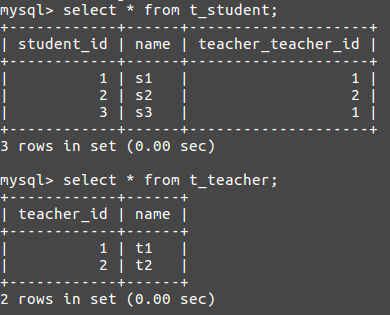

# 关联映射

关系型数据库中，表与表之间的关系通过外键约束进行维持，两张表可以组成一对多，多对多，一对一等关系，SQL操作这种关系需要使用复杂的连接查询（或子查询）和级联操作语句。对应到Hibernate中，其概念就引申为了持久化对象到数据表的关联映射，这篇笔记记录在Hibernate使用如何定义关联映射。如果关联映射设计的得当，可以大大简化持久层代码的编写。

例如：一个老师有很多学生，那么现在有两张数据表，学生表有一个外键，指向老师表。对应到Hibernate的持久化对象中，我们可以定义单向关联，只能由老师访问学生，或是只能由学生访问老师，或是定义双向关联，老师和学生可以互相访问。因此，对应数据库设计的`1-1`,`1-N`，`N-N`3种关系，Hibernate的持久化对象可以设计7种关系：

* 单向
  * 单向 1-1
  * 单向 1-N
  * 单向 N-1
  * 单向 N-N
* 双向
  * 双向 1-1
  * 双向 1-N
  * 双向 N-N

注：双向没有N-1，因为双向N-1其实等同于双向1-N。

虽然有7种，但这只是理论上的，单向关系通常较少使用，单向1-1，单向1-N基本没什么用。

## 单向N-1

多个学生对应一个老师，现在我们只关系某个学生的老师是谁，不关系某个老师的所有学生是谁，这种情况下可以设计单向N-1关系。

Student.java
```java
package com.ciyaz.domain;

import javax.persistence.*;

@Entity
@Table(name = "t_student")
public class Student
{
	@Id
	@GeneratedValue(strategy = GenerationType.IDENTITY)
	@Column(name = "student_id")
	private Long studentId;
	@Column(name = "name")
	private String studentName;
	@ManyToOne(cascade = CascadeType.ALL)
	private Teacher teacher;

	//构造函数，get/set方法略
```

* 这里使用了`@ManyToOne`注解，标注了该属性对应数据表中的外键，同时设置了外键的级联操作。

ManyToOne注解的几个参数：

* cascade
  * CascadeType.PERSIST 级联插入
  * CascadeType.REMOVE 级联删除
  * CascadeType.REFRESH 级联刷新
  * CascadeType.MERGE 级联更新
  * CascadeType.ALL 以上四项全占
* fetch：是否懒加载，多对一中默认不懒加载
* optional：是否可以为null，默认为true（即某个学生不属于任何老师）

Teacher.java
```java
package com.ciyaz.domain;

import javax.persistence.*;

@Entity
@Table(name = "t_teacher")
public class Teacher
{
	@Id
	@GeneratedValue(strategy = GenerationType.IDENTITY)
	@Column(name = "teacher_id")
	private Long teacherId;
	@Column(name = "name")
	private String teacherName;

	//构造函数，get/set方法略
```

```java
public class Main
{
	public static void main(String[] args)
	{
		Configuration configuration = new Configuration().configure();
		SessionFactory sessionFactory = configuration.buildSessionFactory();

		Session session = sessionFactory.openSession();
		Transaction tx = session.beginTransaction();

		Teacher t1 = new Teacher("t1");
		Student s1 = new Student("s1", t1);
		Student s2 = new Student("s2", t1);
		Student s3 = new Student("s3", t1);

		//将瞬态的Student对象转变到持久态
		session.persist(s1);
		session.persist(s2);
		session.persist(s3);

		//创建新的瞬态Teacher对象，修改已经是持久态的Student对象
		Teacher t2 = new Teacher("t2");
		s2.setTeacher(t2);

		tx.commit();
		session.close();

		sessionFactory.close();
	}
}
```

上面代码中，使用注解定义了两个持久化类的单向多对一关系，并测试了插入操作。

注意：为什么要设置级联操作（cascade）呢？如果直接使用SQL语句进行插入，显然我们需要先插入一个Teacher，再插入一个Student，而上面代码操作持久化类时，s2和t2并不是按照这种顺序的，s2早已存在，t2是根据级联关系后插入的，也就是说：当Hibernate执行到`s2.setTeacher(t2)`时，发现瞬态对象`t2`不是持久态，但是我们定义了级联操作，因此修改持久化对象`s2`之前，先把`t2`转化为了持久态。如果没有定义级联，这里就报错了。



那么如何删除Student呢？既然我们设置了级联关系，总不会删除一个学生把老师也级联删除掉吧。实际上是不会的。假设我们要删除s1，s1关联到t1上，如果直接删除s1，Hibernate会报异常。

```
org.hibernate.ObjectDeletedException: deleted object would be re-saved by cascade (remove deleted object from associations)
```

我们要做的就是先解除s1和t1的关系，这样删除s1就没问题了。

```java
s1.setTeacher(null);
session.delete(s1);
```

## 单向1-N

实际上，虽然可以写出单向1-N，但是不推荐使用。例如：Student和Teacher两个持久化类，如果非要定义单向一对多，那么Student没有到Teacher的引用。如果要插入一个Student，Hibernate会先插入一个外键为null的Student数据，因为Hibernate从Student类里无法得知Student关联到哪个Teacher上，然后更新Teacher的Set<Student>时，Hibernate才回去UPDATE刚刚插入的Student。这样本来一条SQL语句能做到的事被拆成了两条，性能上有很大影响。

## 双向1-N

双向1-N其实就是单向1-N和单向N-1的合体。一的一方持有所有多的一方的引用，保存在Set或List中，多的一方持有一的一方的对象的引用。

Student.java
```java
@Entity
@Table(name = "t_student")
public class Student
{
	@Id
	@GeneratedValue(strategy = GenerationType.IDENTITY)
	@Column(name = "student_id")
	private Long studentId;
	@Column(name = "name")
	private String studentName;
	@ManyToOne
	@JoinColumn(name = "teacher_id")
	private Teacher teacher;

  //构造函数，get/set方法略
}
```

Teacher.java
```java
@Entity
@Table(name = "t_teacher")
public class Teacher
{
	@Id
	@GeneratedValue(strategy = GenerationType.IDENTITY)
	@Column(name = "teacher_id")
	private Long teacherId;
	@Column(name = "name")
	private String teacherName;

	@OneToMany(mappedBy = "teacher")
	private Set<Student> studentSet = new HashSet<>();

  //构造函数，get/set方法略
}
```

注意：建议在多的一方使用`@JoinColumn`，这样指定后Hibernate会在多的一方表中生成外键，而不是弄出一张中间表。一的一方应该使用`mappedBy`属性，让多的一方去维护关联关系，否则两方会维护两次关联关系，产生不必要的性能开销。

这里mappedBy有点难理解，着重解释一下。假设A和B是两个持久化类，A持有B引用，B持有A引用，形成双向关系。

```java
class A
{
  @OneToOne(mappedBy="aaa")
  private B bbb;
}
class B
{
  private A aaa;
}
```

mappedBy这里的意思是将“维护关系”这项工作交给B类的`aaa`属性，也就是说A的实例和B的实例在持久化状态下，如果想要关联到一起，必须使用`b.setAAA(a)`，而使用`a.setBBB(b)`是不会触发数据库操作的。`mappedBy`属性的取值是A类的bbb属性对应的类B中的属性aaa的名称。在双向关系中，如果不使用`mappedBy`属性，默认两方都会维护关系，这会造成不必要的性能开销，而我们的需求一般只需要一方维护关系就好了。

Hibernate中，`@JoinColumn`和`mappedBy`是冲突的，不能同时使用。一般我们把`@JoinColumn`放在多对一关系多的一方，在其中制定外键，因此`mappedBy`放在一的一方。

## 单向N-N

还是老师和学生的例子，一个老师教多个学生，一个学生有多个老师，单向关系条件下，我们只关心某个老师的所有学生。但是，我们知道刚才单向1-N的例子就是只关心一个老师的所有学生。这里区别就是一个学生可以对应多个老师，只用两张表是无法完成的，数据库设计上需要一张中间表（当然1-N关系也可以设置中间表，但是没必要）。

Student.java
```java
@Entity
@Table(name = "t_student")
public class Student
{
	@Id
	@GeneratedValue(strategy = GenerationType.IDENTITY)
	@Column(name = "student_id")
	private Long studentId;
	@Column(name = "name")
	private String studentName;

  //构造函数，get/set方法略
}
```

Teacher.java
```java
@Entity
@Table(name = "t_teacher")
public class Teacher
{
	@Id
	@GeneratedValue(strategy = GenerationType.IDENTITY)
	@Column(name = "teacher_id")
	private Long teacherId;
	@Column(name = "name")
	private String teacherName;

	@ManyToMany
	@JoinTable(name = "teacher_student",
			joinColumns = {@JoinColumn(name = "teacher_id")},
			inverseJoinColumns = {@JoinColumn(name = "student_id")})
	private Set<Student> studentSet = new HashSet<>();

  //构造函数，get/set方法略
}
```

我们使用了`@JoinTable`和`@JoinColumn`创建了中间表，实现了单向多对多关系。

## 双向N-N

双向N-N的写法和单向N-N差不多，只要在单向N-N的基础上，持久化类双方都具有一个Set属性持有对方引用的集合就可以了，当然不要忘了设置好`mappedBy`属性。

```java
@Entity
@Table(name = "t_student")
public class Student
{
	@Id
	@GeneratedValue(strategy = GenerationType.IDENTITY)
	@Column(name = "student_id")
	private Long studentId;
	@Column(name = "name")
	private String studentName;

	@ManyToMany(mappedBy = "studentSet")
	private Set<Teacher> teacherSet = new HashSet<>();

  //构造函数，get/set方法略
}
```

```java
@Entity
@Table(name = "t_teacher")
public class Teacher
{
	@Id
	@GeneratedValue(strategy = GenerationType.IDENTITY)
	@Column(name = "teacher_id")
	private Long teacherId;
	@Column(name = "name")
	private String teacherName;

	@ManyToMany
	@JoinTable(name = "teacher_student",
			joinColumns = {@JoinColumn(name = "teacher_id")},
			inverseJoinColumns = {@JoinColumn(name = "student_id")})
	private Set<Student> studentSet = new HashSet<>();

  //构造函数，get/set方法略
}
```

## 1-1关系

实际上单向一对一没有什么必要，这里只介绍双向一对一。

基于主键的一对一关系比较常用，两个表相同主键的数据项具有一对一关联，即主键就是外键。在Hibernate中，我们可以使用`@OnetoOne`表示这种关系。但是这里要注意，这里使用JPA注解配置和书上的XML配置有些差异，JPA有些功能未实现，由于主键即是外键，那么一对一的某一方主键是依赖于另一方的，`@OnetoOne`功能需要使用Hibernate注解定义关联实体的主键生成策略。

Student.java
```java
@Entity
@Table(name = "t_student")
public class Student
{
	@Id
	@GeneratedValue(generator = "pkgenerator")
	@GenericGenerator(name = "pkgenerator", strategy = "foreign", parameters = @org.hibernate.annotations.Parameter(name = "property", value = "teacher"))
	@Column(name = "student_id")
	private Long studentId;
	@Column(name = "name")
	private String studentName;
	@OneToOne(cascade = CascadeType.ALL, mappedBy = "student")
	private Teacher teacher;

  //构造函数，get/set方法略
}
```

注意：这里配置的逐渐生成策略是`foreign`，JPA没有定义这种策略，因此我们调用了Hibernate的主键生成策略。这里写法略显复杂，但是是固定的，用的时候直接抄上就行了。Student一方设置了`mappedBy`，表示将关联关系交由Teacher表的student字段维护，Teacher表的Student字段又指定了`@PrimaryKeyJoinColumn`，表示使用基于主键的一对一关系，被维护的一方主键由Teacher一方维护，对应Student中主键`foreign`生成策略。

Teacher.java
```java
@Entity
@Table(name = "t_teacher")
public class Teacher
{
	@Id
	@GeneratedValue(strategy = GenerationType.IDENTITY)
	@Column(name = "teacher_id")
	private Long teacherId;
	@Column(name = "name")
	private String teacherName;

	@OneToOne(cascade = CascadeType.ALL)
	@PrimaryKeyJoinColumn
	private Student student;

  //构造函数，get/set方法略
}
```

除了基于主键我们还可以设置单独的外键实现1-1.实际上基于外键的1-1就是一种特殊的N-1，只不过`1`的一方将外键设为了`unique`。设立就不详细说明了，1-1建议使用基于主键的形式，没有必要使用基于外键的。
